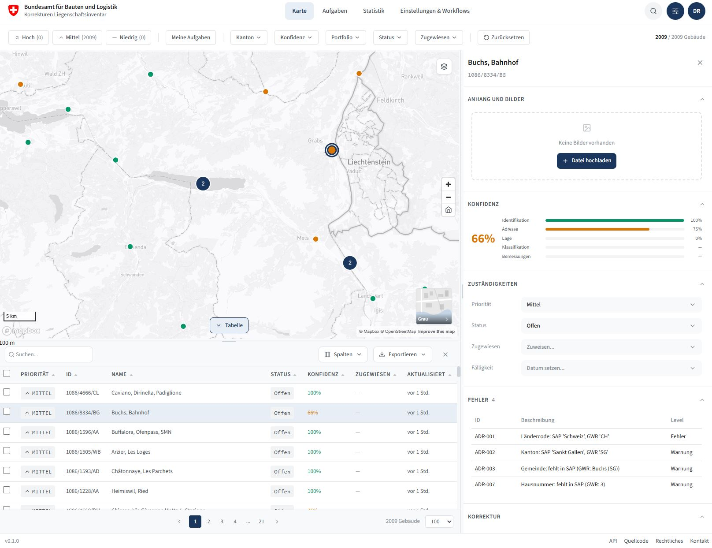

# Geo-Check

A prototype web application for validating and managing property data.

> [!CAUTION]
> **This is an unofficial mockup for demonstration purposes only.**
> All data is fictional. Not all features are fully functional. This project serves as a visual and conceptual prototype — it is not intended for production use.
A prototype web application for validating and managing property data. Built for the Federal Office for Buildings and Logistics (BBL).

- **Live Demo:** https://bbl-dres.github.io/geo-check/



## Features

### Map View
- Interactive map with Swiss federal buildings
- Multiple basemap options (swisstopo, OpenStreetMap, Orthofoto)
- WMS layer overlays (Cadastral parcels, Administrative boundaries)
- Location search via swisstopo API
- Click-to-identify building information

### Data Table
- Searchable and sortable building list
- Row selection with checkboxes
- Configurable page size (100, 500, 1000)
- Export to CSV, XLSX, GeoJSON (all or selected)

### Kanban Board
- Task management with drag-and-drop
- Status columns: Backlog, In Bearbeitung, Abklärung, Erledigt
- Filter by priority, canton, confidence, assignee

### Detail Panel
- Building metadata and confidence scores
- Data source comparison (GEOREF, SAP, GWR, ADDRESS)
- Inline editing capabilities
- Comments and event history

### Validation Rules
- Automated data quality checks
- Configurable rule severity levels
- Last check timestamp tracking

## Tech Stack

- **Frontend:** Vanilla JavaScript (ES Modules)
- **Map:** Leaflet.js with swisstopo WMS/WMTS
- **Icons:** Lucide Icons
- **Styling:** Custom CSS with design tokens

## Project Structure

```
geo-check/
├── index.html          # Main application
├── css/
│   ├── tokens.css      # Design tokens (colors, spacing, etc.)
│   └── styles.css      # Component styles
├── js/
│   ├── main.js         # Application entry point
│   ├── state.js        # Global state management
│   ├── map.js          # Leaflet map setup and layers
│   ├── search.js       # swisstopo location search
│   ├── data-table.js   # Table view with pagination
│   ├── detail-panel.js # Building detail sidebar
│   ├── kanban.js       # Kanban board view
│   └── statistics.js   # Statistics dashboard
└── data/
    ├── buildings.json  # Building data
    ├── users.json      # Team members
    ├── events.json     # Activity log
    ├── comments.json   # Building comments
    ├── errors.json     # Validation errors
    └── rules.json      # Validation rules
```

## Getting Started

1. Clone the repository
2. Serve the files with any static web server
3. Open in browser

Example with Python:
```bash
python -m http.server 8000
```

Example with Node.js:
```bash
npx serve
```

## Configuration

The application uses swisstopo APIs for:
- Base maps (WMTS)
- WMS overlay layers
- Location search (geo.admin.ch SearchServer)

No API keys required for swisstopo services.

## Browser Support

Modern browsers with ES Module support:
- Chrome 61+
- Firefox 60+
- Safari 11+
- Edge 16+

## License

> [!CAUTION]
> **This is an unofficial mockup for demonstration purposes only.**
> All data is fictional. Not all features are fully functional. This project serves as a visual and conceptual prototype — it is not intended for production use.
