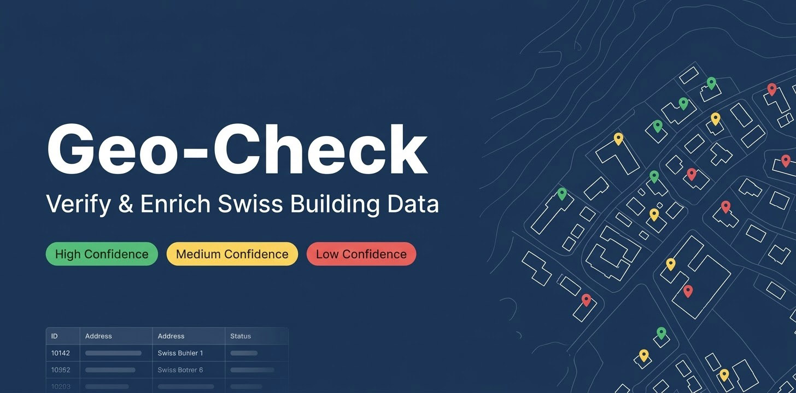
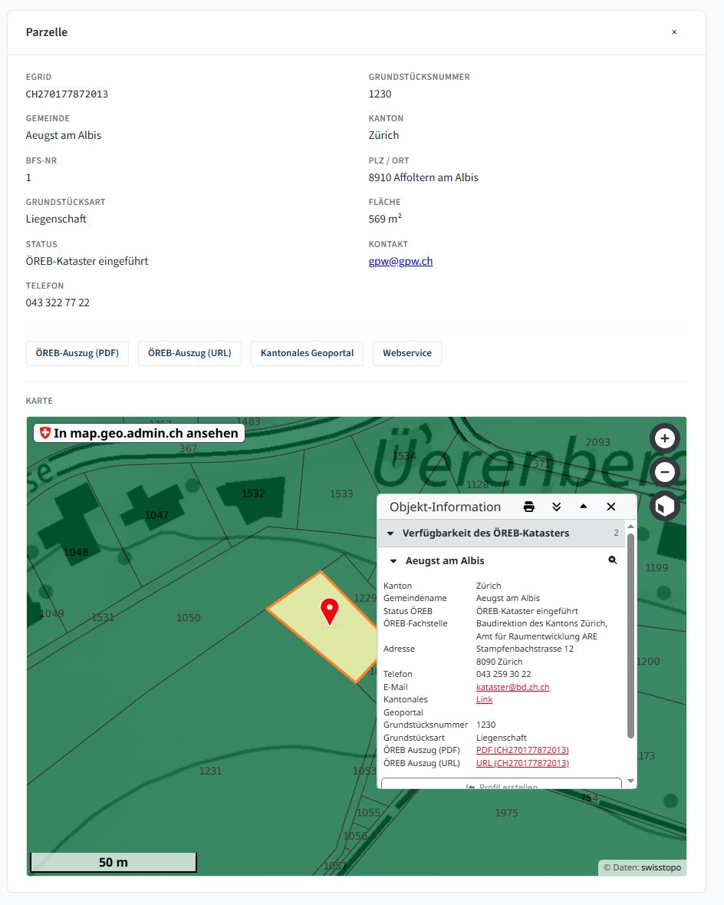
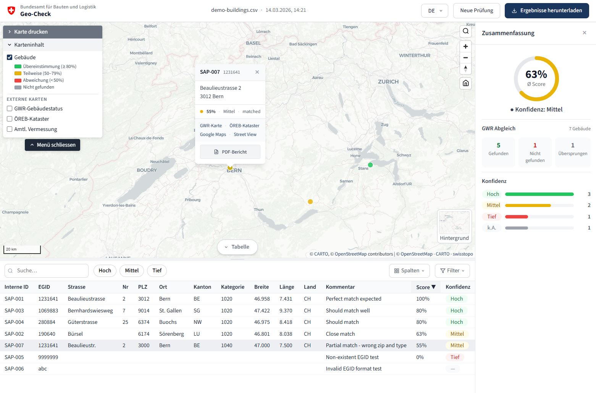

# Geo-Check



[](https://opensource.org/licenses/MIT)
[](https://bbl-dres.github.io/geo-check/)
[](https://developer.mozilla.org/en-US/docs/Web/JavaScript)
[](https://maplibre.org/)
[](https://www.bbl.admin.ch/)

A collection of tools for working with Swiss building and parcel data — built around the official [Gebäude- und Wohnungsregister (GWR)](https://www.housing-stat.ch/), the [ÖREB cadastre](https://www.cadastre.ch/en/oereb.html), and [swisstopo APIs](https://docs.geo.admin.ch/).

This repo is a **monorepo of independent projects**: several browser apps plus one command-line tool. Each lives in its own folder with its own detailed README — this page is just the overview. The browser apps are static (no build step) and deploy to GitHub Pages; the CLI tool runs locally.

## Apps

### ÖREB Parcel Search

Search the Swiss ÖREB cadastre by municipality, EGRID, parcel number, postcode, or canton. Autocomplete, area calculation, and direct links to the official ÖREB extracts. Also does **batch CSV** lookups, and is bundled with a companion Python script for raw XML extracts. Multilingual: DE / FR / IT.

- Live demo: <https://bbl-dres.github.io/geo-check/oereb-search/>
- Source code: [`oereb-search/`](oereb-search/)

<p align="center">
  
  
</p>

---

### GWR Building Search

> [!TIP]
> Also see the official GWR query form: https://www.housing-stat.ch/de/data/query/egid.html

Look up individual buildings in the GWR by EGID, address, municipality, postcode, BFS number, or canton. Shows the full building profile (identification, classification, structure, heating, dwellings), resolves coded fields to readable DE/FR/IT labels, and maps the building. Also does **batch CSV** lookups. Sibling of ÖREB Parcel Search — same UI, different register.

- Live demo: <https://bbl-dres.github.io/geo-check/gwr-search/>
- Source code: [`gwr-search/`](gwr-search/)

---

### GWR Validator

Verify your building records against the official GWR. Upload a CSV/Excel file, enrich each row against the public GWR API, review the results on a map + table, and export the enriched file. All processing happens in the browser — no data leaves your device. **This is the main app; the repo root redirects here.**

- Live demo: <https://bbl-dres.github.io/geo-check/gwr-check/>
- Source code: [`gwr-check/`](gwr-check/)

<p align="center">
  
</p>

## Command-line tool

### ÖREB Validator

Validate BBL **SAP** building & parcel master data against the Swiss national registers — it flags parcels whose **E-GRID** foreign key (and buildings whose **EGID**) is wrong, missing, or stale by cross-checking each key's coordinates against the swisstopo API. A standard-library **Python** script (no `pip install`) that runs locally against a SAP export and writes CSVs plus a self-contained, multilingual (DE / FR / IT / EN) interactive HTML report. Unlike the browser apps it isn't deployed to GitHub Pages — its inputs/outputs embed internal master data, so they're git-ignored.

- Source code: [`oereb-check/`](oereb-check/)
- Rule catalogue: [`oereb-check/RULE-SET.md`](oereb-check/RULE-SET.md)

## Deprecated

### Data-Quality Prototype (deprecated)

> [!CAUTION]
> Unofficial mockup for demonstration only; its backend database is no longer online.

Project-management-style mockup for building-data quality workflows: multi-source validation (GEOREF / SAP RE-FX / GWR), confidence scoring across five dimensions, a kanban board with inline correction tracking, role-based auth (Supabase), and a Deno + Hono rule engine.

- Live demo: <https://bbl-dres.github.io/geo-check/prototype-quality/>
- Source code: [`prototype-quality/`](prototype-quality/)

## Running locally

The browser apps have no build step. Serve the repo root with any static file server and open the app's path:

```bash
python -m http.server 8000   # → http://localhost:8000/  (redirects to /gwr-check/)
npx serve .                  # or any static server
php -S localhost:8000
```

Each app lives at its own path (e.g. `/oereb-search/`). The Data-Quality Prototype's rule-engine backend additionally needs Deno — see its README. The CLI tool is run directly: `cd oereb-check && python oereb_check.py`.

## Deployment

**GitHub Pages:** every push to `main` deploys the static apps automatically. Old bookmarks for `/app-oereb/` and `/prototype-pm/` keep working via redirect stubs that point to `/oereb-search/` and `/prototype-quality/` respectively.


## License

[MIT](LICENSE) — developed by the [Bundesamt für Bauten und Logistik (BBL)](https://www.bbl.admin.ch/) of the Swiss Federal Administration.
