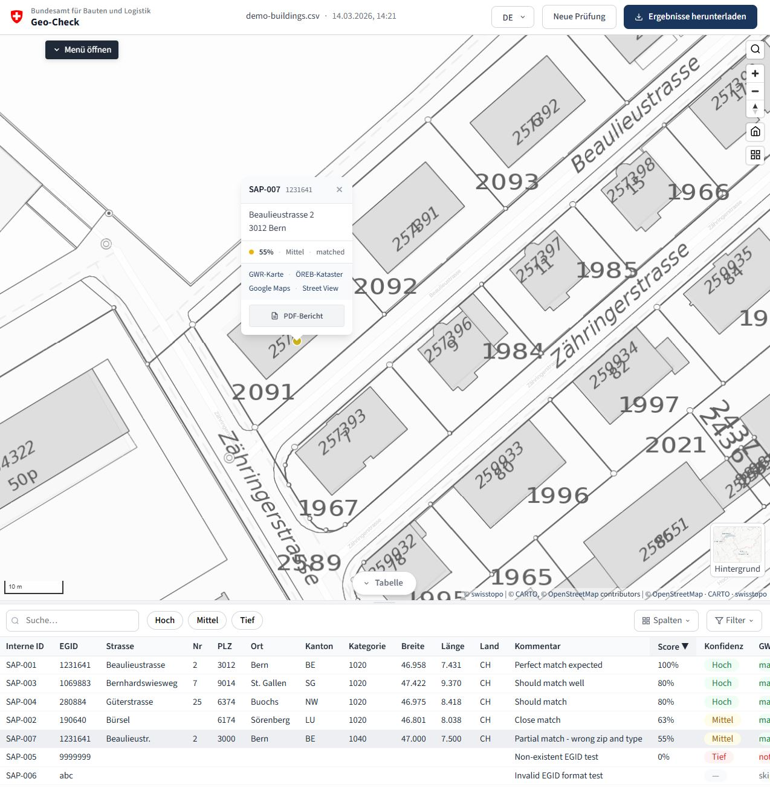
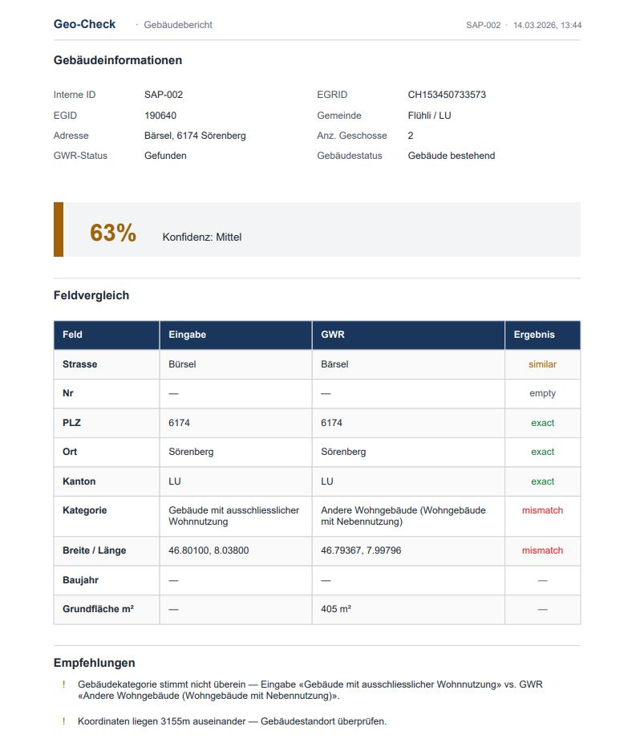
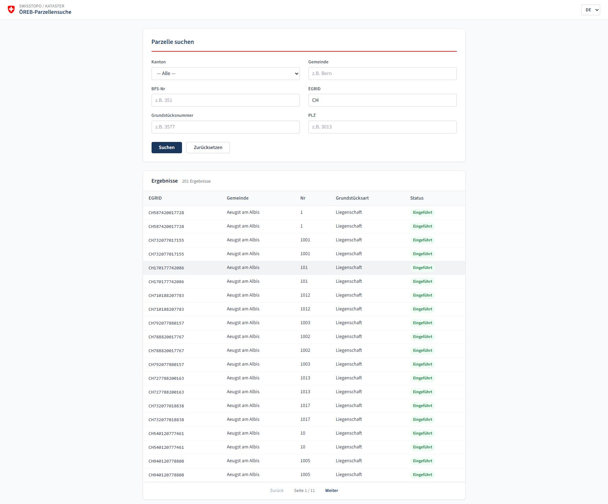
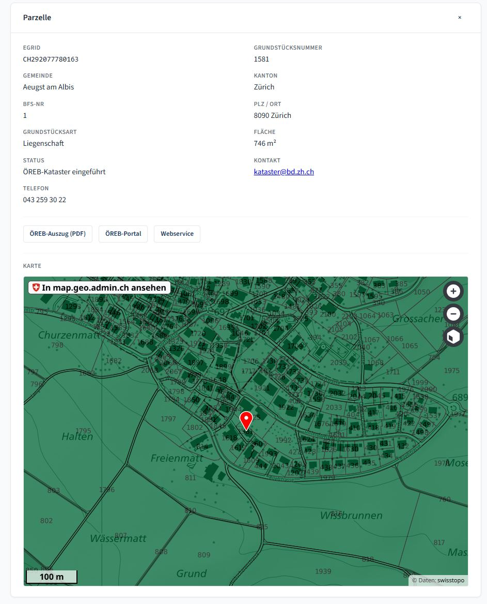
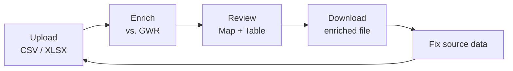

# Geo-Check


[](https://bbl-dres.github.io/geo-check/)
[](js/)
[](#privacy)
[](LICENSE)
[](https://www.bbl.admin.ch/)
[](https://maplibre.org/)
[](https://api3.geo.admin.ch)

A collection of browser-based tools for working with Swiss building and parcel data — built around the official [Gebäude- und Wohnungsregister (GWR)](https://www.housing-stat.ch/), the [ÖREB cadastre](https://www.cadastre.ch/en/oereb.html), and swisstopo APIs.

> [!NOTE]
> The **PM Prototype** is an unofficial mockup for demonstration purposes. The main **Geo-Check** and **ÖREB Parcel Search** apps use live public APIs and are fully functional.

## Apps in this repo

You don't need to install anything — every app is deployed on GitHub Pages.

### Geo-Check (main app)

Verify your building records against the official GWR. Upload a CSV or Excel file with EGIDs, enrich each record against the public GWR API, review on an interactive map and sortable table, then export the enriched results. All processing happens in the browser — no data leaves your device.

- Link: https://bbl-dres.github.io/geo-check/


<p>
  
  
</p>

---

### ÖREB Parcel Search (`app-oereb/`)

Search the Swiss ÖREB cadastre by municipality, EGRID, parcel number, PLZ, or canton. Autocomplete, area calculation, and direct links to official ÖREB extracts. Uses the [swisstopo ÖREB layer](https://api3.geo.admin.ch/rest/services/ech/MapServer/ch.swisstopo-vd.stand-oerebkataster). Multilingual: DE / FR / IT.

- Link: https://bbl-dres.github.io/geo-check/app-oereb/

<p>
  
  
</p>

---

### PM Prototype (`prototype-pm/`)

Project-management-style prototype for building-data quality workflows. Multi-source validation (GEOREF / SAP RE-FX / GWR), confidence scoring across 5 dimensions, kanban board with status workflow, inline correction tracking, role-based authentication (Supabase Auth), and a Deno + Hono rule engine backend. German UI.

- Link: https://bbl-dres.github.io/geo-check/prototype-pm/


---

## How Geo-Check works


```mermaid
graph LR
    A["Upload<br/>CSV / XLSX"] --> B["Enrich<br/>vs. GWR"]
    B --> C["Review<br/>Map + Table"]
    C --> D["Download<br/>enriched file"]
    D --> E["Fix source data"]
    E --> A
```

1. **Upload** a CSV or Excel file with your building data (requires `internal_id` and `egid` columns)
2. **Enrich** — each EGID is looked up against the public GWR API; address, coordinates, building type, and more are compared and scored (0–100)
3. **Review** — explore results on an interactive map with color-coded markers and a sortable, filterable table
4. **Download** — export enriched results as CSV, Excel, or GeoJSON
5. **Fix & repeat** — correct mismatches in your source file and re-upload to verify improvements

## Key features (main app)

- **Interactive map** — MapLibre GL with CARTO basemaps (Positron, Dark Matter, Voyager) and Swisstopo aerial imagery; location search via swisstopo SearchServer
- **Results table** — sortable, filterable, paginated; confidence presets (High / Medium / Low); clickable badges to filter by match result; column visibility toggle
- **Match scoring** — weighted comparison across street, house number, ZIP, city, canton, building type, and coordinates with confidence classification
- **GWR code resolution** — integer codes (building category, class, status, heating, etc.) resolved to multilingual labels (DE / FR / IT)
- **Export formats** — CSV (semicolon, UTF-8 BOM), Excel (results + summary sheets), GeoJSON
- **Multilingual** — DE, FR, IT, EN interface

## Privacy

The main Geo-Check app does all processing in the browser. No data is uploaded to any server.

- No backend, no database, no cookies, no analytics
- Only the EGID (a public building identifier) is sent to the GWR API
- Nothing persists between sessions — close the tab and data is gone

(The PM Prototype is a separate app that uses Supabase for auth/storage — different privacy model, see [prototype-pm/README.md](prototype-pm/README.md).)

## Credits & data sources

### Data

| Source | Usage | API |
|--------|-------|-----|
| [GWR](https://www.housing-stat.ch/) — Gebäude- und Wohnungsregister | Building data (address, type, coordinates, heating, etc.) | [`MapServer/find`](https://api3.geo.admin.ch/rest/services/ech/MapServer/find?layer=ch.bfs.gebaeude_wohnungs_register&searchField=egid&searchText=1231641&returnGeometry=true&contains=false&sr=4326) |
| [swisstopo](https://www.swisstopo.admin.ch/) — Bundesamt für Landestopografie | Location search for map navigation | [`SearchServer`](https://api3.geo.admin.ch/rest/services/ech/SearchServer?searchText=Bern&type=locations&sr=4326&limit=5) |
| [swisstopo ÖREB layer](https://api3.geo.admin.ch/rest/services/ech/MapServer/ch.swisstopo-vd.stand-oerebkataster) | ÖREB cadastre data for parcel search | swisstopo API |
| [CARTO](https://carto.com/) | Basemap tiles (Positron, Dark Matter, Voyager) | Free, no API key |
| [OpenStreetMap](https://www.openstreetmap.org/copyright) | Map data underlying CARTO tiles | [ODbL](https://opendatacommons.org/licenses/odbl/) |
| [Swisstopo WMTS](https://www.swisstopo.admin.ch/) | Aerial imagery basemap | Free, no API key |

All swisstopo APIs used here are public and require no API key.

### Libraries

| Library | Purpose | License |
|---------|---------|---------|
| [MapLibre GL JS](https://maplibre.org/) | Interactive vector map | BSD-3-Clause |
| [Papa Parse](https://www.papaparse.com/) | CSV parsing | MIT |
| [SheetJS](https://sheetjs.com/) | Excel parsing & export | Apache-2.0 |

All loaded via CDN — no build step, no `node_modules` in the main app.

## Repository layout

```
geo-check/
├── index.html              # Main app — Geo-Check (GWR validator)
├── css/                    # Main app styles
│   ├── tokens.css          # Design tokens (colors, spacing, typography)
│   └── styles.css          # Component styles
├── js/                     # Main app modules (ES6, no build step)
│   ├── main.js             # App state machine (upload → processing → results)
│   ├── upload.js           # File parsing, column detection, mapping UI
│   ├── processor.js        # GWR API calls, batching, match scoring
│   ├── map.js              # MapLibre GL map, markers, popups
│   ├── table.js            # Results table, sorting, filtering, pagination
│   ├── export.js           # CSV, XLSX, GeoJSON generation
│   ├── gwr-codes.js        # Code → label resolution
│   ├── i18n.js             # Translations (DE / FR / IT / EN)
│   └── utils.js            # String similarity, helpers
├── data/
│   └── gwr-codes.json      # GWR code tables (DE / FR / IT)
├── assets/
│   ├── demo-buildings.csv  # Sample data for testing
│   ├── GWR Codes.xlsx      # Source for gwr-codes.json
│   └── *.jpg / *.svg       # Previews, social image, branding
├── app-oereb/              # ÖREB Parcel Search app
│   ├── index.html
│   ├── css/style.css
│   └── js/
│       ├── app.js          # Search, results, detail, area calculation
│       └── i18n.js         # Translations (DE / FR / IT)
├── prototype-pm/           # PM Prototype (Supabase + Deno backend + kanban)
│   ├── index.html
│   ├── js/                 # Auth, map, kanban, detail panel, statistics
│   ├── backend/            # Deno + Hono rule engine (port 8787)
│   ├── supabase/           # Edge functions, config
│   └── docs/               # DATABASE.md, EDGE-FUNCTIONS.md, RULES.md
└── docs/
    ├── SPECIFICATION.md    # Full specification of the main app
    └── INSTRUCTIONS.md
```

The main app and ÖREB app have no build step and no `node_modules`. The PM Prototype has a Deno backend — see [prototype-pm/README.md](prototype-pm/README.md) for setup.

## Running locally

Serve the project root with any static file server:

```bash
# Python
python -m http.server 8000

# Node.js (npx)
npx serve .

# VS Code
# Install "Live Server" extension, right-click index.html → Open with Live Server
```

Then open:
- `http://localhost:8000/` — main Geo-Check app
- `http://localhost:8000/app-oereb/` — ÖREB Parcel Search
- `http://localhost:8000/prototype-pm/` — PM Prototype (frontend only; backend setup in [prototype-pm/README.md](prototype-pm/README.md))

## Input format (main app)

Upload a CSV or Excel file with these columns:

| Column | Required | Example |
|--------|----------|---------|
| `internal_id` | Yes | `SAP-4821` |
| `egid` | Yes | `1755615` |
| `street` | No | `Bahnhofstrasse` |
| `street_number` | No | `12` |
| `zip` | No | `8001` |
| `city` | No | `Zürich` |
| `region` | No | `ZH` |
| `building_type` | No | `1020` |
| `latitude` | No | `47.3769` |
| `longitude` | No | `8.5417` |
| `country` | No | `CH` |
| `comment` | No | `Check roof area` |

Column headers are matched case-insensitively with common aliases (e.g., `plz` → `zip`, `hausnummer` → `street_number`). A sample file is available at [assets/demo-buildings.csv](assets/demo-buildings.csv).

## License

[MIT](LICENSE) — developed by the [Bundesamt für Bauten und Logistik (BBL)](https://www.bbl.admin.ch/) of the Swiss Federal Administration.
