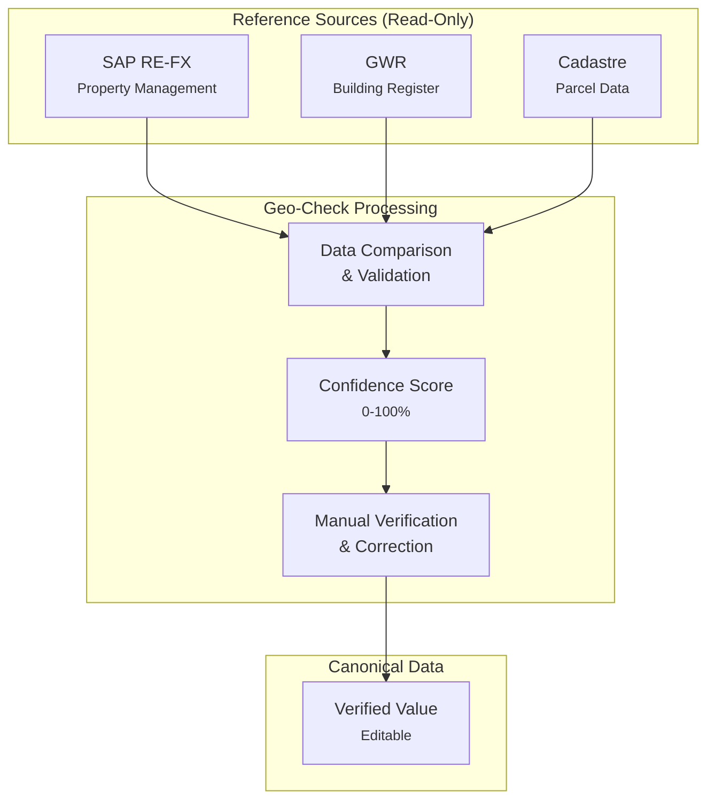
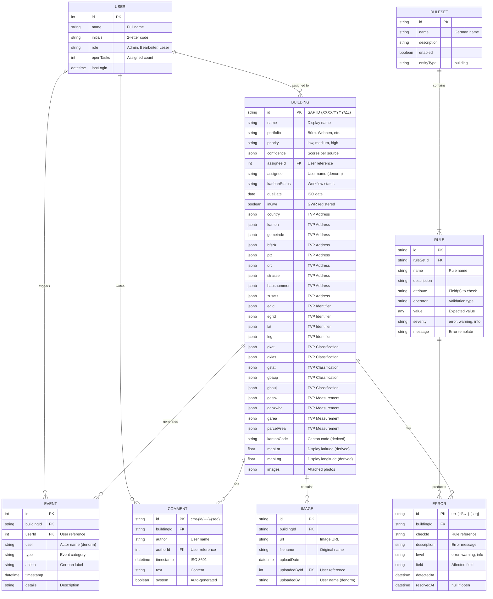
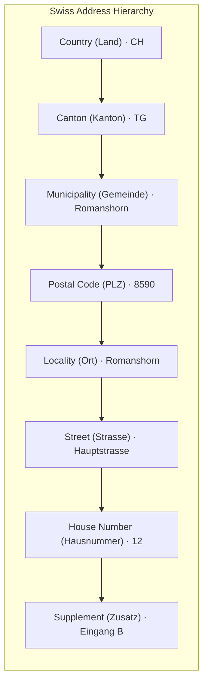

# DATABASE.md - Geo-Check Data Model

> **This document is the authoritative source of truth for the Geo-Check data model.** All data structures, field definitions, PostgreSQL column types, and code lists are defined here. The SQL implementation in `DATABASE.sql` must conform to this specification. When discrepancies exist, this document takes precedence.

---

## 1. Architecture Overview

Geo-Check manages Swiss federal building data by comparing records from multiple authoritative sources and maintaining a canonical verified value.



### Data Sources

| Source | Purpose | Editable |
|--------|---------|----------|
| **SAP RE-FX** | Federal property management system | No (reference) |
| **GWR** | Swiss Federal Register of Buildings and Dwellings | No (reference) |
| **Cadastre** | Official parcel and building geometry data | No (reference) |
| **Value** | Canonical verified value maintained by BBL | Yes |

### Three-Value Pattern (TVP)

Each comparable field is stored as **its own JSONB column** in PostgreSQL. Every TVP column contains the same four keys:

```json
{
  "sap": "...",       // SAP RE-FX value (read-only reference)
  "gwr": "...",       // GWR value (read-only reference)
  "korrektur": "...", // Manual correction value (editable, empty if no correction)
  "match": false      // Whether SAP and GWR values match
}
```

**PostgreSQL storage:** Each TVP field (e.g. `strasse`, `plz`, `egid`) maps to an individual `JSONB` column in the `buildings` table. This allows direct column-level queries, indexes, and Supabase API filtering without JSONB path operators.

**Example query:**
```sql
SELECT id, name, strasse->>'gwr' AS strasse_gwr
FROM buildings
WHERE kanton->>'sap' = 'TG' AND (plz->>'match')::boolean = false;
```

**Canonical value derivation:** `korrektur` if set, otherwise `gwr` (preferred source), otherwise `sap`.

---

## 1.5 Entity Overview

The following ER diagram shows the main entities and their relationships in the Geo-Check data model.



### Entity Relationships

| Relationship | Cardinality | Description |
|--------------|-------------|-------------|
| Building → User | N:1 | A building can be assigned to one user (via `assignee`) |
| Building → Event | 1:N | A building can have multiple events in the activity log |
| Building → Comment | 1:N | A building can have multiple comments |
| Building → Error | 1:N | A building can have multiple validation errors |
| Building → Image | 1:N | A building can have multiple attached images |
| User → Event | 1:N | A user can trigger multiple events |
| User → Comment | 1:N | A user can write multiple comments |
| RuleSet → Rule | 1:N | A rule set contains multiple validation rules |
| Rule → Error | 1:N | A rule can produce errors on multiple buildings |

### Referential Integrity Pattern

User references use a **dual-field pattern** for flexibility and display performance:

| Entity | ID Field | Display Field | Purpose |
|--------|----------|---------------|---------|
| Building | `assigneeId` | `assignee` | Task assignment |
| Event | `userId` | `user` | Activity tracking |
| Comment | `authorId` | `author` | Audit trail |
| Image | `uploadedById` | `uploadedBy` | Upload tracking |

**Rationale:**
- `*Id` fields (integer) provide referential integrity to `User.id`
- Display fields (string) are denormalized for read performance
- Display fields should be updated when user names change (application logic)
- For JSON storage without FK enforcement, display fields serve as fallback

**Current Implementation Note:**
The current JSON-based storage uses display names only. When migrating to a relational database, add the `*Id` fields and enforce foreign key constraints.

---

## 2. Building Entity

The primary entity representing a federal building record.

### 2.1 Attributes

| Attribute | PostgreSQL Column | Type | Required | SAP | GWR | Description |
|-----------|-------------------|------|----------|:---:|:---:|-------------|
| **Top-Level (Metadata)** ||||||
| `id` | `id VARCHAR(20) PK` | string | Yes | X | | SAP RE-FX property ID (format: `XXXX/YYYY/ZZ`) |
| `name` | `name VARCHAR(255)` | string | Yes | X | | SAP Name (City, Street) from RE-FX |
| `portfolio` | `portfolio VARCHAR(50)` | string | Yes | X | | Building type from SAP RE-FX |
| `priority` | `priority VARCHAR(20)` | string | Yes | | | Task priority: low, medium, high |
| `confidence` | `confidence JSONB` | object | Yes | | | Confidence scores per source |
| `assigneeId` | `assignee_id INTEGER FK` | number | No | | | Foreign key to users table |
| `assignee` | `assignee VARCHAR(100)` | string | No | | | Assigned team member name (denormalized) |
| `kanbanStatus` | `kanban_status VARCHAR(20)` | string | Yes | | | Workflow status |
| `dueDate` | `due_date DATE` | string | No | | | ISO 8601 date |
| `lastUpdate` | `last_update TIMESTAMPTZ` | string | Yes | | | ISO 8601 timestamp |
| `lastUpdateBy` | `last_update_by VARCHAR(100)` | string | Yes | | | Last editor name or "System" |
| `inGwr` | `in_gwr BOOLEAN` | boolean | Yes | | | Whether building exists in GWR |
| `images` | `images JSONB` | array | No | | | Attached building photographs |
| **Address Fields** — each column is `JSONB {sap, gwr, korrektur, match}` ||||||
| `country` | `country JSONB` | TVP | Yes | X | | ISO country code (CH) |
| `kanton` | `kanton JSONB` | TVP | Yes | X | | 2-letter canton code (derived from GGDENR) |
| `gemeinde` | `gemeinde JSONB` | TVP | Yes | X | GGDENR | Municipality name (from BFS number) |
| `bfsNr` | `bfs_nr JSONB` | TVP | No | X | GGDENR | BFS municipality number (4-digit) |
| `plz` | `plz JSONB` | TVP | Yes | X | DPLZ4 | 4-digit postal code (Postleitzahl) |
| `ort` | `ort JSONB` | TVP | Yes | X | DPLZ4+DPLZZ | Postal locality (derived) |
| `strasse` | `strasse JSONB` | TVP | Yes | X | STRNAME | Street name (Strassenbezeichnung) |
| `hausnummer` | `hausnummer JSONB` | TVP | No | X | DEINR | House number (Eingangsnummer) |
| `zusatz` | `zusatz JSONB` | TVP | No | X | DPLZZ | Address supplement |
| **Building Identifiers** — each column is `JSONB {sap, gwr, korrektur, match}` ||||||
| `egid` | `egid JSONB` | TVP | No | X | EGID | GWR building identifier |
| `egrid` | `egrid JSONB` | TVP | No | X | GEGRID | E-GRID parcel identifier |
| `lat` | `lat JSONB` | TVP | Yes | X | GKODN | WGS84 latitude (GWR: LV95 N-coordinate, converted) |
| `lng` | `lng JSONB` | TVP | Yes | X | GKODE | WGS84 longitude (GWR: LV95 E-coordinate, converted) |
| **Building Classification** — each column is `JSONB {sap, gwr, korrektur, match}` ||||||
| `gkat` | `gkat JSONB` | TVP | No | X | GKAT | Building category (SAP: mapped from own classification) |
| `gklas` | `gklas JSONB` | TVP | No | X | GKLAS | Building class (SAP: mapped from own classification) |
| `gstat` | `gstat JSONB` | TVP | No | X | GSTAT | Building status (Gebäudestatus) |
| `gbaup` | `gbaup JSONB` | TVP | No | X | GBAUP | Construction period (Bauperiode) |
| `gbauj` | `gbauj JSONB` | TVP | No | X | GBAUJ | Construction year (Baujahr) |
| **Bemessungen** — each column is `JSONB {sap, gwr, korrektur, match}` ||||||
| `gastw` | `gastw JSONB` | TVP | No | X | GASTW | Number of floors (Anzahl Geschosse) |
| `ganzwhg` | `ganzwhg JSONB` | TVP | No | X | | Number of dwellings (Anzahl Wohnungen) |
| `garea` | `garea JSONB` | TVP | No | X | GAREA | Building footprint in m² (Gebäudefläche) |
| `parcelArea` | `parcel_area JSONB` | TVP | No | X | ÖREB | Parcel area in m² (via Swisstopo API by EGID) |
| **Derived Columns** (auto-populated via triggers) ||||||
| `kantonCode` | `kanton_code CHAR(2)` | string | — | | | Derived from `kanton` TVP (korrektur > gwr > sap) |
| `mapLat` | `map_lat DOUBLE PRECISION` | number | — | | | Derived from `lat` TVP (korrektur > gwr > sap) |
| `mapLng` | `map_lng DOUBLE PRECISION` | number | — | | | Derived from `lng` TVP (korrektur > gwr > sap) |

**Legend:**
- **TVP** = Three-Value Pattern — stored as individual `JSONB` column containing `{sap, gwr, korrektur, match}`
- **SAP/GWR columns**: Official field code from that source, empty if not available
- **ÖREB** = Cadastre data retrieved via [Swisstopo API](https://api3.geo.admin.ch/) using EGID
- **Derived columns** are auto-populated by PostgreSQL triggers and should not be set directly

**JSON-to-SQL column name mapping:** `bfsNr` → `bfs_nr`, `parcelArea` → `parcel_area`, `kanbanStatus` → `kanban_status`, `dueDate` → `due_date`, `lastUpdate` → `last_update`, `lastUpdateBy` → `last_update_by`, `inGwr` → `in_gwr`, `assigneeId` → `assignee_id`, `mapLat` → `map_lat`, `mapLng` → `map_lng`, `kantonCode` → `kanton_code`

**GWR Reference:** [Merkmalskatalog 4.3](https://www.housing-stat.ch/catalog/de/4.3/final)

### 2.2 Complete Structure

```json
{
  "id": "1080/2020/AA",
  "name": "Romanshorn, Friedrichshafnerstrasse",
  "portfolio": "Büro",
  "priority": "medium",

  "confidence": {
    "total": 67,
    "georef": 67,
    "sap": 100,
    "gwr": 100
  },

  "assignee": "M. Keller",
  "kanbanStatus": "inprogress",
  "dueDate": "2026-02-15",
  "lastUpdate": "2026-01-27T14:30:00Z",
  "lastUpdateBy": "M. Keller",

  "inGwr": true,
  "mapLat": 47.5656,
  "mapLng": 9.3744,

  "country":      { "sap": "CH", "gwr": "CH", "korrektur": "", "match": true },
  "kanton":       { "sap": "TG", "gwr": "TG", "korrektur": "", "match": true },
  "gemeinde":     { "sap": "Romanshorn", "gwr": "Romanshorn", "korrektur": "", "match": true },
  "bfsNr":        { "sap": "4436", "gwr": "4436", "korrektur": "", "match": true },
  "plz":          { "sap": "8590", "gwr": "8590", "korrektur": "", "match": true },
  "ort":          { "sap": "Romanshorn", "gwr": "Romanshorn", "korrektur": "", "match": true },
  "strasse":      { "sap": "Friedrichshafnerstr.", "gwr": "Friedrichshafnerstrasse", "korrektur": "", "match": false },
  "hausnummer":   { "sap": "", "gwr": "", "korrektur": "", "match": true },
  "zusatz":       { "sap": "", "gwr": "", "korrektur": "", "match": true },
  "egid":         { "sap": "", "gwr": "302045678", "korrektur": "", "match": false },
  "gkat":         { "sap": "1060", "gwr": "1060", "korrektur": "", "match": true },
  "gklas":        { "sap": "1220", "gwr": "1220", "korrektur": "", "match": true },
  "gstat":        { "sap": "1004", "gwr": "1004", "korrektur": "", "match": true },
  "gbaup":        { "sap": "8014", "gwr": "8014", "korrektur": "", "match": true },
  "gbauj":        { "sap": "", "gwr": "1965", "korrektur": "", "match": false },
  "gastw":        { "sap": "3", "gwr": "3", "korrektur": "", "match": true },
  "ganzwhg":      { "sap": "0", "gwr": "0", "korrektur": "", "match": true },
  "garea":        { "sap": "", "gwr": "485", "korrektur": "", "match": false },
  "lat":          { "sap": "", "gwr": "47.5656", "korrektur": "", "match": false },
  "lng":          { "sap": "", "gwr": "9.3744", "korrektur": "", "match": false },
  "egrid":        { "sap": "", "gwr": "CH336583840978", "korrektur": "", "match": false },
  "parcelArea":   { "sap": "1250", "gwr": "1275", "korrektur": "", "match": false },

  "images": [
    {
      "id": "img-001",
      "url": "https://example.com/images/building1.jpg",
      "filename": "Fassade_Nord.jpg",
      "uploadDate": "2026-01-12T10:30:00Z",
      "uploadedBy": "M. Keller"
    }
  ]
}
```

**Note:** In JSON, comparison fields are stored at the top level of the building object. In PostgreSQL, each comparison field maps to its own `JSONB` column (not nested inside a single JSONB blob). The derived columns (`kanton_code`, `map_lat`, `map_lng`) are auto-populated by triggers and do not appear in the JSON.

### 2.3 Confidence Object

```json
{
  "total": 67,
  "georef": 67,
  "sap": 100,
  "gwr": 100
}
```

| Field | Range | Description |
|-------|-------|-------------|
| `total` | 0-100 | Weighted overall confidence |
| `georef` | 0-100 | GEOREF geometric data quality score |
| `sap` | 0-100 | SAP RE-FX data completeness/match rate |
| `gwr` | 0-100 | GWR data completeness/match rate |

**Confidence Thresholds:**

| Level | Range | Color |
|-------|-------|-------|
| Critical | < 50% | Red |
| Warning | 50-80% | Orange |
| OK | >= 80% | Green |

---

## 3. Address Components

### 3.1 Hierarchy

Swiss addresses follow a hierarchical structure. For federal buildings, we track both the official municipality (Gemeinde) and the postal locality (Ort), as these can differ.



### 3.2 Field Definitions

Fields are categorized by importance for daily verification tasks:

| Field | PostgreSQL Column | German | Example | Priority | Description |
|-------|-------------------|--------|---------|----------|-------------|
| `plz` | `plz JSONB` | PLZ | "8590" | **Primary** | 4-digit Swiss postal code |
| `ort` | `ort JSONB` | Ort | "Romanshorn" | **Primary** | Postal locality name (can differ from Gemeinde) |
| `strasse` | `strasse JSONB` | Strasse | "Hauptstrasse" | **Primary** | Street name without house number |
| `hausnummer` | `hausnummer JSONB` | Hausnr. | "12" | **Primary** | House/building number (may include letters: "12a") |
| `country` | `country JSONB` | Land | "CH" | Secondary | ISO 3166-1 alpha-2 country code. Required for border cases. |
| `kanton` | `kanton JSONB` | Kanton | "TG" | Secondary | 2-letter canton abbreviation |
| `gemeinde` | `gemeinde JSONB` | Gemeinde | "Romanshorn" | Secondary | Official municipality name |
| `bfsNr` | `bfs_nr JSONB` | BFS-Nr. | "4436" | Secondary | Official 4-digit BFS municipality number (Gemeindenummer) |
| `zusatz` | `zusatz JSONB` | Zusatz | "Eingang B" | Secondary | Address supplement (entrance, floor, c/o, etc.) |

**BFS Municipality Number:**
- 4-digit code uniquely identifying each Swiss municipality
- Essential for unambiguous identification (municipality names can be duplicated)
- Source: [BFS Gemeinderegister](https://www.bfs.admin.ch/bfs/de/home/grundlagen/agvch.html)

**Priority Levels:**
- **Primary**: Essential for address verification, always visible
- **Secondary**: Supplementary context, hidden by default (expandable)

### 3.3 Gemeinde vs. Ort

In Switzerland, the official municipality (Gemeinde) and postal locality (Ort) can differ:

| Situation | Gemeinde | Ort | PLZ |
|-----------|----------|-----|-----|
| Same | Zürich | Zürich | 8001 |
| Different | Arlesheim | Münchenstein | 4142 |
| Multiple PLZ | Bern | Bern | 3000-3030 |

---

## 4. Parcel & Building Geometry

### 4.1 Identifiers

| Field | PostgreSQL Column | Description | Example | Priority |
|-------|-------------------|-------------|---------|----------|
| `egid` | `egid JSONB` | Eidgenössischer Gebäudeidentifikator (GWR building ID) | "2340212" | **Primary** |
| `egrid` | `egrid JSONB` | Eidgenössischer Grundstücksidentifikator (E-GRID parcel ID) | "CH336583840978" | Secondary |
| `lat` | `lat JSONB` | WGS84 latitude | "47.5656" | **Primary** |
| `lng` | `lng JSONB` | WGS84 longitude | "9.3744" | **Primary** |

**EGID Format:**
- 1 to 9 digits, no leading zeros
- Range: 1 to 999999999
- Regex: `^[1-9][0-9]{0,8}$`
- Unique per building across Switzerland

**E-GRID Format:**
- 14 characters total: `CH` + 12 alphanumeric characters
- Structure: `CH` + canton-specific identifier
- Regex: `^CH[A-Z0-9]{12}$`
- Example: `CH336583840978` (parcel in TG)
- Unique per parcel across Switzerland

### 4.2 Coordinate Handling

**Coordinate Reference Systems:**

| System | EPSG | Usage |
|--------|------|-------|
| WGS84 | 4326 | Storage and display (lat/lng in JSON) |
| LV95 | 2056 | Swiss cadastre native format (requires transformation) |

**Dual Coordinate Fields:**

The building entity stores coordinates in two places for different purposes:

| Field | PostgreSQL Column | Purpose | Source |
|-------|-------------------|---------|--------|
| `lat`/`lng` | `lat JSONB` / `lng JSONB` | Data comparison between SAP and GWR | Raw values from each system |
| `mapLat`/`mapLng` | `map_lat DOUBLE PRECISION` / `map_lng DOUBLE PRECISION` | Canonical display coordinates for map | Derived via trigger (see below) |

**Coordinate Derivation Logic:**

`mapLat`/`mapLng` are the **final source of truth** for map display, derived through this priority:

```
1. If korrektur is set in lat/lng     → use korrektur (user-verified position)
2. Else if GWR coordinates exist      → use GWR (preferred authoritative source)
3. Else if SAP coordinates exist      → use SAP (fallback)
4. Else                               → building cannot be displayed on map
```

**Why separate fields?**
- GWR coordinates are not always correct or available
- Some federal buildings are not registered in GWR
- Users may need to manually correct positions after field verification
- The Three-Value Pattern preserves original values for audit trail

### 4.3 Bemessungen (Measurements)

| Field | PostgreSQL Column | Unit | Source | Description |
|-------|-------------------|------|--------|-------------|
| `gastw` | `gastw JSONB` | count | SAP/GWR | Number of floors (Anzahl Geschosse) |
| `ganzwhg` | `ganzwhg JSONB` | count | SAP/GWR | Number of dwellings (Anzahl Wohnungen) |
| `garea` | `garea JSONB` | m² | GWR | Building footprint (Gebäudefläche) |
| `parcelArea` | `parcel_area JSONB` | m² | ÖREB | Total parcel area (via Swisstopo API by EGID) |

These measurements help validate building data:
- Floor count discrepancy may indicate different building or measurement method
- Dwelling count helps verify residential classification
- Large discrepancy between SAP/GWR building size suggests wrong building match
- Parcel area helps identify if coordinates fall within expected boundaries

---

## 5. Building Classification

All building classification fields are **Secondary** priority (hidden by default).

### 5.1 Category (GKAT)

High-level building classification:

| Code | Short | Description |
|------|-------|-------------|
| 1010 | Prov. Unterkunft | Provisorische Unterkunft |
| 1020 | Mit Wohnnutzung | Gebäude mit ausschliesslicher Wohnnutzung |
| 1021 | Einfamilienhaus | Einfamilienhaus, ohne Nebennutzung |
| 1025 | Mehrfamilienhaus | Mehrfamilienhaus, ohne Nebennutzung |
| 1030 | Wohngebäude m. Nebennutzung | Andere Wohngebäude (mit Nebennutzung) |
| 1040 | Mit teilw. Wohnnutzung | Gebäude mit teilweiser Wohnnutzung |
| 1060 | Ohne Wohnnutzung | Gebäude ohne Wohnnutzung |
| 1080 | Sonderbau | Sonderbau |

### 5.2 Class (GKLAS)

Detailed building classification (EUROSTAT-based):

| Code | Short | Description |
|------|-------|-------------|
| 1110 | Gebäude mit 1 Wohnung | Gebäude mit einer Wohnung |
| 1121 | Gebäude mit 2 Wohnungen | Gebäude mit zwei Wohnungen |
| 1122 | Gebäude mit 3+ Wohnungen | Gebäude mit drei oder mehr Wohnungen |
| 1130 | Wohngeb. f. Gemeinschaften | Wohngebäude für Gemeinschaften |
| 1211 | Hotelgebäude | Hotelgebäude |
| 1212 | Andere Beherbergung | Andere Gebäude für kurzfristige Beherbergung |
| 1220 | Bürogebäude | Bürogebäude |
| 1230 | Gross- und Einzelhandel | Gross- und Einzelhandelsgebäude |
| 1231 | Restaurants und Bars | Restaurants und Bars in Gebäuden ohne Wohnnutzung |
| 1241 | Verkehr / Kommunikation | Gebäude des Verkehrs- und Nachrichtenwesens ohne Garagen |
| 1242 | Garagengebäude | Garagengebäude |
| 1251 | Industriegebäude | Industriegebäude |
| 1252 | Behälter, Silo, Lager | Behälter, Silos und Lagergebäude |
| 1261 | Kultur-/Freizeitstätte | Gebäude für Kultur- und Freizeitzwecke |
| 1262 | Museum / Bibliothek | Museen und Bibliotheken |
| 1263 | Schul-/Hochschulgebäude | Schul- und Hochschulgebäude, Forschungseinrichtungen |
| 1264 | Krankenhaus | Krankenhäuser und Facheinrichtungen des Gesundheitswesens |
| 1265 | Sporthalle | Sporthallen |
| 1271 | Landw. Betriebsgebäude | Landwirtschaftliche Betriebsgebäude |
| 1272 | Kirche / Kultgebäude | Kirchen und sonstige Kultgebäude |
| 1273 | Denkmal | Denkmäler oder unter Denkmalschutz stehende Bauwerke |
| 1274 | Sonstiger Hochbau | Sonstige Hochbauten, anderweitig nicht genannt |
| 1275 | Andere kollektive Unterkünfte | Andere Gebäude für die kollektive Unterkunft |
| 1276 | Tierhaltung | Gebäude für die Tierhaltung |
| 1277 | Pflanzenbau | Gebäude für den Pflanzenbau |
| 1278 | Andere landw. Gebäude | Andere landwirtschaftliche Gebäude |

---

## 6. Workflow & Status

### 6.1 Kanban Status

| Status | German | Description |
|--------|--------|-------------|
| `backlog` | Backlog | Not yet started |
| `inprogress` | In Bearbeitung | Currently being worked on |
| `clarification` | Abklärung | Requires external input |
| `done` | Erledigt | Completed |

### 6.2 Priority

| Priority | German | Criteria |
|----------|--------|----------|
| `high` | Hoch | Critical data issues, urgent deadline |
| `medium` | Mittel | Moderate issues, standard deadline |
| `low` | Niedrig | Minor issues, no urgency |

---

## 7. Related Entities

### 7.1 User

```json
{
  "id": 1,
  "name": "M. Keller",
  "initials": "MK",
  "role": "Admin",
  "openTasks": 3,
  "lastLogin": "2026-01-31T08:42:00Z"
}
```

| Attribute | PostgreSQL Column | Type | Description |
|-----------|-------------------|------|-------------|
| `id` | `id SERIAL PK` | number | Unique user identifier |
| `name` | `name VARCHAR(100)` | string | Full display name |
| `initials` | `initials CHAR(2)` | string | 2-letter abbreviation |
| `email` | `email VARCHAR(255) UNIQUE` | string | User email address |
| `role` | `role VARCHAR(50)` | string | Permission level |
| `openTasks` | — (computed via view) | number | Count of assigned buildings |
| `lastLogin` | `last_login TIMESTAMPTZ` | string | ISO 8601 timestamp |
| `authUserId` | `auth_user_id UUID FK` | string | Link to Supabase auth.users |

| Role | German | Description |
|------|--------|-------------|
| `Admin` | Administrator | Full access, can manage users |
| `Bearbeiter` | Bearbeiter | Can edit buildings, manage tasks |
| `Leser` | Leser | Read-only access |

### 7.2 Error

Errors are stored in `errors.json` as an object keyed by building ID.

```json
{
  "1080/2020/AA": [
    {
      "id": "err-1080-2020-AA-001",
      "checkId": "GEO-002",
      "description": "SAP- und GWR-Koordinaten weichen um 47m ab",
      "level": "warning",
      "field": "lat",
      "detectedAt": "2026-01-15T09:30:00Z",
      "resolvedAt": null
    }
  ]
}
```

| Attribute | PostgreSQL Column | Type | Description |
|-----------|-------------------|------|-------------|
| `id` | `id VARCHAR(50) PK` | string | Unique error identifier (format: `err-{id/→-}-{seq}`) |
| `buildingId` | `building_id VARCHAR(20) FK` | string | Reference to building |
| `checkId` | `check_id VARCHAR(50) FK` | string | Validation rule reference (e.g., GEO-012) |
| `description` | `description TEXT` | string | Human-readable error description |
| `level` | `level VARCHAR(20)` | string | Severity level |
| `field` | `field VARCHAR(50)` | string | Field that triggered the error (optional) |
| `detectedAt` | `detected_at TIMESTAMPTZ` | string | ISO 8601 timestamp when error was detected |
| `resolvedAt` | `resolved_at TIMESTAMPTZ` | string | ISO 8601 timestamp when resolved (null if open) |
| `resolvedById` | `resolved_by_id INTEGER FK` | number | User who resolved the error |

| Level | German | Description |
|-------|--------|-------------|
| `error` | Fehler | Critical issue, must be resolved |
| `warning` | Warnung | Notable discrepancy, should review |
| `info` | Hinweis | Minor difference, informational |

### 7.3 Comment

Comments are stored in `comments.json` as an object keyed by building ID.

```json
{
  "1080/2020/AA": [
    {
      "id": "cmt-1080-2020-AA-001",
      "author": "M. Keller",
      "authorId": 1,
      "timestamp": "2026-01-12T14:32:00Z",
      "text": "Vor Ort verifiziert - GWR Position ist korrekt.",
      "system": false
    }
  ]
}
```

| Attribute | PostgreSQL Column | Type | Description |
|-----------|-------------------|------|-------------|
| `id` | `id VARCHAR(50) PK` | string | Unique comment identifier (format: `cmt-{id/→-}-{seq}`) |
| `buildingId` | `building_id VARCHAR(20) FK` | string | Reference to building |
| `author` | `author VARCHAR(100)` | string | User display name or "System" (denormalized) |
| `authorId` | `author_id INTEGER FK` | number | User ID reference (null for system comments) |
| `timestamp` | `created_at TIMESTAMPTZ` | string | ISO 8601 timestamp |
| `text` | `text TEXT` | string | Comment content |
| `system` | `is_system BOOLEAN` | boolean | Auto-generated vs user comment |

**Display Format:** Timestamps are displayed in Swiss format (`dd.mm.yyyy HH:mm`) in the UI but stored as ISO 8601.

### 7.4 Event

Events are stored in `events.json` as an array of activity records.

```json
{
  "id": 1,
  "buildingId": "1080/2020/AA",
  "type": "status",
  "action": "Status geändert",
  "user": "M. Keller",
  "timestamp": "2026-01-12T14:32:00",
  "details": "Status: Zugewiesen → In Prüfung"
}
```

| Attribute | PostgreSQL Column | Type | Description |
|-----------|-------------------|------|-------------|
| `id` | `id SERIAL PK` | number | Unique event identifier |
| `buildingId` | `building_id VARCHAR(20) FK` | string | Reference to building |
| `userId` | `user_id INTEGER FK` | number | User ID reference |
| `user` | `user_name VARCHAR(100)` | string | Actor name or "System" (denormalized) |
| `type` | `type VARCHAR(50)` | string | Event category |
| `action` | `action VARCHAR(100)` | string | German action label |
| `timestamp` | `created_at TIMESTAMPTZ` | string | ISO 8601 timestamp |
| `details` | `details TEXT` | string | Detailed description |

| Event Type | German Action | Description |
|------------|---------------|-------------|
| `comment` | Kommentar hinzugefügt | Comment added |
| `assignment` | Zugewiesen | Assignee changed |
| `detection` | Fehler erkannt | Error detected by system |
| `status` | Status geändert | Workflow status updated |
| `correction` | Korrektur angewendet | Value correction applied |

### 7.5 Image

Images are stored as an array within each Building object.

```json
{
  "id": "img-001",
  "url": "https://example.com/images/building1.jpg",
  "filename": "Fassade_Nord.jpg",
  "uploadDate": "2026-01-12T10:30:00Z",
  "uploadedBy": "M. Keller"
}
```

| Attribute | PostgreSQL | Type | Description |
|-----------|------------|------|-------------|
| `id` | JSONB key `id` | string | Unique image identifier (format: `img-XXX`) |
| `url` | JSONB key `url` | string | Full URL to image resource (or Supabase storage path) |
| `filename` | JSONB key `filename` | string | Original uploaded filename |
| `uploadDate` | JSONB key `uploadDate` | string | ISO 8601 timestamp |
| `uploadedBy` | JSONB key `uploadedBy` | string | User name who uploaded (denormalized) |
| `uploadedById` | JSONB key `uploadedById` | number | User ID reference |

**Storage:** Images are embedded as a JSONB array in the `buildings.images` column. Actual image files are stored in the Supabase `building-images` storage bucket.

### 7.6 Validation Rule

Validation rules are organized in rule sets defined in `rules.json`.

```json
{
  "id": "gwr-001",
  "name": "EGID vorhanden",
  "description": "Prüft ob eine gültige EGID vorhanden ist",
  "attribute": "egid",
  "operator": "exists",
  "severity": "error",
  "message": "Keine EGID vorhanden"
}
```

| Attribute | PostgreSQL Column | Type | Description |
|-----------|-------------------|------|-------------|
| `id` | `id VARCHAR(50) PK` | string | Unique rule identifier |
| `ruleSetId` | `rule_set_id VARCHAR(50) FK` | string | Reference to rule set |
| `name` | `name VARCHAR(100)` | string | Short German name |
| `description` | `description TEXT` | string | Full description |
| `attribute` | `attribute JSONB` | string/array | Field(s) to validate |
| `operator` | `operator VARCHAR(50)` | string | Validation operator type |
| `value` | `value JSONB` | any | Expected value (optional) |
| `severity` | `severity VARCHAR(20)` | string | error, warning, info |
| `message` | `message TEXT` | string | Error message template |
| `enabled` | `enabled BOOLEAN` | boolean | Whether rule is active |

**Available Operators:**

| Operator | Description |
|----------|-------------|
| `exists` | Value is present and not empty |
| `equals` | Exact value match |
| `matches` | Matches regular expression |
| `source_match` | Compares SAP and GWR values (as-is, no normalization) |
| `unique` | Value is unique across all buildings (no duplicates) |
| `distance` | Distance between two coordinate pairs (in meters) |
| `geocode_distance` | Distance between geocoded address and stored coordinates |
| `check` | General check with custom logic |

---

## 8. Code Lists

### 8.1 Building Status (GSTAT)

| Code | Key | German | Description |
|------|-----|--------|-------------|
| 1001 | `projektiert` | Projektiert | Gebäude projektiert |
| 1002 | `bewilligt` | Bewilligt | Gebäude bewilligt |
| 1003 | `im_bau` | Im Bau | Gebäude im Bau |
| 1004 | `bestehend` | Bestehend | Gebäude bestehend |
| 1005 | `nicht_nutzbar` | Nicht nutzbar | Gebäude nicht nutzbar |
| 1007 | `abgebrochen` | Abgebrochen | Gebäude abgebrochen |
| 1008 | `nicht_realisiert` | Nicht realisiert | Gebäude nicht realisiert |

**Note:** The `Key` column shows the normalized string value used in validation rules. The numeric `Code` is the official GWR code.

### 8.2 Construction Period (GBAUP)

| Code | Short | Description |
|------|-------|-------------|
| 8011 | Vor 1919 | Periode vor 1919 |
| 8012 | 1919-1945 | Periode von 1919 bis 1945 |
| 8013 | 1946-1960 | Periode von 1946 bis 1960 |
| 8014 | 1961-1970 | Periode von 1961 bis 1970 |
| 8015 | 1971-1980 | Periode von 1971 bis 1980 |
| 8016 | 1981-1985 | Periode von 1981 bis 1985 |
| 8017 | 1986-1990 | Periode von 1986 bis 1990 |
| 8018 | 1991-1995 | Periode von 1991 bis 1995 |
| 8019 | 1996-2000 | Periode von 1996 bis 2000 |
| 8020 | 2001-2005 | Periode von 2001 bis 2005 |
| 8021 | 2006-2010 | Periode von 2006 bis 2010 |
| 8022 | 2011-2015 | Periode von 2011 bis 2015 |
| 8023 | 2016-2020 | Periode von 2016 bis 2020 |
| 8024 | 2021-2025 | Periode von 2021 bis 2025 |
| 8025 | Nach 2025 | Periode nach 2025 |

### 8.3 Energy Source for Heating (GENH1)

| Code | Short | Description |
|------|-------|-------------|
| 7500 | Keine | Keine |
| 7501 | Luft | Luft |
| 7510 | Erdwärme (generisch) | Erdwärme (generisch) |
| 7511 | Erdwärmesonde | Erdwärmesonde |
| 7512 | Erdregister | Erdregister |
| 7513 | Wasser | Wasser (Grundwasser, Oberflächenwasser, Abwasser) |
| 7520 | Gas | Gas |
| 7530 | Heizöl | Heizöl |
| 7540 | Holz (generisch) | Holz (generisch) |
| 7541 | Holz (Stückholz) | Holz (Stückholz) |
| 7542 | Holz (Pellets) | Holz (Pellets) |
| 7543 | Holz (Schnitzel) | Holz (Schnitzel) |
| 7550 | Abwärme | Abwärme (innerhalb des Gebäudes) |
| 7560 | Elektrizität | Elektrizität |
| 7570 | Sonne (thermisch) | Sonne (thermisch) |
| 7580 | Fernwärme (generisch) | Fernwärme (generisch) |
| 7581 | Fernwärme (Hochtemperatur) | Fernwärme (Hochtemperatur) |
| 7582 | Fernwärme (Niedertemperatur) | Fernwärme (Niedertemperatur) |
| 7598 | Unbestimmt | Unbestimmt |
| 7599 | Andere | Andere |

### 8.4 Heat Generator (GWAERZH1)

| Code | Short | Description |
|------|-------|-------------|
| 7400 | Kein Wärmeerzeuger | Kein Wärmeerzeuger |
| 7410 | Wärmepumpe f. ein Geb. | Wärmepumpe für ein Gebäude |
| 7411 | Wärmepumpe f. mehr. Geb. | Wärmepumpe für mehrere Gebäude |
| 7420 | Therm. Solaranlage ein Geb. | Thermische Solaranlage für ein Gebäude |
| 7421 | Therm. Solaranlage mehr. Geb. | Thermische Solaranlage für mehrere Gebäude |
| 7430 | Heizkessel (gen.) ein Geb. | Heizkessel (generisch) für ein Gebäude |
| 7431 | Heizkessel (gen.) mehr. Geb. | Heizkessel (generisch) für mehrere Gebäude |
| 7432 | Heizkessel nicht kond. ein Geb. | Heizkessel nicht kondensierend für ein Gebäude |
| 7433 | Heizkessel nicht kond. mehr. Geb. | Heizkessel nicht kondensierend für mehrere Gebäude |
| 7434 | Heizkessel kond. ein Geb. | Heizkessel kondensierend für ein Gebäude |
| 7435 | Heizkessel kond. mehr. Geb. | Heizkessel kondensierend für mehrere Gebäude |
| 7436 | Ofen | Ofen |
| 7440 | WKK-Anlage ein Geb. | Wärmekraftkopplungsanlage für ein Gebäude |
| 7441 | WKK-Anlage mehr. Geb. | Wärmekraftkopplungsanlage für mehrere Gebäude |
| 7450 | Elektro-Zentralheizung ein Geb. | Elektrospeicher-Zentralheizung für ein Gebäude |
| 7451 | Elektro-Zentralheizung mehr. Geb. | Elektrospeicher-Zentralheizung für mehrere Gebäude |
| 7452 | Elektro direkt | Elektro direkt |
| 7460 | Wärmetauscher ein Geb. | Wärmetauscher (inkl. Fernwärme) für ein Gebäude |
| 7461 | Wärmetauscher mehr. Geb. | Wärmetauscher (inkl. Fernwärme) für mehrere Gebäude |
| 7499 | Andere | Andere |

### 8.5 Heating Type (GHEIZ)

| Code | Short | Description |
|------|-------|-------------|
| 7100 | Keine Heizung | Keine Heizung |
| 7101 | Einzelofenheizung | Einzelofenheizung |
| 7102 | Etagenheizung | Etagenheizung |
| 7103 | Zentralheizung f. Geb. | Zentralheizung für das Gebäude |
| 7104 | ZH f. mehrere Gebäude | Zentralheizung für mehrere Gebäude |
| 7105 | Fernwärmeversorgung | Öffentliche Fernwärmeversorgung |
| 7109 | Andere Heizungsart | Andere Heizungsart |

### 8.6 Swiss Cantons

| Code | Name (DE) | Name (FR) | Name (IT) |
|------|-----------|-----------|-----------|
| AG | Aargau | Argovie | Argovia |
| AI | Appenzell Innerrhoden | Appenzell Rhodes-Intérieures | Appenzello Interno |
| AR | Appenzell Ausserrhoden | Appenzell Rhodes-Extérieures | Appenzello Esterno |
| BE | Bern | Berne | Berna |
| BL | Basel-Landschaft | Bâle-Campagne | Basilea Campagna |
| BS | Basel-Stadt | Bâle-Ville | Basilea Città |
| FR | Freiburg | Fribourg | Friburgo |
| GE | Genf | Genève | Ginevra |
| GL | Glarus | Glaris | Glarona |
| GR | Graubünden | Grisons | Grigioni |
| JU | Jura | Jura | Giura |
| LU | Luzern | Lucerne | Lucerna |
| NE | Neuenburg | Neuchâtel | Neuchâtel |
| NW | Nidwalden | Nidwald | Nidvaldo |
| OW | Obwalden | Obwald | Obvaldo |
| SG | St. Gallen | Saint-Gall | San Gallo |
| SH | Schaffhausen | Schaffhouse | Sciaffusa |
| SO | Solothurn | Soleure | Soletta |
| SZ | Schwyz | Schwyz | Svitto |
| TG | Thurgau | Thurgovie | Turgovia |
| TI | Tessin | Tessin | Ticino |
| UR | Uri | Uri | Uri |
| VD | Waadt | Vaud | Vaud |
| VS | Wallis | Valais | Vallese |
| ZG | Zug | Zoug | Zugo |
| ZH | Zürich | Zurich | Zurigo |

---

## 9. Match Logic

### 9.1 Field Comparison

The `match` flag indicates whether SAP and GWR values are equivalent:

```javascript
// Basic match: SAP equals GWR
match = normalize(sap) === normalize(gwr)

// Canonical value derivation (for display/export)
canonical = korrektur || gwr || sap || null
```

**Normalization Rules:**
- Case-insensitive string comparison
- Whitespace trimming
- Street abbreviation expansion (Str. → Strasse)
- Empty values (`""`, `"—"`, `null`) treated as missing

### 9.2 Coordinate Matching

Coordinates match if within tolerance:

| Tolerance | Use Case |
|-----------|----------|
| 5m | Urban areas |
| 10m | Rural areas |

### 9.3 Confidence Calculation

```
total = Σ(field_weight × field_match) / Σ(field_weight)
```

Fields with missing values in all sources are excluded from calculation.

---

## 10. Supabase Configuration

When deployed to Supabase, the following additional features are configured:

### 10.1 Authentication

User authentication is handled by Supabase Auth. The `users` table links to `auth.users` via the `auth_user_id` column.

| Role | Permissions |
|------|-------------|
| `Admin` | Full access: manage users, rules, all buildings |
| `Bearbeiter` | Edit buildings, add comments, manage assigned tasks |
| `Leser` | Read-only access to all data |

### 10.2 Row Level Security (RLS)

All tables have RLS enabled with policies based on user role:

| Table | SELECT | INSERT | UPDATE | DELETE |
|-------|--------|--------|--------|--------|
| `users` | All authenticated | Admin only | Admin only | Admin only |
| `buildings` | All authenticated | Bearbeiter+ | Bearbeiter+ | Admin only |
| `comments` | All authenticated | Bearbeiter+ | — | Admin only |
| `events` | All authenticated | Bearbeiter+ / System | — | — |
| `errors` | All authenticated | System | Bearbeiter+ | Admin only |
| `rules` | All authenticated | Admin only | Admin only | Admin only |

### 10.3 Storage

Building images are stored in the `building-images` bucket:

| Setting | Value |
|---------|-------|
| Bucket name | `building-images` |
| Public access | Yes (read) |
| Max file size | 5 MB |
| Allowed types | JPEG, PNG, WebP |

### 10.4 Realtime

The following tables have realtime subscriptions enabled for collaborative editing:

- `buildings` — Live status/assignment updates
- `comments` — New comments appear instantly
- `events` — Activity feed updates
- `errors` — Validation status changes

### 10.5 Denormalized Columns

For query performance, some fields are denormalized and auto-derived via triggers:

| Column | PostgreSQL Type | Source | Trigger |
|--------|-----------------|--------|---------|
| `buildings.kanton_code` | `CHAR(2)` | `kanton JSONB` column | `tr_buildings_derive_kanton` |
| `buildings.map_lat` | `DOUBLE PRECISION` | `lat JSONB` column | `tr_buildings_derive_coords` |
| `buildings.map_lng` | `DOUBLE PRECISION` | `lng JSONB` column | `tr_buildings_derive_coords` |
| `buildings.assignee` | `VARCHAR(100)` | `users.name` | `tr_users_name_sync` |

**Derivation priority:** `korrektur` > `gwr` > `sap`

---

## 11. References

- [GWR Merkmalskatalog 4.3](https://www.housing-stat.ch/catalog/de/4.3/final) - Official attribute catalog
- [E-GRID Specification](https://www.cadastre.ch/de/manual-av/service/egrid.html) - Parcel identifier format
- [Swisstopo API](https://api3.geo.admin.ch/) - Swiss geographic services
- [BFS Gemeinderegister](https://www.bfs.admin.ch/bfs/de/home/grundlagen/agvch.html) - Municipality register

---

*Document version: 3.0*
*Last updated: 2026-02-09*
