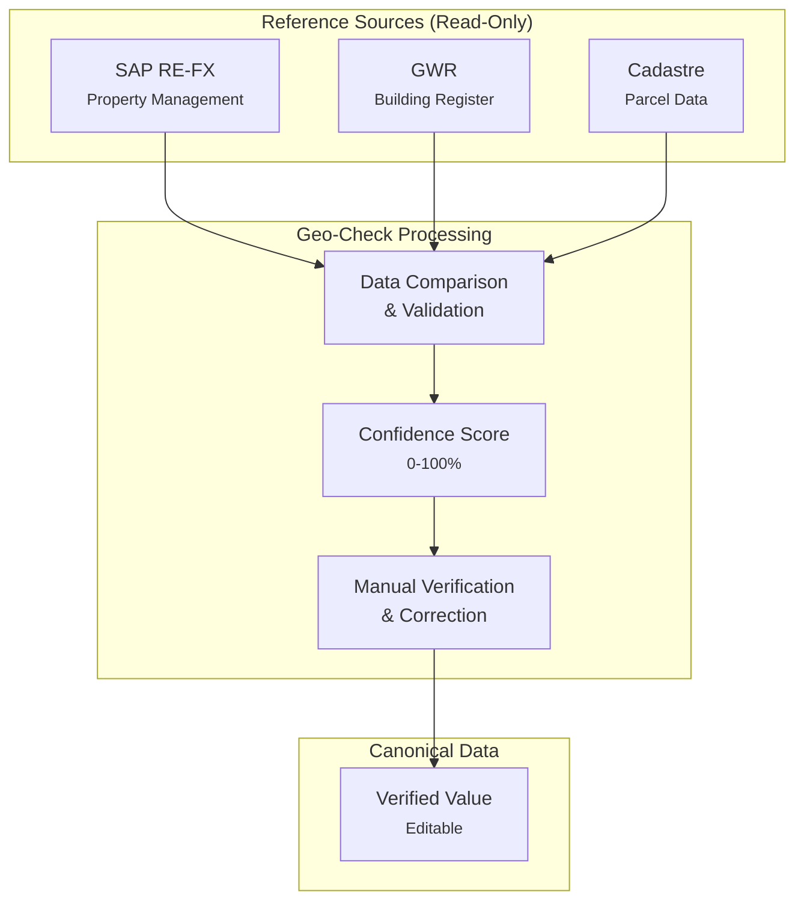
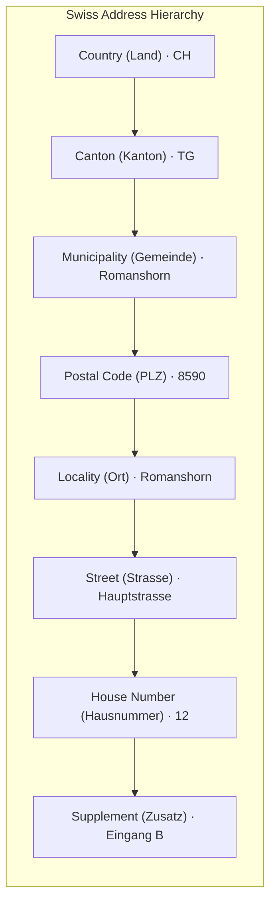

# DATABASE.md - Geo-Check Data Model

This document defines the conceptual data model for the Geo-Check application. It serves as the authoritative reference for data structures, field definitions, and code lists.

---

## 1. Architecture Overview

Geo-Check manages Swiss federal building data by comparing records from multiple authoritative sources and maintaining a canonical verified value.



### Data Sources

| Source | Purpose | Editable |
|--------|---------|----------|
| **SAP RE-FX** | Federal property management system | No (reference) |
| **GWR** | Swiss Federal Register of Buildings and Dwellings | No (reference) |
| **Cadastre** | Official parcel and building geometry data | No (reference) |
| **Value** | Canonical verified value maintained by BBL | Yes |

### Three-Value Pattern

Each comparable field follows this structure:

```json
{
  "fieldName": {
    "sap": "...",      // SAP RE-FX value (read-only reference)
    "gwr": "...",      // GWR value (read-only reference)
    "value": "...",    // Canonical verified value (editable)
    "match": false     // Whether all three values match
  }
}
```

---

## 2. Building Entity

The primary entity representing a federal building record.

### 2.1 Top-Level Attributes

| Attribute | Type | Required | Description |
|-----------|------|----------|-------------|
| `id` | string | Yes | SAP property ID (format: `XXXX/YYYY/ZZ`) |
| `egid` | string | No | GWR building identifier (EGID) |
| `egrid` | string | No | Land register parcel identifier (E-GRID) |
| `name` | string | Yes | Display name (City, Street) |
| `lat` | number | Yes | WGS84 latitude (canonical) |
| `lng` | number | Yes | WGS84 longitude (canonical) |
| `parcelArea` | number | No | Parcel area in m² (from cadastre) |
| `footprintArea` | number | No | Building footprint area in m² (from cadastre) |
| `confidence` | object | Yes | Confidence scores per source |
| `assignee` | string | No | Assigned team member |
| `kanbanStatus` | string | Yes | Workflow status |
| `priority` | string | Yes | Task priority |
| `dueDate` | string | No | ISO 8601 date |
| `lastUpdate` | string | Yes | ISO 8601 timestamp |
| `lastUpdateBy` | string | Yes | Last editor name |
| `data` | object | Yes | Compared field values |

### 2.2 Complete Structure

```json
{
  "id": "1080/2020/AA",
  "egid": "2340212",
  "egrid": "CH943571236489",
  "name": "Romanshorn, Friedrichshafnerstrasse 12",

  "lat": 47.5656,
  "lng": 9.3744,
  "parcelArea": 1250,
  "footprintArea": 480,

  "confidence": {
    "total": 67,
    "sap": 100,
    "gwr": 100
  },

  "assignee": "M. Keller",
  "kanbanStatus": "inprogress",
  "priority": "medium",
  "dueDate": "2026-02-15",
  "lastUpdate": "2026-01-27T14:30:00Z",
  "lastUpdateBy": "M. Keller",

  "data": {
    "country":    { "sap": "CH", "gwr": "CH", "value": "CH", "match": true },
    "kanton":     { "sap": "TG", "gwr": "TG", "value": "TG", "match": true },
    "gemeinde":   { "sap": "Romanshorn", "gwr": "Romanshorn", "value": "Romanshorn", "match": true },
    "plz":        { "sap": "8590", "gwr": "8590", "value": "8590", "match": true },
    "ort":        { "sap": "Romanshorn", "gwr": "Romanshorn", "value": "Romanshorn", "match": true },
    "strasse":    { "sap": "Friedrichshafnerstr.", "gwr": "Friedrichshafnerstrasse", "value": "Friedrichshafnerstrasse", "match": false },
    "hausnummer": { "sap": "12", "gwr": "12", "value": "12", "match": true },
    "zusatz":     { "sap": "", "gwr": "", "value": "", "match": true },
    "gkat":       { "sap": "1060", "gwr": "1060", "value": "1060", "match": true },
    "gklas":      { "sap": "1220", "gwr": "1220", "value": "1220", "match": true },
    "gbaup":      { "sap": "8014", "gwr": "8014", "value": "8014", "match": true },
    "coords":     { "sap": "47.5650, 9.3740", "gwr": "47.5656, 9.3744", "value": "47.5656, 9.3744", "match": false }
  }
}
```

### 2.3 Confidence Object

```json
{
  "total": 67,
  "sap": 100,
  "gwr": 100
}
```

| Field | Range | Description |
|-------|-------|-------------|
| `total` | 0-100 | Weighted overall confidence |
| `sap` | 0-100 | SAP RE-FX data completeness/match rate |
| `gwr` | 0-100 | GWR data completeness/match rate |

**Confidence Thresholds:**

| Level | Range | Color |
|-------|-------|-------|
| Critical | < 50% | Red |
| Warning | 50-80% | Orange |
| OK | >= 80% | Green |

---

## 3. Address Components

### 3.1 Hierarchy

Swiss addresses follow a hierarchical structure. For federal buildings, we track both the official municipality (Gemeinde) and the postal locality (Ort), as these can differ.



### 3.2 Field Definitions

Fields are categorized by importance for daily verification tasks:

| Field | German | Example | Priority | Description |
|-------|--------|---------|----------|-------------|
| `plz` | PLZ | "8590" | **Primary** | 4-digit Swiss postal code |
| `ort` | Ort | "Romanshorn" | **Primary** | Postal locality name (can differ from Gemeinde) |
| `strasse` | Strasse | "Hauptstrasse" | **Primary** | Street name without house number |
| `hausnummer` | Hausnr. | "12" | **Primary** | House/building number (may include letters: "12a") |
| `country` | Land | "CH" | Secondary | ISO 3166-1 alpha-2 country code. Required for border cases. |
| `kanton` | Kanton | "TG" | Secondary | 2-letter canton abbreviation |
| `gemeinde` | Gemeinde | "Romanshorn" | Secondary | Official municipality name (BFS Gemeindenummer) |
| `zusatz` | Zusatz | "Eingang B" | Secondary | Address supplement (entrance, floor, c/o, etc.) |

**Priority Levels:**
- **Primary**: Essential for address verification, always visible
- **Secondary**: Supplementary context, hidden by default (expandable)

### 3.3 Gemeinde vs. Ort

In Switzerland, the official municipality (Gemeinde) and postal locality (Ort) can differ:

| Situation | Gemeinde | Ort | PLZ |
|-----------|----------|-----|-----|
| Same | Zürich | Zürich | 8001 |
| Different | Arlesheim | Münchenstein | 4142 |
| Multiple PLZ | Bern | Bern | 3000-3030 |

---

## 4. Parcel & Building Geometry

### 4.1 Identifiers

| Field | Description | Example | Priority |
|-------|-------------|---------|----------|
| `egid` | Eidgenössischer Gebäudeidentifikator (GWR building ID) | "2340212" | **Primary** |
| `egrid` | Eidgenössischer Grundstücksidentifikator (E-GRID parcel ID) | "CH943571236489" | Secondary |
| `lat` | WGS84 latitude | "47.5656" | **Primary** |
| `lng` | WGS84 longitude | "9.3744" | **Primary** |

**EGRID Format:** `CH` + 12 digits (unique across Switzerland)

### 4.2 Area Fields

| Field | Unit | Source | Description |
|-------|------|--------|-------------|
| `parcelArea` | m² | Cadastre | Total parcel (Grundstück) area |
| `footprintArea` | m² | Cadastre | Building footprint (Gebäudegrundfläche) |

These areas help validate address correctness:
- Large discrepancy between SAP/GWR building size and footprint suggests wrong building
- Parcel area helps identify if coordinates fall within expected boundaries

---

## 5. Building Classification

All building classification fields are **Secondary** priority (hidden by default).

### 5.1 Category (GKAT)

High-level building classification:

| Code | Short | Description |
|------|-------|-------------|
| 1010 | Prov. Unterkunft | Provisorische Unterkunft |
| 1020 | Mit Wohnnutzung | Gebäude mit ausschliesslicher Wohnnutzung |
| 1021 | Einfamilienhaus | Einfamilienhaus, ohne Nebennutzung |
| 1025 | Mehrfamilienhaus | Mehrfamilienhaus, ohne Nebennutzung |
| 1030 | Wohngebäude m. Nebennutzung | Andere Wohngebäude (mit Nebennutzung) |
| 1040 | Mit teilw. Wohnnutzung | Gebäude mit teilweiser Wohnnutzung |
| 1060 | Ohne Wohnnutzung | Gebäude ohne Wohnnutzung |
| 1080 | Sonderbau | Sonderbau |

### 5.2 Class (GKLAS)

Detailed building classification (EUROSTAT-based):

| Code | Short | Description |
|------|-------|-------------|
| 1110 | Gebäude mit 1 Wohnung | Gebäude mit einer Wohnung |
| 1121 | Gebäude mit 2 Wohnungen | Gebäude mit zwei Wohnungen |
| 1122 | Gebäude mit 3+ Wohnungen | Gebäude mit drei oder mehr Wohnungen |
| 1130 | Wohngeb. f. Gemeinschaften | Wohngebäude für Gemeinschaften |
| 1211 | Hotelgebäude | Hotelgebäude |
| 1212 | Andere Beherbergung | Andere Gebäude für kurzfristige Beherbergung |
| 1220 | Bürogebäude | Bürogebäude |
| 1230 | Gross- und Einzelhandel | Gross- und Einzelhandelsgebäude |
| 1231 | Restaurants und Bars | Restaurants und Bars in Gebäuden ohne Wohnnutzung |
| 1241 | Verkehr / Kommunikation | Gebäude des Verkehrs- und Nachrichtenwesens ohne Garagen |
| 1242 | Garagengebäude | Garagengebäude |
| 1251 | Industriegebäude | Industriegebäude |
| 1252 | Behälter, Silo, Lager | Behälter, Silos und Lagergebäude |
| 1261 | Kultur-/Freizeitstätte | Gebäude für Kultur- und Freizeitzwecke |
| 1262 | Museum / Bibliothek | Museen und Bibliotheken |
| 1263 | Schul-/Hochschulgebäude | Schul- und Hochschulgebäude, Forschungseinrichtungen |
| 1264 | Krankenhaus | Krankenhäuser und Facheinrichtungen des Gesundheitswesens |
| 1265 | Sporthalle | Sporthallen |
| 1271 | Landw. Betriebsgebäude | Landwirtschaftliche Betriebsgebäude |
| 1272 | Kirche / Kultgebäude | Kirchen und sonstige Kultgebäude |
| 1273 | Denkmal | Denkmäler oder unter Denkmalschutz stehende Bauwerke |
| 1274 | Sonstiger Hochbau | Sonstige Hochbauten, anderweitig nicht genannt |
| 1275 | Andere kollektive Unterkünfte | Andere Gebäude für die kollektive Unterkunft |
| 1276 | Tierhaltung | Gebäude für die Tierhaltung |
| 1277 | Pflanzenbau | Gebäude für den Pflanzenbau |
| 1278 | Andere landw. Gebäude | Andere landwirtschaftliche Gebäude |

---

## 6. Workflow & Status

### 6.1 Kanban Status

| Status | German | Description |
|--------|--------|-------------|
| `backlog` | Backlog | Not yet started |
| `inprogress` | In Bearbeitung | Currently being worked on |
| `clarification` | Abklärung | Requires external input |
| `done` | Erledigt | Completed |

### 6.2 Priority

| Priority | German | Criteria |
|----------|--------|----------|
| `high` | Hoch | Critical data issues, urgent deadline |
| `medium` | Mittel | Moderate issues, standard deadline |
| `low` | Niedrig | Minor issues, no urgency |

---

## 7. Related Entities

### 7.1 User

```json
{
  "id": 1,
  "name": "M. Keller",
  "initials": "MK",
  "role": "Admin"
}
```

| Role | Description |
|------|-------------|
| `Admin` | Full access, can manage users |
| `Bearbeiter` | Can edit buildings, manage tasks |
| `Leser` | Read-only access |

### 7.2 Error

```json
{
  "type": "coords",
  "title": "Koordinatenabweichung",
  "description": "SAP - GWR: 47m Differenz",
  "severity": "warning"
}
```

| Severity | Description |
|----------|-------------|
| `critical` | Major data inconsistency |
| `warning` | Notable discrepancy |
| `minor` | Small difference |

### 7.3 Comment

```json
{
  "author": "M. Keller",
  "date": "2026-01-12T14:32:00Z",
  "text": "Vor Ort verifiziert - GWR Position ist korrekt.",
  "system": false
}
```

### 7.4 Event

```json
{
  "id": 1,
  "buildingId": "1080/2020/AA",
  "type": "status_change",
  "action": "Status geändert",
  "user": "M. Keller",
  "timestamp": "2026-01-12T14:32:00Z",
  "details": "backlog → inprogress"
}
```

| Event Type | Description |
|------------|-------------|
| `comment` | Comment added |
| `assignment` | Assignee changed |
| `detection` | Error detected |
| `status_change` | Status updated |
| `value_change` | Canonical value edited |

---

## 8. Code Lists

### 8.1 Building Status (GSTAT)

| Code | Short | Description |
|------|-------|-------------|
| 1001 | projektiert | Gebäude projektiert |
| 1002 | bewilligt | Gebäude bewilligt |
| 1003 | im Bau | Gebäude im Bau |
| 1004 | bestehend | Gebäude bestehend |
| 1005 | nicht nutzbar | Gebäude nicht nutzbar |
| 1007 | abgebrochen | Gebäude abgebrochen |
| 1008 | nicht realisiert | Gebäude nicht realisiert |

### 8.2 Construction Period (GBAUP)

| Code | Short | Description |
|------|-------|-------------|
| 8011 | Vor 1919 | Periode vor 1919 |
| 8012 | 1919-1945 | Periode von 1919 bis 1945 |
| 8013 | 1946-1960 | Periode von 1946 bis 1960 |
| 8014 | 1961-1970 | Periode von 1961 bis 1970 |
| 8015 | 1971-1980 | Periode von 1971 bis 1980 |
| 8016 | 1981-1985 | Periode von 1981 bis 1985 |
| 8017 | 1986-1990 | Periode von 1986 bis 1990 |
| 8018 | 1991-1995 | Periode von 1991 bis 1995 |
| 8019 | 1996-2000 | Periode von 1996 bis 2000 |
| 8020 | 2001-2005 | Periode von 2001 bis 2005 |
| 8021 | 2006-2010 | Periode von 2006 bis 2010 |
| 8022 | 2011-2015 | Periode von 2011 bis 2015 |
| 8023 | Nach 2015 | Periode nach 2015 |

### 8.3 Energy Source for Heating (GENH1)

| Code | Short | Description |
|------|-------|-------------|
| 7500 | Keine | Keine |
| 7501 | Luft | Luft |
| 7510 | Erdwärme (generisch) | Erdwärme (generisch) |
| 7511 | Erdwärmesonde | Erdwärmesonde |
| 7512 | Erdregister | Erdregister |
| 7513 | Wasser | Wasser (Grundwasser, Oberflächenwasser, Abwasser) |
| 7520 | Gas | Gas |
| 7530 | Heizöl | Heizöl |
| 7540 | Holz (generisch) | Holz (generisch) |
| 7541 | Holz (Stückholz) | Holz (Stückholz) |
| 7542 | Holz (Pellets) | Holz (Pellets) |
| 7543 | Holz (Schnitzel) | Holz (Schnitzel) |
| 7550 | Abwärme | Abwärme (innerhalb des Gebäudes) |
| 7560 | Elektrizität | Elektrizität |
| 7570 | Sonne (thermisch) | Sonne (thermisch) |
| 7580 | Fernwärme (generisch) | Fernwärme (generisch) |
| 7581 | Fernwärme (Hochtemperatur) | Fernwärme (Hochtemperatur) |
| 7582 | Fernwärme (Niedertemperatur) | Fernwärme (Niedertemperatur) |
| 7598 | Unbestimmt | Unbestimmt |
| 7599 | Andere | Andere |

### 8.4 Heat Generator (GWAERZH1)

| Code | Short | Description |
|------|-------|-------------|
| 7400 | Kein Wärmeerzeuger | Kein Wärmeerzeuger |
| 7410 | Wärmepumpe f. ein Geb. | Wärmepumpe für ein Gebäude |
| 7411 | Wärmepumpe f. mehr. Geb. | Wärmepumpe für mehrere Gebäude |
| 7420 | Therm. Solaranlage ein Geb. | Thermische Solaranlage für ein Gebäude |
| 7421 | Therm. Solaranlage mehr. Geb. | Thermische Solaranlage für mehrere Gebäude |
| 7430 | Heizkessel (gen.) ein Geb. | Heizkessel (generisch) für ein Gebäude |
| 7431 | Heizkessel (gen.) mehr. Geb. | Heizkessel (generisch) für mehrere Gebäude |
| 7432 | Heizkessel nicht kond. ein Geb. | Heizkessel nicht kondensierend für ein Gebäude |
| 7433 | Heizkessel nicht kond. mehr. Geb. | Heizkessel nicht kondensierend für mehrere Gebäude |
| 7434 | Heizkessel kond. ein Geb. | Heizkessel kondensierend für ein Gebäude |
| 7435 | Heizkessel kond. mehr. Geb. | Heizkessel kondensierend für mehrere Gebäude |
| 7436 | Ofen | Ofen |
| 7440 | WKK-Anlage ein Geb. | Wärmekraftkopplungsanlage für ein Gebäude |
| 7441 | WKK-Anlage mehr. Geb. | Wärmekraftkopplungsanlage für mehrere Gebäude |
| 7450 | Elektro-Zentralheizung ein Geb. | Elektrospeicher-Zentralheizung für ein Gebäude |
| 7451 | Elektro-Zentralheizung mehr. Geb. | Elektrospeicher-Zentralheizung für mehrere Gebäude |
| 7452 | Elektro direkt | Elektro direkt |
| 7460 | Wärmetauscher ein Geb. | Wärmetauscher (inkl. Fernwärme) für ein Gebäude |
| 7461 | Wärmetauscher mehr. Geb. | Wärmetauscher (inkl. Fernwärme) für mehrere Gebäude |
| 7499 | Andere | Andere |

### 8.5 Heating Type (GHEIZ)

| Code | Short | Description |
|------|-------|-------------|
| 7100 | Keine Heizung | Keine Heizung |
| 7101 | Einzelofenheizung | Einzelofenheizung |
| 7102 | Etagenheizung | Etagenheizung |
| 7103 | Zentralheizung f. Geb. | Zentralheizung für das Gebäude |
| 7104 | ZH f. mehrere Gebäude | Zentralheizung für mehrere Gebäude |
| 7105 | Fernwärmeversorgung | Öffentliche Fernwärmeversorgung |
| 7109 | Andere Heizungsart | Andere Heizungsart |

### 8.6 Swiss Cantons

| Code | Name (DE) | Name (FR) | Name (IT) |
|------|-----------|-----------|-----------|
| AG | Aargau | Argovie | Argovia |
| AI | Appenzell Innerrhoden | Appenzell Rhodes-Intérieures | Appenzello Interno |
| AR | Appenzell Ausserrhoden | Appenzell Rhodes-Extérieures | Appenzello Esterno |
| BE | Bern | Berne | Berna |
| BL | Basel-Landschaft | Bâle-Campagne | Basilea Campagna |
| BS | Basel-Stadt | Bâle-Ville | Basilea Città |
| FR | Freiburg | Fribourg | Friburgo |
| GE | Genf | Genève | Ginevra |
| GL | Glarus | Glaris | Glarona |
| GR | Graubünden | Grisons | Grigioni |
| JU | Jura | Jura | Giura |
| LU | Luzern | Lucerne | Lucerna |
| NE | Neuenburg | Neuchâtel | Neuchâtel |
| NW | Nidwalden | Nidwald | Nidvaldo |
| OW | Obwalden | Obwald | Obvaldo |
| SG | St. Gallen | Saint-Gall | San Gallo |
| SH | Schaffhausen | Schaffhouse | Sciaffusa |
| SO | Solothurn | Soleure | Soletta |
| SZ | Schwyz | Schwyz | Svitto |
| TG | Thurgau | Thurgovie | Turgovia |
| TI | Tessin | Tessin | Ticino |
| UR | Uri | Uri | Uri |
| VD | Waadt | Vaud | Vaud |
| VS | Wallis | Valais | Vallese |
| ZG | Zug | Zoug | Zugo |
| ZH | Zürich | Zurich | Zurigo |

---

## 9. Match Logic

### 9.1 Field Comparison

The `match` flag is `true` when all three values (SAP, GWR, canonical) are equivalent:

```javascript
match = normalize(sap) === normalize(gwr) && normalize(gwr) === normalize(value)
```

**Normalization Rules:**
- Case-insensitive string comparison
- Whitespace trimming
- Street abbreviation expansion (Str. → Strasse)
- Empty values (`""`, `"—"`, `null`) treated as missing

### 9.2 Coordinate Matching

Coordinates match if within tolerance:

| Tolerance | Use Case |
|-----------|----------|
| 5m | Urban areas |
| 10m | Rural areas |

### 9.3 Confidence Calculation

```
total = Σ(field_weight × field_match) / Σ(field_weight)
```

Fields with missing values in all sources are excluded from calculation.

---

## 10. References

- [GWR Merkmalskatalog 4.3](https://www.housing-stat.ch/catalog/de/4.3/final) - Official attribute catalog
- [E-GRID Specification](https://www.cadastre.ch/de/manual-av/service/egrid.html) - Parcel identifier format
- [Swisstopo API](https://api3.geo.admin.ch/) - Swiss geographic services
- [BFS Gemeinderegister](https://www.bfs.admin.ch/bfs/de/home/grundlagen/agvch.html) - Municipality register

---

*Document version: 2.0*
*Last updated: 2026-02-01*
