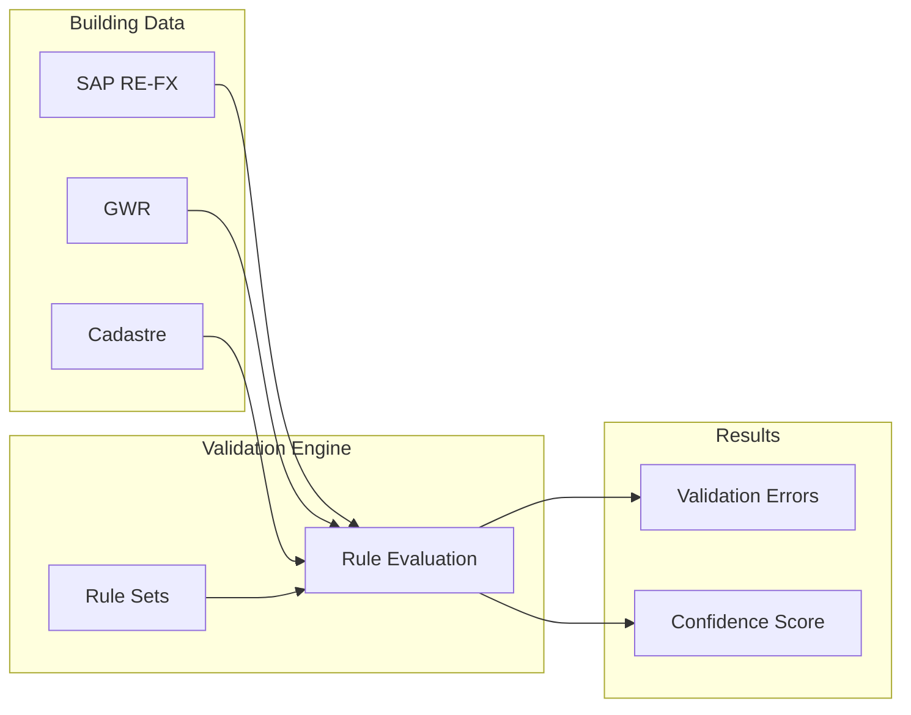
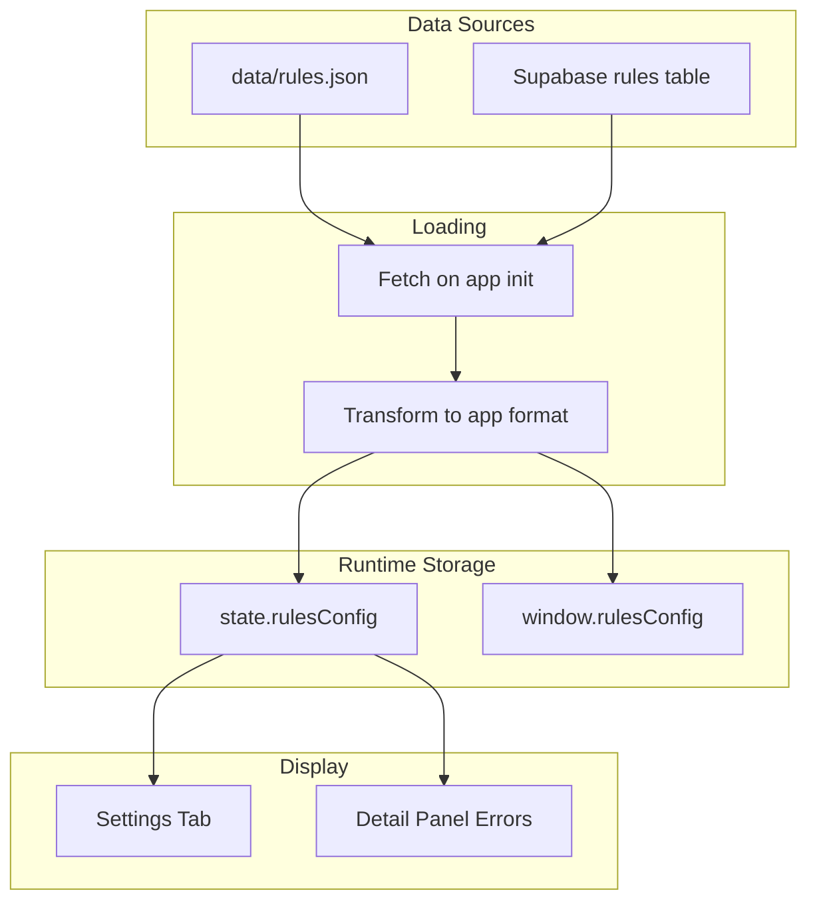

# RULES.md - Geo-Check Validation Rules

This document describes the validation rule system used by Geo-Check to ensure data quality across Swiss federal building records.

---

## 1. Goals

The validation system is designed to achieve the following objectives:

### 1.1 Source Consistency

**Ensure SAP RE-FX data is consistent with national authoritative databases.**

Federal building records in SAP RE-FX must align with:

| Source | Authoritative For | Key Identifiers |
|--------|-------------------|-----------------|
| **GWR** (Eidg. Gebäude- und Wohnungsregister) | Building attributes, EGID | EGID, GKAT, GKLAS, GSTAT |
| **Cadastre** (Amtliche Vermessung) | Parcel boundaries, land ownership | EGRID, parcel geometry |
| **BFS** (Bundesamt für Statistik) | Municipality codes, administrative boundaries | BFS-Nr, canton codes |

When discrepancies exist, the system flags them for manual review. The **canonical value** follows this priority: `korrektur` (manual correction) → `GWR` → `SAP`.

### 1.2 Spatial Accuracy

**Ensure addresses and coordinates are correct and mutually consistent.**

- Coordinates must fall within Swiss borders
- Address components (PLZ, Ort, Strasse) must resolve to a location near the stored coordinates
- Coordinate precision must be sufficient for building-level identification (≥5 decimal places)
- Tolerance thresholds account for legitimate differences:
  - **Urban areas:** 5-10m deviation acceptable
  - **Rural areas:** 10-20m deviation acceptable
  - **Street name variations:** Abbreviations (Str./Strasse) are normalized before comparison

### 1.3 Actionable Feedback

**Avoid overwhelming data stewards with unnecessary warnings.**

Every validation error must be:

| Principle | Implementation |
|-----------|----------------|
| **Actionable** | Clear what needs to be fixed and how |
| **Relevant** | Only flag issues that matter for data quality |
| **Prioritized** | Severity levels (error > warning > info) guide workflow |
| **Contextual** | Show related data to help resolve the issue |

**What we avoid:**
- Duplicate errors for the same root cause
- Warnings for edge cases that don't affect data usability
- Errors that cannot be resolved by the data steward

### 1.4 Prioritization

**Help users focus on critical issues first.**

The system supports prioritization through:

1. **Severity Levels:** Errors must be fixed, warnings should be reviewed, info is for awareness
2. **Confidence Scores:** Buildings with low confidence (< 50%) are flagged as critical
3. **Building Priority:** High/medium/low based on business importance
4. **Due Dates:** Time-sensitive corrections are tracked

Data stewards can filter by severity, confidence, and priority to focus their work.

### 1.5 Traceability

**Track validation history for audit and accountability.**

The system maintains:

| What | Where | Purpose |
|------|-------|---------|
| Error detection timestamp | `errors.detectedAt` | When issue was first found |
| Error resolution timestamp | `errors.resolvedAt` | When issue was fixed |
| Last update timestamp | `buildings.lastUpdate` | When record was modified |
| Update author | `buildings.lastUpdateBy` | Who made the change |
| Activity log | `events` | Full history of actions |

### 1.6 Data Completeness

**Ensure required fields are populated before sign-off.**

Buildings cannot be marked as "Erledigt" (done) until:

- All **error**-level validation issues are resolved
- Required fields (EGID, address, coordinates) are present
- A responsible person has verified the data

---

## 2. Overview

Geo-Check validates building data by comparing records from multiple authoritative sources (SAP RE-FX, GWR, Cadastre) and checking for completeness, consistency, and plausibility. The validation system uses declarative rules organized into rule sets.



### Key Concepts

| Concept | Description |
|---------|-------------|
| **Rule Set** | A logical grouping of related validation rules |
| **Rule** | A single validation check with operator, expected value, and severity |
| **Operator** | The type of comparison or check to perform |
| **Severity** | The importance level of a rule violation (error, warning, info) |
| **Error** | A detected rule violation on a specific building |

---

## 3. Rule Sets

Rules are organized into 5 rule sets, each targeting a specific validation domain.

### 3.1 GWR Grundprüfungen (`gwr-basic`)

Basic validations against the Swiss Federal Register of Buildings and Dwellings (GWR).

| Rule ID | Name | Description | Severity |
|---------|------|-------------|----------|
| `gwr-001` | EGID vorhanden | Checks if a valid EGID exists | error |
| `gwr-002` | EGID Format | Validates EGID format (1-9 digits, no leading zeros) | error |
| `gwr-003` | Gebäudestatus gültig | Checks if building status is a valid GWR value | error |
| `gwr-004` | Baujahr plausibel | Checks if construction year is plausible (1800-2030) | warning |

### 3.2 Geometrie-Qualität (`geo-quality`)

Validations for geodata quality and coordinate accuracy.

| Rule ID | Name | Description | Severity |
|---------|------|-------------|----------|
| `geo-001` | Koordinaten in Schweiz | Checks if coordinates are within Swiss borders | error |
| `geo-002` | Koordinaten-Präzision | Checks coordinate precision (min. 5 decimal places) | warning |
| `geo-003` | Adresse-Koordinaten-Match | Checks if address and coordinates match (< 50m) | warning |

### 3.3 SAP RE-FX Abgleich (`sap-refx`)

Validations against the SAP Real Estate system.

| Rule ID | Name | Description | Severity |
|---------|------|-------------|----------|
| `sap-001` | RE-Objekt vorhanden | Checks if a linked SAP RE object exists | warning |
| `sap-002` | Fläche plausibel | Checks if area is plausible (1-1,000,000 m²) | warning |
| `sap-003` | Flächen-Abweichung GWR | Checks SAP/GWR area deviation (max 10%) | warning |

### 3.4 ÖREB Prüfungen (`oereb-check`)

Validations against the ÖREB cadastre (public law restrictions on land ownership).

| Rule ID | Name | Description | Severity |
|---------|------|-------------|----------|
| `oereb-001` | ÖREB-Kanton aktiv | Checks if canton provides ÖREB data | info |
| `oereb-002` | Grundstück-ID vorhanden | Checks if parcel ID exists for ÖREB queries | warning |

### 3.5 Vollständigkeit (`completeness`)

Checks for data completeness.

| Rule ID | Name | Description | Severity |
|---------|------|-------------|----------|
| `comp-001` | Pflichtfelder | Checks if all required fields are filled | error |
| `comp-002` | Portfolio zugewiesen | Checks if building is assigned to a portfolio | warning |
| `comp-003` | Verantwortlicher zugewiesen | Checks if a responsible person is assigned | info |

---

## 4. Operators

Operators define the type of validation check performed. Each rule specifies one operator.

### 4.1 Existence Operators

| Operator | Description | Example |
|----------|-------------|---------|
| `exists` | Value is present and not empty | `{ "attribute": "egid", "operator": "exists" }` |
| `not_exists` | Value is absent or empty | `{ "attribute": "korrektur", "operator": "not_exists" }` |
| `all_exist` | All specified attributes are present | `{ "attribute": ["name", "plz", "ort"], "operator": "all_exist" }` |

### 4.2 Comparison Operators

| Operator | Description | Example |
|----------|-------------|---------|
| `equals` | Exact match | `{ "attribute": "country", "operator": "equals", "value": "CH" }` |
| `not_equals` | Not equal | `{ "attribute": "gstat", "operator": "not_equals", "value": "1007" }` |
| `greater_than` | Numeric greater than | `{ "attribute": "garea", "operator": "greater_than", "value": 0 }` |
| `less_than` | Numeric less than | `{ "attribute": "distance", "operator": "less_than", "value": 50 }` |
| `between` | Value in numeric range | `{ "attribute": "baujahr", "operator": "between", "value": [1800, 2030] }` |

### 4.3 Set Operators

| Operator | Description | Example |
|----------|-------------|---------|
| `in` | Value in allowed list | `{ "attribute": "gwr_status", "operator": "in", "value": ["projektiert", "bestehend"] }` |
| `not_in` | Value not in list | `{ "attribute": "kanton", "operator": "not_in", "value": ["FL"] }` |

### 4.4 String Operators

| Operator | Description | Example |
|----------|-------------|---------|
| `matches` | Matches regex pattern | `{ "attribute": "egid", "operator": "matches", "value": "^[1-9][0-9]{0,8}$" }` |
| `contains` | Contains substring | `{ "attribute": "strasse", "operator": "contains", "value": "strasse" }` |

### 4.5 Specialized Operators

| Operator | Description | Example |
|----------|-------------|---------|
| `within_bounds` | Coordinates within geographic bounds | See example below |
| `decimal_places` | Minimum decimal precision | `{ "attribute": ["lat", "lng"], "operator": "decimal_places", "value": 5 }` |
| `deviation_percent` | Percentage deviation between two values | `{ "attribute": ["sap_flaeche", "gwr_flaeche"], "operator": "deviation_percent", "value": 10 }` |
| `lookup` | Check against lookup table | See example below |

**within_bounds Example:**
```json
{
  "attribute": ["lat", "lng"],
  "operator": "within_bounds",
  "value": {
    "lat_min": 45.81,
    "lat_max": 47.81,
    "lng_min": 5.95,
    "lng_max": 10.49
  }
}
```

**lookup Example:**
```json
{
  "attribute": "kanton",
  "operator": "lookup",
  "lookupTable": "oereb_kantone",
  "lookupField": "active",
  "value": true
}
```

---

## 5. Severity Levels

Each rule has a severity level that determines how violations are prioritized and displayed.

| Level | German | Priority | Color | Description |
|-------|--------|----------|-------|-------------|
| `error` | Fehler | 1 (highest) | Red | Critical issue that must be corrected |
| `warning` | Warnung | 2 | Orange | Potential problem that should be reviewed |
| `info` | Hinweis | 3 (lowest) | Blue | Information for awareness |

### Display in UI

- **Detail Panel:** Errors are shown in the "Fehler" accordion section with severity badges
- **Statistics:** Error counts are aggregated by source (GEO, GWR, SAP, ADR)
- **Kanban:** Cards show error indicators for buildings with critical issues

---

## 6. Error Code Catalog

Validation errors are identified by prefixed codes that indicate the error domain.

### 6.1 GEO Errors (Geometry/Coordinates)

| Code | Description | Severity |
|------|-------------|----------|
| `GEO-001` | Coordinates missing or invalid | error |
| `GEO-012` | Coordinate deviation between sources | warning |

### 6.2 GWR Errors (Building Register)

| Code | Description | Severity |
|------|-------------|----------|
| `GWR-003` | Building not registered in GWR | error |
| `GWR-005` | EGID mismatch or refers to different building | error |
| `GWR-009` | Floor count discrepancy | info |
| `GWR-011` | Building area deviation | info |

### 6.3 SAP Errors (SAP RE-FX)

| Code | Description | Severity |
|------|-------------|----------|
| `SAP-008` | Usage type not recorded | warning |
| `SAP-015` | Construction year discrepancy | info |
| `SAP-016` | Construction period mismatch | warning |
| `SAP-020` | Data not updated for extended period | warning |

### 6.4 ADR Errors (Address)

| Code | Description | Severity |
|------|-------------|----------|
| `ADR-002` | Postal code deviation | warning |
| `ADR-004` | House number supplement missing | warning |
| `ADR-007` | Street name deviation | warning |

---

## 7. Rule Structure

### 7.1 Rule Set Schema

```json
{
  "id": "gwr-basic",
  "name": "GWR Grundprüfungen",
  "description": "Grundlegende Validierungen gegen das GWR",
  "enabled": true,
  "entityType": "building",
  "rules": [...]
}
```

| Field | Type | Required | Description |
|-------|------|----------|-------------|
| `id` | string | Yes | Unique rule set identifier |
| `name` | string | Yes | German display name |
| `description` | string | Yes | Rule set description |
| `enabled` | boolean | Yes | Whether rule set is active |
| `entityType` | string | Yes | Target entity type (currently only "building") |
| `rules` | array | Yes | Array of rule definitions |

### 7.2 Rule Schema

```json
{
  "id": "gwr-001",
  "name": "EGID vorhanden",
  "description": "Prüft ob eine gültige EGID vorhanden ist",
  "attribute": "egid",
  "operator": "exists",
  "value": null,
  "severity": "error",
  "message": "Keine EGID vorhanden"
}
```

| Field | Type | Required | Description |
|-------|------|----------|-------------|
| `id` | string | Yes | Unique rule identifier |
| `name` | string | Yes | Short German name |
| `description` | string | Yes | Full description of what the rule checks |
| `attribute` | string/array | Yes | Field(s) to validate |
| `operator` | string | Yes | Validation operator |
| `value` | any | No | Expected value (depends on operator) |
| `unit` | string | No | Unit for numeric values (e.g., "meters") |
| `severity` | string | Yes | error, warning, or info |
| `message` | string | Yes | Error message template (supports `{value}`, `{attribute}` placeholders) |

---

## 8. Error Storage

### 8.1 Format

Errors are stored in `data/errors.json` as an object keyed by building ID:

```json
{
  "1080/2020/AA": [
    {
      "checkId": "GEO-012",
      "description": "SAP - GWR: 47m Differenz",
      "level": "warning"
    }
  ],
  "1080/2021/AB": [
    {
      "checkId": "GEO-001",
      "description": "Koordinaten in SAP RE-FX fehlen vollständig",
      "level": "error"
    },
    {
      "checkId": "GWR-003",
      "description": "Gebäude im GWR nicht registriert",
      "level": "error"
    }
  ]
}
```

### 8.2 Error Object

| Field | Type | Description |
|-------|------|-------------|
| `checkId` | string | Rule/check identifier (e.g., GEO-012) |
| `description` | string | Human-readable error description |
| `level` | string | Severity: error, warning, info |

### 8.3 Extended Fields (Supabase)

When stored in Supabase, errors include additional fields:

| Field | Type | Description |
|-------|------|-------------|
| `id` | string | Unique error ID (`err-{buildingId}-{seq}`) |
| `field` | string | Affected field name |
| `detectedAt` | string | ISO 8601 timestamp |
| `resolvedAt` | string | Resolution timestamp (null if open) |

---

## 9. Integration Points

### 9.1 UI Display

| Component | Location | Purpose |
|-----------|----------|---------|
| Settings Tab | `#rules-container` | Displays all rule sets with expand/collapse |
| Detail Panel | `#error-table` | Shows errors for selected building |
| Statistics | Chart: "Errors by Source" | Aggregates errors by prefix |

### 9.2 Code References

| File | Function | Purpose |
|------|----------|---------|
| `js/main.js:412-477` | `renderRules()` | Renders rule sets in Settings tab |
| `js/detail-panel.js:203-231` | Error table rendering | Displays errors in detail panel |
| `js/statistics.js:393-448` | `renderSourceChart()` | Error source chart |
| `js/supabase.js:232-252` | `transformRulesFromDB()` | Transforms DB rules to app format |
| `js/state.js:44` | `rulesConfig` | Global rules configuration |

### 9.3 Data Flow



---

## 10. Adding New Rules

### 10.1 Adding to JSON

1. Open `data/rules.json`
2. Find the appropriate rule set (or create a new one)
3. Add your rule to the `rules` array:

```json
{
  "id": "gwr-005",
  "name": "Stockwerkzahl plausibel",
  "description": "Prüft ob die Anzahl Stockwerke plausibel ist (1-50)",
  "attribute": "gastw",
  "operator": "between",
  "value": [1, 50],
  "severity": "warning",
  "message": "Stockwerkzahl {value} ausserhalb des plausiblen Bereichs"
}
```

### 10.2 Creating a New Rule Set

```json
{
  "id": "custom-checks",
  "name": "Benutzerdefinierte Prüfungen",
  "description": "Projektspezifische Validierungen",
  "enabled": true,
  "entityType": "building",
  "rules": [
    // Add rules here
  ]
}
```

### 10.3 Adding to Supabase

For Supabase deployments, add rules via the `rules` and `rule_sets` tables:

```sql
-- Add rule set
INSERT INTO rule_sets (id, name, description, enabled, entity_type)
VALUES ('custom-checks', 'Benutzerdefinierte Prüfungen', '...', true, 'building');

-- Add rule
INSERT INTO rules (id, rule_set_id, name, description, attribute, operator, value, severity, message)
VALUES ('custom-001', 'custom-checks', 'Regel Name', '...', 'fieldName', 'exists', NULL, 'warning', 'Fehlermeldung');
```

---

## 11. Confidence Score Calculation

Validation results contribute to the overall confidence score displayed for each building.

### 10.1 Score Components

| Component | Weight | Description |
|-----------|--------|-------------|
| `georef` | 30% | Geometric data quality |
| `sap` | 35% | SAP RE-FX completeness/match rate |
| `gwr` | 35% | GWR data completeness/match rate |

### 10.2 Calculation

```
total = (georef × 0.30) + (sap × 0.35) + (gwr × 0.35)
```

### 10.3 Thresholds

| Level | Range | Color | CSS Variable |
|-------|-------|-------|--------------|
| Critical | < 50% | Red | `--color-critical` |
| Warning | 50-80% | Orange | `--color-warning` |
| OK | >= 80% | Green | `--color-success` |

---

## 12. References

- [DATABASE.md](./DATABASE.md) - Complete data model documentation
- [GWR Merkmalskatalog](https://www.housing-stat.ch/catalog/de/4.3/final) - Official GWR attributes
- [ÖREB-Kataster](https://www.cadastre.ch/de/oereb.html) - Public law restrictions

---

*Document version: 1.0*
*Last updated: 2026-02-03*
