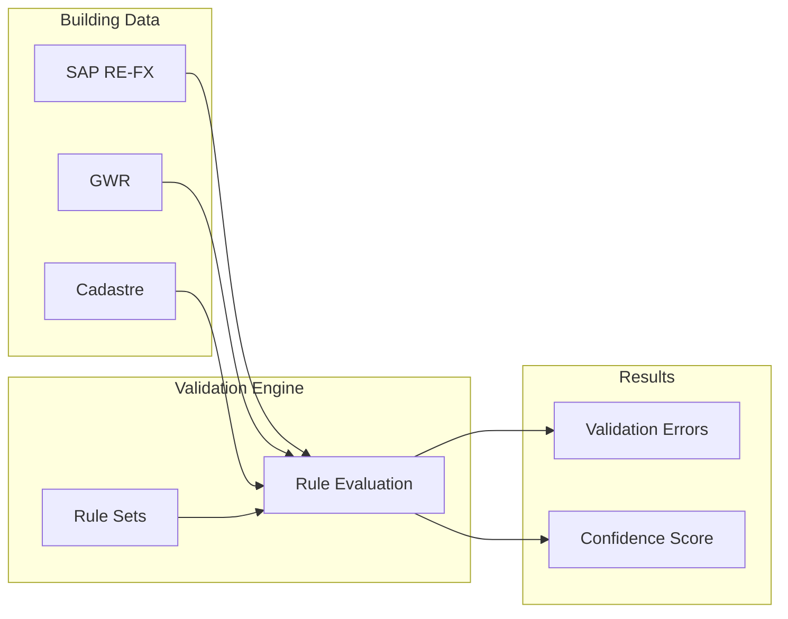
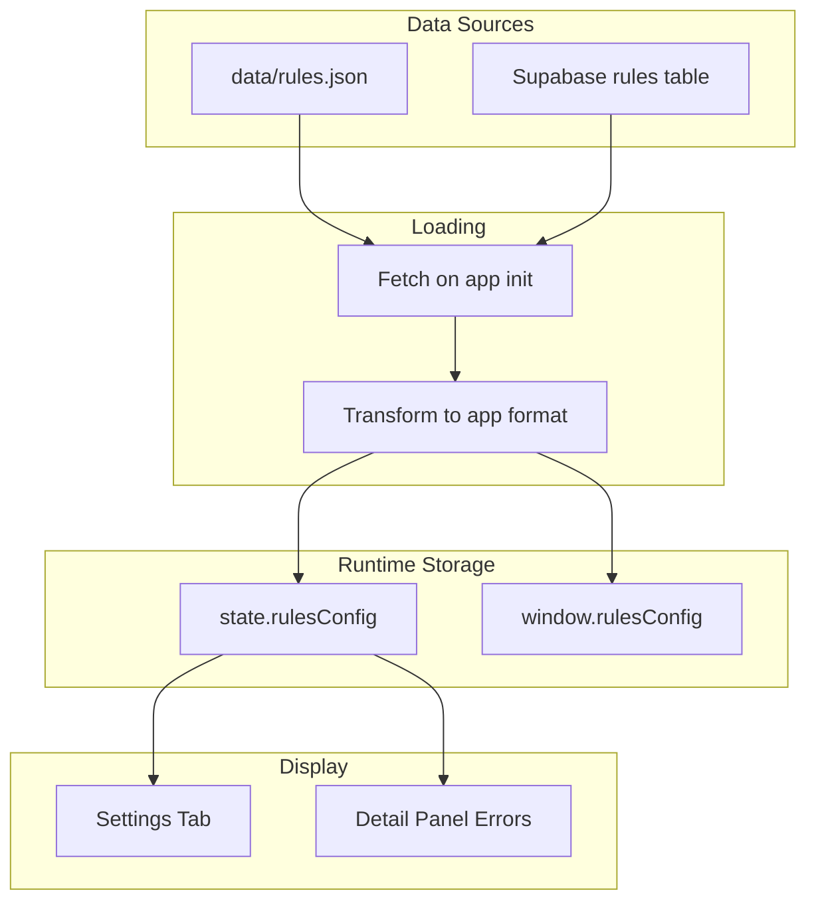

# RULES.md - Geo-Check Validation Rules

This document describes the validation rule system used by Geo-Check to ensure data quality across Swiss federal building records.

---

## 1. Goals

The validation system is designed to achieve the following objectives:

### 1.1 Source Consistency

**Ensure SAP RE-FX data is consistent with national authoritative databases.**

Federal building records in SAP RE-FX must align with:

| Source | Authoritative For | Key Identifiers |
|--------|-------------------|-----------------|
| **GWR** (Eidg. Gebäude- und Wohnungsregister) | Building attributes, EGID | EGID, GKAT, GKLAS, GSTAT |
| **Cadastre** (Amtliche Vermessung) | Parcel boundaries, land ownership | EGRID, parcel geometry |
| **BFS** (Bundesamt für Statistik) | Municipality codes, administrative boundaries | BFS-Nr, canton codes |

When discrepancies exist, the system flags them for manual review. The **canonical value** follows this priority: `korrektur` (manual correction) → `GWR` → `SAP`.

### 1.2 Spatial Accuracy

**Ensure addresses and coordinates are correct and mutually consistent.**

- Coordinates must fall within Swiss borders
- Address components (PLZ, Ort, Strasse) must resolve to a location near the stored coordinates
- Coordinate precision must be sufficient for building-level identification (≥5 decimal places)
- Tolerance thresholds account for legitimate differences:
  - **Urban areas:** 5-10m deviation acceptable
  - **Rural areas:** 10-20m deviation acceptable
  - **Street name variations:** Abbreviations (Str./Strasse) are normalized before comparison

### 1.3 Actionable Feedback

**Avoid overwhelming data stewards with unnecessary warnings.**

Every validation error must be:

| Principle | Implementation |
|-----------|----------------|
| **Actionable** | Clear what needs to be fixed and how |
| **Relevant** | Only flag issues that matter for data quality |
| **Prioritized** | Severity levels (error > warning > info) guide workflow |
| **Contextual** | Show related data to help resolve the issue |

**What we avoid:**
- Duplicate errors for the same root cause
- Warnings for edge cases that don't affect data usability
- Errors that cannot be resolved by the data steward

### 1.4 Prioritization

**Help users focus on critical issues first.**

The system supports prioritization through:

1. **Severity Levels:** Errors must be fixed, warnings should be reviewed, info is for awareness
2. **Confidence Scores:** Buildings with low confidence (< 50%) are flagged as critical
3. **Building Priority:** High/medium/low based on business importance
4. **Due Dates:** Time-sensitive corrections are tracked

Data stewards can filter by severity, confidence, and priority to focus their work.

### 1.5 Traceability

**Track validation history for audit and accountability.**

The system maintains:

| What | Where | Purpose |
|------|-------|---------|
| Error detection timestamp | `errors.detectedAt` | When issue was first found |
| Error resolution timestamp | `errors.resolvedAt` | When issue was fixed |
| Last update timestamp | `buildings.lastUpdate` | When record was modified |
| Update author | `buildings.lastUpdateBy` | Who made the change |
| Activity log | `events` | Full history of actions |

### 1.6 Data Completeness

**Ensure required fields are populated before sign-off.**

Buildings cannot be marked as "Erledigt" (done) until:

- All **error**-level validation issues are resolved
- Required fields (EGID, address, coordinates) are present
- A responsible person has verified the data

---

## 2. Overview

Geo-Check validates building data by comparing records from multiple authoritative sources (SAP RE-FX, GWR, Cadastre) and checking for completeness, consistency, and plausibility. The validation system uses declarative rules organized into rule sets.



### Key Concepts

| Concept | Description |
|---------|-------------|
| **Rule Set** | A logical grouping of related validation rules |
| **Rule** | A single validation check with operator, expected value, and severity |
| **Operator** | The type of comparison or check to perform |
| **Severity** | The importance level of a rule violation (error, warning, info) |
| **Error** | A detected rule violation on a specific building |

---

## 3. Rule Sets

Rules are organized into 3 focused rule sets that avoid overwhelming users while ensuring data quality.

### 3.1 Identifikation (`identification`)

**Critical checks for linkage to authoritative registers.**

These rules ensure that SAP RE-FX records can be uniquely linked to the correct building in GWR and the correct parcel in the cadastre.

| Rule ID | Name | Description | Severity |
|---------|------|-------------|----------|
| `ID-001` | EGID vorhanden | EGID must exist | error |
| `ID-002` | EGID Format | EGID format valid (1-9 digits, no leading zeros) | error |
| `ID-003` | EGID verifiziert | EGID points to correct building in GWR (not a different building) | error |
| `ID-004` | EGRID vorhanden | EGRID exists for cadastre/ÖREB linkage | warning |

**Error consolidation:** If EGID is missing (`ID-001`), do not also trigger `ID-002` or `ID-003`.

### 3.2 Adresse (`address`)

**SAP ↔ GWR address consistency per GeoNV.**

Compares address components between SAP RE-FX and GWR. Street names are normalized before comparison (e.g., "Str." → "Strasse").

| Rule ID | Name | Field | Description | Severity |
|---------|------|-------|-------------|----------|
| `ADR-001` | Land | `country` | Country code differs (should be CH) | error |
| `ADR-002` | Kanton | `kanton` | Canton code differs | warning |
| `ADR-003` | Gemeinde | `gemeinde` | Municipality name differs | warning |
| `ADR-004` | BFS-Nr | `bfsNr` | BFS municipality number differs | warning |
| `ADR-005` | PLZ | `plz` | Postal code differs | warning |
| `ADR-006` | Ort | `ort` | Locality differs | warning |
| `ADR-007` | Strasse | `strasse` | Street name differs (after normalization) | info |
| `ADR-008` | Hausnummer | `hausnummer` | House number differs or missing | warning |
| `ADR-009` | Zusatz | `zusatz` | Address supplement differs | info |

**Normalization rules:**
- Street abbreviations: `Str.` → `Strasse`, `Pl.` → `Platz`, `Av.` → `Avenue`
- Case-insensitive comparison
- Whitespace trimming
- Empty values treated as missing (not mismatched)

### 3.3 Geometrie (`geometry`)

**Spatial accuracy and coordinate quality.**

| Rule ID | Name | Description | Severity |
|---------|------|-------------|----------|
| `GEO-001` | Koordinaten vorhanden | Coordinates exist in at least one source | error |
| `GEO-002` | Koordinaten in Schweiz | Coordinates within Swiss borders (lat 45.8-47.8, lng 5.9-10.5) | error |
| `GEO-003` | Koordinaten-Abweichung | SAP vs GWR coordinates differ by > 50m | warning |
| `GEO-004` | Adresse-Koordinaten-Match | Geocoded address > 100m from stored coordinates | info |

**Error consolidation:** If coordinates are missing (`GEO-001`), do not also trigger `GEO-002`, `GEO-003`, or `GEO-004`.

### 3.4 Future Development

The following checks are planned for future releases:

| Category | Rule | Description | Priority |
|----------|------|-------------|----------|
| **Flächen** | Flächen-Abweichung | SAP vs GWR building area deviation > 10% | Medium |
| **Nutzung** | Nutzungsart-Abgleich | SAP usage type matches GWR GKAT/GKLAS | Medium |
| **Baujahr** | Baujahr-Validierung | Construction year/period (GBAUJ/GBAUP) consistency | Low |
| **Energie** | Heizsystem erfasst | Heating system (GENH1, GWAERZH1) recorded for energy monitoring | Low |
| **Eigentum** | Eigentümer-Abgleich | Ownership matches cadastre/land register | Low |

**Why deferred:**
- **Flächen-Abweichung:** High false-positive rate; area definitions differ between systems
- **Nutzungsart:** Requires mapping table between SAP and GWR classification codes
- **Baujahr:** Often legitimately unknown or estimated; low impact on data quality
- **Energie:** Depends on GWR data completeness; not all cantons report
- **Eigentum:** Requires integration with cantonal land registers (Grundbuch)

### Summary

| Rule Set | Rules | Errors | Warnings | Info |
|----------|-------|--------|----------|------|
| Identifikation | 4 | 3 | 1 | 0 |
| Adresse | 9 | 1 | 6 | 2 |
| Geometrie | 4 | 2 | 1 | 1 |
| **Total** | **17** | **6** | **8** | **3** |

This focused approach ensures:
- **No duplicate errors** for the same root cause
- **Actionable feedback** - every error can be resolved by the data steward
- **Appropriate severity** - only true blockers are errors

---

## 4. Operators

Operators define the type of validation check performed. Each rule specifies one operator.

### 4.1 Existence Operators

| Operator | Description | Example |
|----------|-------------|---------|
| `exists` | Value is present and not empty | `{ "attribute": "egid", "operator": "exists" }` |
| `not_exists` | Value is absent or empty | `{ "attribute": "korrektur", "operator": "not_exists" }` |
| `all_exist` | All specified attributes are present | `{ "attribute": ["name", "plz", "ort"], "operator": "all_exist" }` |

### 4.2 Comparison Operators

| Operator | Description | Example |
|----------|-------------|---------|
| `equals` | Exact match | `{ "attribute": "country", "operator": "equals", "value": "CH" }` |
| `not_equals` | Not equal | `{ "attribute": "gstat", "operator": "not_equals", "value": "1007" }` |
| `greater_than` | Numeric greater than | `{ "attribute": "garea", "operator": "greater_than", "value": 0 }` |
| `less_than` | Numeric less than | `{ "attribute": "distance", "operator": "less_than", "value": 50 }` |
| `between` | Value in numeric range | `{ "attribute": "baujahr", "operator": "between", "value": [1800, 2030] }` |

### 4.3 Set Operators

| Operator | Description | Example |
|----------|-------------|---------|
| `in` | Value in allowed list | `{ "attribute": "gwr_status", "operator": "in", "value": ["projektiert", "bestehend"] }` |
| `not_in` | Value not in list | `{ "attribute": "kanton", "operator": "not_in", "value": ["FL"] }` |

### 4.4 String Operators

| Operator | Description | Example |
|----------|-------------|---------|
| `matches` | Matches regex pattern | `{ "attribute": "egid", "operator": "matches", "value": "^[1-9][0-9]{0,8}$" }` |
| `contains` | Contains substring | `{ "attribute": "strasse", "operator": "contains", "value": "strasse" }` |

### 4.5 Specialized Operators

| Operator | Description | Example |
|----------|-------------|---------|
| `within_bounds` | Coordinates within geographic bounds | See example below |
| `decimal_places` | Minimum decimal precision | `{ "attribute": ["lat", "lng"], "operator": "decimal_places", "value": 5 }` |
| `deviation_percent` | Percentage deviation between two values | `{ "attribute": ["sap_flaeche", "gwr_flaeche"], "operator": "deviation_percent", "value": 10 }` |
| `lookup` | Check against lookup table | See example below |

**within_bounds Example:**
```json
{
  "attribute": ["lat", "lng"],
  "operator": "within_bounds",
  "value": {
    "lat_min": 45.81,
    "lat_max": 47.81,
    "lng_min": 5.95,
    "lng_max": 10.49
  }
}
```

**lookup Example:**
```json
{
  "attribute": "kanton",
  "operator": "lookup",
  "lookupTable": "oereb_kantone",
  "lookupField": "active",
  "value": true
}
```

---

## 5. Severity Levels

Each rule has a severity level that determines how violations are prioritized and displayed.

| Level | German | Priority | Color | Description |
|-------|--------|----------|-------|-------------|
| `error` | Fehler | 1 (highest) | Red | Critical issue that must be corrected |
| `warning` | Warnung | 2 | Orange | Potential problem that should be reviewed |
| `info` | Hinweis | 3 (lowest) | Blue | Information for awareness |

### Display in UI

- **Detail Panel:** Errors are shown in the "Fehler" accordion section with severity badges
- **Statistics:** Error counts are aggregated by category (ID, ADR, GEO)
- **Kanban:** Cards show error indicators for buildings with critical issues

---

## 6. Error Code Catalog

Validation errors are identified by prefixed codes that indicate the error domain.

### 6.1 ID Errors (Identification)

| Code | Description | Severity |
|------|-------------|----------|
| `ID-001` | EGID missing | error |
| `ID-002` | EGID format invalid | error |
| `ID-003` | EGID points to wrong building in GWR | error |
| `ID-004` | EGRID missing (cadastre linkage) | warning |

### 6.2 ADR Errors (Address)

| Code | Description | Severity |
|------|-------------|----------|
| `ADR-001` | Country code differs or not CH | error |
| `ADR-002` | Canton code differs | warning |
| `ADR-003` | Municipality name differs | warning |
| `ADR-004` | BFS municipality number differs | warning |
| `ADR-005` | Postal code differs | warning |
| `ADR-006` | Locality differs | warning |
| `ADR-007` | Street name differs | info |
| `ADR-008` | House number differs or missing | warning |
| `ADR-009` | Address supplement differs | info |

### 6.3 GEO Errors (Geometry/Coordinates)

| Code | Description | Severity |
|------|-------------|----------|
| `GEO-001` | Coordinates missing in all sources | error |
| `GEO-002` | Coordinates outside Swiss borders | error |
| `GEO-003` | SAP/GWR coordinate deviation > 50m | warning |
| `GEO-004` | Address/coordinate mismatch > 100m | info |

---

## 7. Rule Structure

### 7.1 Rule Set Schema

```json
{
  "id": "identification",
  "name": "Identifikation",
  "description": "Prüfung der Verknüpfung mit GWR und Kataster",
  "enabled": true,
  "entityType": "building",
  "rules": [...]
}
```

| Field | Type | Required | Description |
|-------|------|----------|-------------|
| `id` | string | Yes | Unique rule set identifier |
| `name` | string | Yes | German display name |
| `description` | string | Yes | Rule set description |
| `enabled` | boolean | Yes | Whether rule set is active |
| `entityType` | string | Yes | Target entity type (currently only "building") |
| `rules` | array | Yes | Array of rule definitions |

### 7.2 Rule Schema

```json
{
  "id": "ID-001",
  "name": "EGID vorhanden",
  "description": "Prüft ob eine gültige EGID vorhanden ist",
  "attribute": "egid",
  "operator": "exists",
  "value": null,
  "severity": "error",
  "message": "Keine EGID vorhanden"
}
```

| Field | Type | Required | Description |
|-------|------|----------|-------------|
| `id` | string | Yes | Unique rule identifier |
| `name` | string | Yes | Short German name |
| `description` | string | Yes | Full description of what the rule checks |
| `attribute` | string/array | Yes | Field(s) to validate |
| `operator` | string | Yes | Validation operator |
| `value` | any | No | Expected value (depends on operator) |
| `unit` | string | No | Unit for numeric values (e.g., "meters") |
| `severity` | string | Yes | error, warning, or info |
| `message` | string | Yes | Error message template (supports `{value}`, `{attribute}` placeholders) |

---

## 8. Error Storage

### 8.1 Format

Errors are stored in `data/errors.json` as an object keyed by building ID:

```json
{
  "1080/2020/AA": [
    {
      "checkId": "GEO-012",
      "description": "SAP - GWR: 47m Differenz",
      "level": "warning"
    }
  ],
  "1080/2021/AB": [
    {
      "checkId": "GEO-001",
      "description": "Koordinaten in SAP RE-FX fehlen vollständig",
      "level": "error"
    },
    {
      "checkId": "GWR-003",
      "description": "Gebäude im GWR nicht registriert",
      "level": "error"
    }
  ]
}
```

### 8.2 Error Object

| Field | Type | Description |
|-------|------|-------------|
| `checkId` | string | Rule/check identifier (e.g., GEO-012) |
| `description` | string | Human-readable error description |
| `level` | string | Severity: error, warning, info |

### 8.3 Extended Fields (Supabase)

When stored in Supabase, errors include additional fields:

| Field | Type | Description |
|-------|------|-------------|
| `id` | string | Unique error ID (`err-{buildingId}-{seq}`) |
| `field` | string | Affected field name |
| `detectedAt` | string | ISO 8601 timestamp |
| `resolvedAt` | string | Resolution timestamp (null if open) |

---

## 9. Integration Points

### 9.1 UI Display

| Component | Location | Purpose |
|-----------|----------|---------|
| Settings Tab | `#rules-container` | Displays all rule sets with expand/collapse |
| Detail Panel | `#error-table` | Shows errors for selected building |
| Statistics | Chart: "Errors by Source" | Aggregates errors by prefix |

### 9.2 Code References

| File | Function | Purpose |
|------|----------|---------|
| `js/main.js:412-477` | `renderRules()` | Renders rule sets in Settings tab |
| `js/detail-panel.js:203-231` | Error table rendering | Displays errors in detail panel |
| `js/statistics.js:393-448` | `renderSourceChart()` | Error source chart |
| `js/supabase.js:232-252` | `transformRulesFromDB()` | Transforms DB rules to app format |
| `js/state.js:44` | `rulesConfig` | Global rules configuration |

### 9.3 Data Flow



---

## 10. Adding New Rules

### 10.1 Adding to JSON

1. Open `data/rules.json`
2. Find the appropriate rule set (or create a new one)
3. Add your rule to the `rules` array:

```json
{
  "id": "ADR-010",
  "name": "BFS-Nr Format",
  "description": "Prüft ob die BFS-Gemeindenummer 4-stellig ist",
  "attribute": "bfsNr",
  "operator": "matches",
  "value": "^[0-9]{4}$",
  "severity": "warning",
  "message": "BFS-Nr {value} ist nicht 4-stellig"
}
```

### 10.2 Creating a New Rule Set

```json
{
  "id": "custom-checks",
  "name": "Benutzerdefinierte Prüfungen",
  "description": "Projektspezifische Validierungen",
  "enabled": true,
  "entityType": "building",
  "rules": [
    // Add rules here
  ]
}
```

### 10.3 Adding to Supabase

For Supabase deployments, add rules via the `rules` and `rule_sets` tables:

```sql
-- Add rule set
INSERT INTO rule_sets (id, name, description, enabled, entity_type)
VALUES ('custom-checks', 'Benutzerdefinierte Prüfungen', '...', true, 'building');

-- Add rule
INSERT INTO rules (id, rule_set_id, name, description, attribute, operator, value, severity, message)
VALUES ('custom-001', 'custom-checks', 'Regel Name', '...', 'fieldName', 'exists', NULL, 'warning', 'Fehlermeldung');
```

---

## 11. Confidence Score Calculation

Validation results contribute to the overall confidence score displayed for each building.

### 11.1 Score Components

| Component | Weight | Description |
|-----------|--------|-------------|
| `georef` | 30% | Geometric data quality |
| `sap` | 35% | SAP RE-FX completeness/match rate |
| `gwr` | 35% | GWR data completeness/match rate |

### 11.2 Calculation

```
total = (georef × 0.30) + (sap × 0.35) + (gwr × 0.35)
```

### 11.3 Thresholds

| Level | Range | Color | CSS Variable |
|-------|-------|-------|--------------|
| Critical | < 50% | Red | `--color-critical` |
| Warning | 50-80% | Orange | `--color-warning` |
| OK | >= 80% | Green | `--color-success` |

---

## 12. Standards and Legal Framework

This section documents the standards and Swiss legal requirements that inform the validation rules.

### 12.1 What is Data Quality?

Data quality refers to the fitness of data for its intended use. The international standard **ISO 8000** defines data quality management principles, while the **DAMA International** framework identifies six core dimensions:

| Dimension | Definition | Geo-Check Application |
|-----------|------------|----------------------|
| **Accuracy** | Data correctly reflects real-world entities | Coordinates match actual building location |
| **Completeness** | All required data elements are present | EGID, address, coordinates must be filled |
| **Consistency** | Data values agree across different sources | SAP and GWR values should match |
| **Timeliness** | Data reflects the current state | Building status is up-to-date |
| **Validity** | Data conforms to defined formats and rules | EGID format, PLZ is 4 digits |
| **Uniqueness** | Each entity is represented only once | One EGID per building, no duplicates |

### 12.2 Swiss Legal Framework

The validation rules are grounded in Swiss federal law governing geoinformation and building registers.

#### Hierarchy of Legal Sources

```
┌─────────────────────────────────────────────────────────┐
│  Federal Constitution (BV) Art. 75a                     │
│  Harmonization of official land information             │
└─────────────────────────┬───────────────────────────────┘
                          │
┌─────────────────────────▼───────────────────────────────┐
│  GeoIG (SR 510.62) - Geoinformationsgesetz              │
│  Federal Act on Geoinformation (2007)                   │
└─────────────────────────┬───────────────────────────────┘
                          │
        ┌─────────────────┼─────────────────┐
        │                 │                 │
┌───────▼───────┐ ┌───────▼───────┐ ┌───────▼───────┐
│ GeoIV         │ │ GeoNV         │ │ VAV           │
│ SR 510.620    │ │ SR 510.625    │ │ SR 211.432.2  │
│ Geoinform.    │ │ Geographic    │ │ Official      │
│ Ordinance     │ │ Names         │ │ Survey        │
└───────────────┘ └───────────────┘ └───────────────┘
```

#### Key Ordinances

| Ordinance | SR Number | Relevance to Geo-Check |
|-----------|-----------|------------------------|
| **VGWR** | [SR 431.841](https://www.fedlex.admin.ch/eli/cc/2017/376/de) | Defines GWR structure, EGID/EWID, building attributes, update obligations |
| **GeoNV** | [SR 510.625](https://www.fedlex.admin.ch/eli/cc/2008/390/de) | Building addressing rules, street name conventions, official address register |
| **VAV** | [SR 211.432.2](https://www.fedlex.admin.ch/eli/cc/1992/2446_2446_2446/de) | Cadastral survey requirements, parcel boundaries, EGRID |
| **GeoIG** | [SR 510.62](https://www.fedlex.admin.ch/eli/cc/2008/388/de) | Framework law for all geoinformation in Switzerland |

### 12.3 Key Identifiers

Swiss building and parcel data uses federally-defined unique identifiers:

#### EGID (Eidgenössischer Gebäudeidentifikator)

| Attribute | Specification |
|-----------|---------------|
| **Definition** | Unique building identifier in the Federal Register of Buildings and Dwellings |
| **Format** | 1-9 digits, no leading zeros |
| **Regex** | `^[1-9][0-9]{0,8}$` |
| **Scope** | Unique across all of Switzerland |
| **Persistence** | Unchanged through municipal mergers, ownership changes, renovations |
| **Authority** | BFS (Bundesamt für Statistik) via GWR |
| **Legal basis** | VGWR Art. 8 |

#### EGRID (Eidgenössischer Grundstücksidentifikator)

| Attribute | Specification |
|-----------|---------------|
| **Definition** | Unique parcel identifier in official surveying and land register |
| **Format** | `CH` + 12 alphanumeric characters |
| **Regex** | `^CH[A-Z0-9]{12}$` |
| **Scope** | Unique across all of Switzerland |
| **Since** | 2010 |
| **Authority** | Cantons (cadastral surveying) |
| **Legal basis** | VAV, GeoIG |

#### Related Identifiers

| ID | Name | Purpose |
|----|------|---------|
| **EWID** | Eidgenössischer Wohnungsidentifikator | Dwelling within a building |
| **EDID** | Eingangsidentifikator | Building entrance |
| **BFS-Nr** | Gemeindenummer | 4-digit municipality code |

### 12.4 Building Address Requirements

According to **GeoNV Art. 26c**, the official address register (amtliches Verzeichnis der Gebäudeadressen) must contain:

- All buildings with residential use
- All buildings with workplaces
- All buildings of general public interest

Each building must have **one or more unique addresses**. The canonical source is the GWR.

#### Address Components (per GeoNV)

| Component | German | Required | Authority |
|-----------|--------|----------|-----------|
| Street name | Strassenname | Yes | Municipality |
| House number | Hausnummer | Yes | Municipality |
| Postal code | PLZ | Yes | Swiss Post |
| Locality | Ortschaft | Yes | Canton |
| Municipality | Gemeinde | Yes | BFS |

### 12.5 GWR Update Obligations

According to **VGWR Art. 10**, responsible authorities must:

1. Maintain all building project information in the GWR continuously
2. Complete quarterly updates within **30 days** after quarter end
3. Report all construction phases: planned → approved → under construction → completed

### 12.6 Data Quality Requirements

The VGWR establishes quality standards for recognized cantonal/municipal registers (Art. 6):

| Requirement | Description |
|-------------|-------------|
| Legal basis | Cantonal or municipal regulation required |
| Minimum quality | Defined by BFS |
| Minimum size | 25,000 buildings and 100,000 dwellings, OR complete cantonal coverage |
| Audit | BFS may verify compliance |

---

## 13. References

### Internal Documentation

- [DATABASE.md](./DATABASE.md) - Complete data model documentation

### Swiss Federal Law (Fedlex)

- [VGWR (SR 431.841)](https://www.fedlex.admin.ch/eli/cc/2017/376/de) - Verordnung über das eidgenössische Gebäude- und Wohnungsregister
- [GeoIG (SR 510.62)](https://www.fedlex.admin.ch/eli/cc/2008/388/de) - Bundesgesetz über Geoinformation
- [GeoNV (SR 510.625)](https://www.fedlex.admin.ch/eli/cc/2008/390/de) - Verordnung über die geografischen Namen
- [VAV (SR 211.432.2)](https://www.fedlex.admin.ch/eli/cc/1992/2446_2446_2446/de) - Verordnung über die amtliche Vermessung

### Technical Resources

- [GWR Merkmalskatalog 4.3](https://www.housing-stat.ch/catalog/de/4.3/final) - Official GWR attribute catalog
- [ÖREB-Kataster](https://www.cadastre.ch/de/oereb.html) - Public law restrictions on ownership
- [EGID/EWID Documentation](https://www.bfs.admin.ch/bfs/de/home/register/personenregister/registerharmonisierung/egid-ewid.html) - Identifier documentation
- [E-GRID Service](https://www.cadastre.ch/de/services/service/egrid.html) - Parcel identifier lookup
- [Gebäudeadressierung (GeoNV)](https://www.giswiki.ch/Auszüge_der_GeoNV_für_die_Gebäudeadressierung) - Address requirements

### International Standards

- [ISO 8000](https://www.iso.org/standard/62392.html) - Data quality management
- [INSPIRE Directive](https://inspire.ec.europa.eu/) - EU spatial data infrastructure (reference)

---

*Document version: 1.2*
*Last updated: 2026-02-03*
