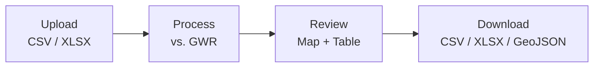
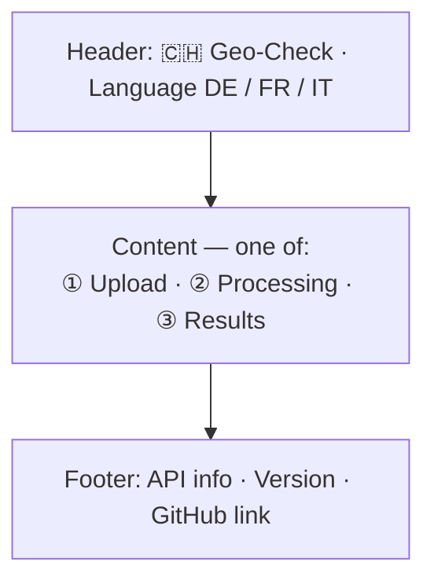
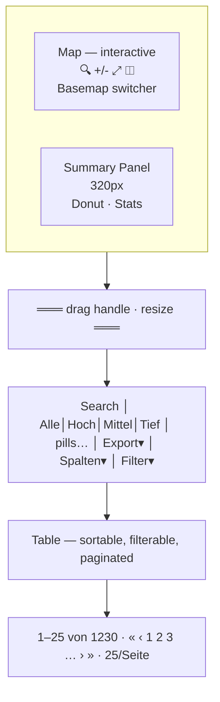

# Geo-Check v2 — Specification

> **Status:** Draft · **Date:** 2026-03-13
> **Goal:** Replace the prototype with a zero-backend, zero-login building data quality tool that runs entirely in the browser.

---

## 1. Problem Statement

Organizations managing Swiss building portfolios need to verify that their internal records (from SAP, Excel exports, etc.) match the official Gebäude- und Wohnungsregister (GWR). The prototype solved this with a full-stack app (Supabase, Deno backend, auth, kanban, rule engine). User feedback and compliance requirements demand a radically simpler approach:

- **No backend** — all processing happens client-side. No data leaves the browser except for calls to the public GWR API.
- **No login** — no user accounts, no stored data. Upload, process, download, done.
- **No persistence** — nothing is saved between sessions. The browser tab is the session.

---

## 2. Core Workflow



**One direction. No side quests.**

---

## 3. Input Format

Users upload a **CSV** or **Excel (.xlsx)** file. The app accepts the following columns (header names are matched case-insensitively and with common aliases):

| Column | Required | Description | Example |
|--------|----------|-------------|---------|
| `internal_id` | yes | Organization's internal building identifier | `SAP-4821` |
| `egid` | yes | Federal building identifier (EGID) | `1755615` |
| `latitude` | no | WGS84 latitude | `47.3769` |
| `longitude` | no | WGS84 longitude | `8.5417` |
| `building_type` | no | Building category code or description | `1020` |
| `country` | no | Country code | `CH` |
| `region` | no | Canton abbreviation | `ZH` |
| `city` | no | City / locality name | `Zürich` |
| `zip` | no | Postal code | `8001` |
| `street` | no | Street name | `Bahnhofstrasse` |
| `street_number` | no | House number | `12` |
| `comment` | no | Free-text note (passed through, not processed) | `Check roof area` |

### Column Matching

The app will attempt to match uploaded column headers to the expected schema using:
1. Exact match (case-insensitive)
2. Common aliases (e.g., `egid` ↔ `EGID` ↔ `gwr_id` ↔ `federal_id`; `zip` ↔ `plz` ↔ `postal_code` ↔ `npa`; `street_number` ↔ `hausnummer` ↔ `house_number` ↔ `deinr`)
3. A mapping UI lets the user manually assign columns if auto-detection fails

Rows with an empty or non-numeric `egid` are flagged as "skipped" and included in the output with an error note, but not sent to the API.

---

## 4. Processing

### 4.1 GWR API Lookup

For each valid EGID, the app calls the **public swisstopo MapServer** endpoint:

```
GET https://api3.geo.admin.ch/rest/services/ech/MapServer/find
  ?layer=ch.bfs.gebaeude_wohnungs_register
  &searchField=egid
  &searchText={egid}
  &returnGeometry=true
  &contains=false
  &sr=4326
```

**No API key required.** This is a public Swiss federal API.

**Example response** (abbreviated, EGID 1231641):

```json
{
  "results": [{
    "featureId": "1231641_0",
    "geometry": { "x": 7.430877, "y": 46.958232, "spatialReference": { "wkid": 4326 } },
    "attributes": {
      "egid": "1231641",
      "egrid": "CH251146763508",
      "strname": ["Beaulieustrasse"],       // array (multilingual)
      "strnamk": ["Beaulieustr."],           // abbreviated form
      "deinr": "2",                          // house number (string)
      "strname_deinr": "Beaulieustrasse 2",  // combined label
      "dplz4": 3012,                         // postal code (integer)
      "dplzname": "Bern",                    // city name
      "ggdename": "Bern",                    // municipality
      "ggdenr": 351,                         // BFS municipality number
      "gdekt": "BE",                         // canton
      "gkat": 1020,                          // building category (integer code)
      "gklas": 1122,                         // building class (integer code)
      "gstat": 1004,                         // building status (integer code)
      "gbauj": null,                         // construction year (often null)
      "gbaup": 8012,                         // construction period code
      "garea": 174,                          // building area m² (integer)
      "gastw": 4,                            // number of floors
      "ganzwhg": 10,                         // number of dwellings
      "gkode": 2599407.817,                  // Swiss LV95 easting
      "gkodn": 1200797.593,                  // Swiss LV95 northing
      "label": "Beaulieustrasse 2"
    }
  }]
}
```

> Note: `strname` is an **array** (supports multilingual street names). `deinr` is a separate string field for the house number. `dplz4` is an integer. `gkat`/`gklas`/`gstat` are integer codes. `gbauj` (construction year) is often null — `gbaup` (construction period) is more reliable.

**Response fields used** (see §5.2 for full column descriptions and multilingual aliases):

| API field | Type | Mapped to |
|-----------|------|-----------|
| `egid` | string | `gwr_egid` |
| `egrid` | string | `gwr_egrid` |
| `strname[0]` | string (from array) | `gwr_street` |
| `deinr` | string | `gwr_street_number` |
| `dplz4` | integer | `gwr_zip` |
| `dplzname` | string | `gwr_city` |
| `ggdename` | string | `gwr_municipality` |
| `ggdenr` | integer | `gwr_municipality_nr` |
| `gdekt` | string | `gwr_region` |
| `gkat` | integer | `gwr_building_type` |
| `gklas` | integer | `gwr_building_class` |
| `gstat` | integer | `gwr_status` |
| `gbauj` | integer/null | `gwr_year_built` |
| `gbaup` | integer | `gwr_construction_period` |
| `garea` | integer | `gwr_area` |
| `gastw` | integer | `gwr_floors` |
| `ganzwhg` | integer | `gwr_dwellings` |
| `geometry.y` | float | `gwr_latitude` |
| `geometry.x` | float | `gwr_longitude` |
| `gkode` | float | `gwr_coord_e` |
| `gkodn` | float | `gwr_coord_n` |
| `gksce` | integer | `gwr_coord_source` |
| `gabbj` | integer/null | `gwr_demolition_year` |
| `lparz` | string | `gwr_plot_nr` |
| `gbez` | string | `gwr_building_name` |
| `gwaerzh1` | integer | `gwr_heating_type` |
| `genh1` | integer | `gwr_heating_energy` |
| `gwaerzw1` | integer | `gwr_hot_water_type` |
| `genw1` | integer | `gwr_hot_water_energy` |

If the EGID is not found in GWR, the row is marked with `gwr_match = "not_found"`.

### 4.2 Code Resolution

Several GWR fields return integer codes (e.g., `gkat=1020`, `gstat=1004`). The app resolves these to multilingual labels at render time using `data/gwr-codes.json` (generated from `assets/GWR Codes.xlsx`). The raw code is preserved in the data; labels are shown in the table with the code as tooltip. Resolved attributes:

| Code attribute | Column | Example code | Example label (DE) |
|---------------|--------|-------------|-------------------|
| GKAT | `gwr_building_type` | 1020 | Gebäude mit ausschliesslicher Wohnnutzung |
| GKLAS | `gwr_building_class` | 1122 | Gebäude mit drei oder mehr Wohnungen |
| GSTAT | `gwr_status` | 1004 | Gebäude bestehend |
| GBAUP | `gwr_construction_period` | 8012 | Periode von 1919 bis 1945 |
| GKSCE | `gwr_coord_source` | 901 | Amtliche Vermessung, DM.01 |
| GWAERZH1 | `gwr_heating_type` | 7460 | Wärmetauscher (einschl. Fernwärme) |
| GENH1 | `gwr_heating_energy` | 7580 | Fernwärme (generisch) |
| GWAERZW1 | `gwr_hot_water_type` | 7660 | Wärmetauscher (einschl. Fernwärme) |
| GENW1 | `gwr_hot_water_energy` | 7580 | Fernwärme (generisch) |

Labels are available in DE, FR, and IT. Language follows the app's current locale setting.

### 4.3 Rate Limiting & Batching

- Requests are sent sequentially or in small batches (max 5 concurrent) with a configurable delay (default: 100ms between batches) to respect the public API.
- A progress bar shows `processed / total` with estimated time remaining.
- The user can cancel processing at any time; already-processed rows are kept.

### 4.4 Match Scoring

After retrieving GWR data, the app computes a **match score (0–100%)** per building by comparing input columns against GWR values. Only columns that exist in both input and GWR are scored.

#### Field Comparisons

| Field pair | Method | Weight |
|-----------|--------|--------|
| `street` vs `gwr_street` | Normalized string similarity (lowercase, trim, remove common abbreviations like Str./Strasse) | 20% |
| `street_number` vs `gwr_street_number` | Exact match (after trimming) | 10% |
| `zip` vs `gwr_zip` | Exact match | 15% |
| `city` vs `gwr_city` | Normalized string similarity | 15% |
| `region` vs `gwr_region` | Exact match (case-insensitive) | 10% |
| `building_type` vs `gwr_building_type` | Exact code match | 10% |
| `latitude/longitude` vs `gwr_latitude/gwr_longitude` | Distance-based (100% if <50m, linear decay to 0% at >500m) | 20% |

**Scoring rules:**
- If a field is empty in the input, it is excluded from the score (weight redistributed proportionally).
- If the EGID is not found, score = 0%.
- Result column: `match_score` (integer 0–100).
- Per-field match result columns: `match_street`, `match_zip`, etc. with values `exact`, `similar`, `mismatch`, or `empty`.

---

## 5. Output Columns

The processed file contains **all original input columns** plus appended GWR and match result columns. Column order: input first, then GWR output, then match results — matching the table UI.

> **Register abbreviations:** GWR (DE) = RFB (FR) = REA (IT) — Gebäude- und Wohnungsregister / Registre fédéral des bâtiments / Registro federale degli edifici.

### 5.1 Input Columns (passed through)

| # | Column | EN | DE | FR | IT | Description |
|---|--------|----|----|----|-----|-------------|
| 1 | `internal_id` | Internal ID | Interne ID | ID interne | ID interno | Organization's internal building identifier |
| 2 | `egid` | EGID | EGID | EGID | EGID | Federal building identifier as provided in input |
| 3 | `street` | Street | Strasse | Rue | Via | Street name from input |
| 4 | `street_number` | Number | Nr | Numéro | Numero | House number from input |
| 5 | `zip` | ZIP | PLZ | NPA | NPA | Postal code from input |
| 6 | `city` | City | Ort | Localité | Località | City / locality from input |
| 7 | `region` | Region | Kanton | Canton | Cantone | Canton abbreviation from input |
| 8 | `building_type` | Building type | Typ | Type de bâtiment | Tipo di edificio | Building category code from input |
| 9 | `latitude` | Latitude | Breite | Latitude | Latitudine | WGS84 latitude from input |
| 10 | `longitude` | Longitude | Länge | Longitude | Longitudine | WGS84 longitude from input |
| 11 | `country` | Country | Land | Pays | Paese | Country code from input |
| 12 | `comment` | Comment | Kommentar | Commentaire | Commento | Free-text note (passed through, not processed) |

### 5.2 GWR Output Columns (from API)

| # | Column | EN | DE | FR | IT | Description |
|---|--------|----|----|----|-----|-------------|
| 13 | `gwr_egid` | EGID (GWR) | EGID (GWR) | EGID (RFB) | EGID (REA) | EGID as confirmed by GWR |
| 14 | `gwr_egrid` | EGRID | EGRID | EGRID | EGRID | Real estate identifier (EGRID) from GWR |
| 15 | `gwr_street` | Street (GWR) | Strasse (GWR) | Rue (RFB) | Via (REA) | Street name from GWR (`strname[0]`) |
| 16 | `gwr_street_number` | Number (GWR) | Nr (GWR) | N° (RFB) | N. (REA) | House number from GWR (`deinr`) |
| 17 | `gwr_zip` | ZIP (GWR) | PLZ (GWR) | NPA (RFB) | NPA (REA) | Postal code from GWR (`dplz4`) |
| 18 | `gwr_city` | City (GWR) | Ort (GWR) | Localité (RFB) | Località (REA) | City from GWR (`dplzname`) |
| 19 | `gwr_municipality` | Municipality | Gemeinde | Commune | Comune | Municipality from GWR (`ggdename`) |
| 20 | `gwr_municipality_nr` | Municipality nr. | BFS-Nr | N° OFS | N. UST | BFS municipality number (`ggdenr`) |
| 21 | `gwr_region` | Canton (GWR) | Kt (GWR) | Canton (RFB) | Cantone (REA) | Canton from GWR (`gdekt`) |
| 22 | `gwr_building_type` | Building type (GWR) | Typ (GWR) | Type (RFB) | Tipo (REA) | Building category code from GWR (`gkat`) |
| 23 | `gwr_building_class` | Building class | Gebäudeklasse | Classe de bâtiment | Classe di edificio | Building class code from GWR (`gklas`) |
| 24 | `gwr_status` | Building status | Gebäudestatus | Statut du bâtiment | Stato dell'edificio | Building status code from GWR (`gstat`) |
| 25 | `gwr_year_built` | Year built | Baujahr | Année de construction | Anno di costruzione | Construction year from GWR (`gbauj`, may be empty) |
| 26 | `gwr_construction_period` | Constr. period | Bauperiode | Période de constr. | Periodo di costr. | Construction period code from GWR (`gbaup`) |
| 27 | `gwr_area` | Area (m²) | Fläche (m²) | Surface (m²) | Superficie (m²) | Building footprint area from GWR (`garea`) |
| 28 | `gwr_floors` | Floors | Geschosse | Étages | Piani | Number of floors from GWR (`gastw`) |
| 29 | `gwr_dwellings` | Dwellings | Wohnungen | Logements | Abitazioni | Number of dwellings from GWR (`ganzwhg`) |
| 30 | `gwr_latitude` | Latitude (GWR) | Breite (GWR) | Latitude (RFB) | Latitudine (REA) | WGS84 latitude from GWR |
| 31 | `gwr_longitude` | Longitude (GWR) | Länge (GWR) | Longitude (RFB) | Longitudine (REA) | WGS84 longitude from GWR |
| 32 | `gwr_coord_e` | E-coord (LV95) | E-Koord. (LV95) | E-coord (MN95) | E-coord (MN95) | Swiss LV95 easting (`gkode`) |
| 33 | `gwr_coord_n` | N-coord (LV95) | N-Koord. (LV95) | N-coord (MN95) | N-coord (MN95) | Swiss LV95 northing (`gkodn`) |
| 34 | `gwr_coord_source` | Coord. source | Koord.-Herkunft | Source coord. | Origine coord. | Coordinate origin code (`gksce`) |
| 35 | `gwr_demolition_year` | Demolition year | Abbruchjahr | Année de démolition | Anno di demolizione | Demolition year (`gabbj`, may be empty) |
| 36 | `gwr_plot_nr` | Plot nr. | Parzelle | N° parcelle | N. particella | Plot / parcel number (`lparz`) |
| 37 | `gwr_building_name` | Building name | Gebäudename | Nom du bâtiment | Nome dell'edificio | Building name (`gbez`, often empty) |
| 38 | `gwr_heating_type` | Heating type | Heizung | Type de chauffage | Tipo di riscald. | Primary heating generator code (`gwaerzh1`) |
| 39 | `gwr_heating_energy` | Heating energy | Energietr. Heiz. | Source d'énergie chauff. | Fonte en. risc. | Primary heating energy source (`genh1`) |
| 40 | `gwr_hot_water_type` | Hot water type | Warmwasser | Type eau chaude | Tipo acqua calda | Primary hot water generator code (`gwaerzw1`) |
| 41 | `gwr_hot_water_energy` | Hot water energy | Energietr. WW | Source d'énergie EC | Fonte en. AC | Primary hot water energy source (`genw1`) |

### 5.3 Match Result Columns (computed)

| # | Column | EN | DE | FR | IT | Description |
|---|--------|----|----|----|-----|-------------|
| 42 | `match_score` | Score | Score | Score | Score | Overall match percentage (0–100) |
| 43 | `confidence` | Confidence | Konfidenz | Confiance | Confidenza | Confidence label based on score thresholds |
| 44 | `match_street` | Street match | Match Strasse | Corresp. rue | Corrisp. via | Street comparison result |
| 45 | `match_street_number` | Number match | Match Nr | Corresp. n° | Corrisp. n. | Street number comparison result |
| 46 | `match_zip` | ZIP match | Match PLZ | Corresp. NPA | Corrisp. NPA | Zip comparison result |
| 47 | `match_city` | City match | Match Ort | Corresp. localité | Corrisp. località | City comparison result |
| 48 | `match_region` | Region match | Match Kt | Corresp. canton | Corrisp. cantone | Region comparison result |
| 49 | `match_building_type` | Type match | Match Typ | Corresp. type | Corrisp. tipo | Building type comparison result |
| 50 | `match_coordinates` | Coord. match | Match Koord. | Corresp. coord. | Corrisp. coord. | Coordinate distance comparison result |
| 51 | `gwr_match` | Status | Status | Statut | Stato | Overall status: `matched`, `not_found`, `skipped` |

---

## 6. User Interface

### 6.1 Layout

Single page, three states:



### 6.2 State 1 — Upload

- Large drop zone (drag & drop or click to browse)
- Accepts `.csv` and `.xlsx` files
- After file selection:
  - Preview table showing first 5 rows
  - Column mapping UI (auto-detected columns highlighted, manual override via dropdowns)
  - Row count and detected columns summary
  - **"Start Processing"** button (disabled until `egid` column is mapped)

### 6.3 State 2 — Processing

- Progress bar with: `Building 42 of 1,230 — 3.4%`
- Estimated time remaining
- Live counter: `matched: 38 · not found: 3 · skipped: 1`
- **"Cancel"** button (keeps already-processed rows)
- Transitions automatically to Results when done

### 6.4 State 3 — Results

Split view with collapsible summary panel:



#### Map

- **Basemaps**: 4 options via basemap switcher (bottom-right):
  - CARTO Positron (Hell) — default
  - CARTO Dark Matter (Dunkel)
  - CARTO Voyager (Farbe)
  - Swisstopo Luftbild (satellite imagery)
- Buildings plotted at GWR coordinates (fallback to input coordinates if GWR not found)
- Color coding by match score:
  - **Green** (≥80%): good match
  - **Yellow** (50–79%): partial match
  - **Red** (<50%): poor match
  - **Grey**: not found / skipped
- Click a marker → highlight row in table, show popup with key fields

##### Map controls (top-right, stacked)

| Control | Description |
|---------|-------------|
| **Location search** | Search icon → expands input panel to the left. Queries Swisstopo SearchServer (`type=locations`, `sr=4326`). Shows up to 5 suggestions with highlighted matches. Clicking a result places a marker and flies to zoom 15. |
| **Navigation** | MapLibre default zoom +/− and compass |
| **Reset view** | Zoom to fit all data points (`fitBounds`) |
| **Summary toggle** | Re-opens the summary panel when closed (hidden while panel is open) |

##### Location search API

```
GET https://api3.geo.admin.ch/rest/services/ech/SearchServer
  ?searchText={query}
  &type=locations
  &sr=4326
  &limit=5
```

Response: `results[].attrs.label` (HTML with `<b>` highlights), `results[].attrs.lat`, `results[].attrs.lon` (WGS84).

#### Summary Panel

- Width: 320px, collapsible with close button
- **Donut chart**: SVG ring chart showing overall average confidence score (percentage + "Hoch"/"Mittel"/"Tief" label)
- Statistics: total buildings, matched/not found/skipped counts, confidence distribution bars
- When collapsed, a MapLibre control button appears to re-open it

#### Table

- **Default height**: 40vh (35vh on tablet), resizable via drag handle between map and table
- Sortable by any column (click header)
- Click a row → highlight marker on map, fly to location
- `match_score` rendered as plain text (e.g. "85%")
- `confidence` badges (Hoch/Mittel/Tief) color-coded with score thresholds
- Status badges (`matched`/`not_found`/`skipped`) and match result badges (`exact`/`similar`/`mismatch`) color-coded
- Code columns display resolved labels (see §4.2 for code resolution details)
- **Clickable badges**: all categorical badges are clickable filters — clicking adds the corresponding value as an active filter. Confidence badges activate the corresponding preset.

##### Table toolbar

| Element | Position | Description |
|---------|----------|-------------|
| **Search** | Left | Free-text search across all columns, with clear button |
| **Presets** | After search | Confidence-based quick filters: Alle / Hoch (≥80%) / Mittel (50–79%) / Tief (<50%) |
| **Filter pills** | After presets | Active filters shown as removable pills (e.g. "Status: matched ×", "Konfidenz: Hoch ×"). Includes "Alle Filter zurücksetzen" reset pill when any filters are active. |
| **Export** | Right | Dropdown: CSV / Excel / GeoJSON |
| **Spalten** | Right | Column visibility dropdown with "Alle anzeigen" / "Alle ausblenden" buttons at top, then checkboxes per column (max-height 320px, scrollable) |
| **Filter** | Right | Multi-select checkbox dropdown grouped by column, with search bar at top. Supports multiple values per column (OR within same column, AND across columns). |

##### Filter system

- **URL sync**: all filters (preset, search, column filters) are persisted in URL query parameters via `replaceState`. Supports multiple values per key via `append`.
- **Multi-select**: multiple values for the same column use OR logic; filters across different columns use AND logic.
- **Filterable columns**: Status, Kanton, Gebäudetyp, Gebäudeklasse, Gebäudestatus, Gemeinde, PLZ, and all per-field match results.

##### Pagination

Green-inventory style: entries info (left), page buttons with ellipsis (center), page size dropdown (right). Page sizes: 10, 25 (default), 50, 100.

##### Default visible columns

See §5 for full descriptions and multilingual aliases.

| # | Column | Label |
|---|--------|-------|
| 1 | `internal_id` | ID |
| 13 | `gwr_egid` | EGID (GWR) |
| 15 | `gwr_street` | Strasse (GWR) |
| 16 | `gwr_street_number` | Nr (GWR) |
| 17 | `gwr_zip` | PLZ (GWR) |
| 18 | `gwr_city` | Ort (GWR) |
| 42 | `match_score` | Score |
| 43 | `confidence` | Konfidenz |
| 51 | `gwr_match` | Status |

##### Hidden by default (toggle via column dropdown)

See §5 for full descriptions and multilingual aliases.

**Input columns:**

| # | Column | Label |
|---|--------|-------|
| 2 | `egid` | EGID |
| 3 | `street` | Strasse |
| 4 | `street_number` | Nr |
| 5 | `zip` | PLZ |
| 6 | `city` | Ort |
| 7 | `region` | Kanton |
| 8 | `building_type` | Typ |
| 9 | `latitude` | Breite |
| 10 | `longitude` | Länge |
| 11 | `country` | Land |
| 12 | `comment` | Kommentar |

**GWR detail columns:**

| # | Column | Label |
|---|--------|-------|
| 14 | `gwr_egrid` | EGRID |
| 19 | `gwr_municipality` | Gemeinde |
| 20 | `gwr_municipality_nr` | BFS-Nr |
| 21 | `gwr_region` | Kt (GWR) |
| 22 | `gwr_building_type` | Typ (GWR) |
| 23 | `gwr_building_class` | Gebäudeklasse |
| 24 | `gwr_status` | Gebäudestatus |
| 25 | `gwr_year_built` | Baujahr |
| 26 | `gwr_construction_period` | Bauperiode |
| 27 | `gwr_area` | Fläche (m²) |
| 28 | `gwr_floors` | Geschosse |
| 29 | `gwr_dwellings` | Wohnungen |
| 30 | `gwr_latitude` | Breite (GWR) |
| 31 | `gwr_longitude` | Länge (GWR) |
| 32 | `gwr_coord_e` | E-Koord. (LV95) |
| 33 | `gwr_coord_n` | N-Koord. (LV95) |
| 34 | `gwr_coord_source` | Koord.-Herkunft |
| 35 | `gwr_demolition_year` | Abbruchjahr |
| 36 | `gwr_plot_nr` | Parzelle |
| 37 | `gwr_building_name` | Gebäudename |
| 38 | `gwr_heating_type` | Heizung |
| 39 | `gwr_heating_energy` | Energietr. Heiz. |
| 40 | `gwr_hot_water_type` | Warmwasser |
| 41 | `gwr_hot_water_energy` | Energietr. WW |

**Per-field match results:**

| # | Column | Label |
|---|--------|-------|
| 44 | `match_street` | Match Strasse |
| 45 | `match_street_number` | Match Nr |
| 46 | `match_zip` | Match PLZ |
| 47 | `match_city` | Match Ort |
| 48 | `match_region` | Match Kt |
| 49 | `match_building_type` | Match Typ |
| 50 | `match_coordinates` | Match Koord. |

### 6.5 Responsive Behavior

- Desktop (>1024px): side-by-side map + table
- Tablet (768–1024px): stacked map on top, table below
- Mobile (<768px): tab toggle between map and table

---

## 7. Export Formats

### 7.1 CSV

- UTF-8 with BOM (for Excel compatibility)
- Semicolon delimiter (`;`) — standard in Swiss/German locale
- All input + output columns

### 7.2 Excel (.xlsx)

- Sheet 1 "Results": all input + output columns
- Conditional formatting on `match_score` column (green/yellow/red)
- Sheet 2 "Summary": key statistics (total, matched, not found, avg score, per-canton breakdown)
- Generated client-side with SheetJS

### 7.3 GeoJSON

- FeatureCollection with one Feature per building
- Geometry: Point (longitude, latitude) from GWR (fallback to input)
- Properties: all output columns
- Buildings without any coordinates are excluded (noted in export dialog)

---

## 8. Technology Stack

| Concern | Technology | Rationale |
|---------|-----------|-----------|
| Framework | Vanilla JS (ES6 modules) | No build step, no dependencies to audit, same as prototype |
| File parsing | [Papa Parse](https://www.papaparse.com/) (CSV) + [SheetJS](https://sheetjs.com/) (XLSX) | Battle-tested, client-side, MIT licensed |
| Map | [MapLibre GL JS](https://maplibre.org/) + CARTO Positron | Free, no API key, vector basemap |
| String matching | Custom (Levenshtein / Jaro-Winkler) | ~50 lines of code, no library needed |
| Excel export | SheetJS (write mode) | Already used in prototype |
| Styling | CSS custom properties (design tokens) | Carry over design system from prototype |
| Icons | [Lucide](https://lucide.dev/) | Lightweight, already in use |

### No Backend Required

All API calls go directly from the browser to `api3.geo.admin.ch`. Two endpoints are used:

1. **MapServer/find** — EGID lookup for building data matching (see §4.1)
2. **SearchServer** — Location search for map navigation (`type=locations`, see §6.4)

Both APIs:
- Are public (no API key)
- Support CORS
- Return JSON
- Have no documented rate limits (but we throttle EGID lookups to be respectful)

---

## 9. Privacy & Compliance

- **No data storage**: uploaded files are parsed into memory and discarded when the tab closes.
- **No cookies or tracking**: no analytics, no third-party scripts beyond map tiles.
- **No backend**: no server logs, no database, no infrastructure to secure.
- **API calls**: only the EGID (a public identifier) is sent to the GWR API. No personal data, no internal IDs, no addresses are transmitted.
- **CSP**: no CSP meta tag — external resources (CARTO basemap, CDN scripts, Google Fonts) loaded directly.
- **Offline-capable**: once loaded, the app works offline except for GWR API calls and map tiles. Could be packaged as a downloadable HTML file for air-gapped environments.

---

## 10. Out of Scope

This tool is intentionally minimal. The following are not planned:

- User authentication, roles, or multi-user collaboration
- Server-side processing, databases, or persistent storage
- Workflow features (kanban, task management, comments, audit logs)
- Editing or writing back to GWR — results are read-only
- Building image uploads or document attachments

---

## 11. File Structure

```
geo-check/
├── index.html              # Single-page application
├── css/
│   ├── tokens.css          # Design tokens (colors, spacing, typography)
│   └── styles.css          # Component styles
├── js/
│   ├── main.js             # App state machine (upload → processing → results)
│   ├── upload.js            # File parsing, column detection, mapping UI
│   ├── processor.js         # GWR API calls, batching, match scoring
│   ├── map.js               # MapLibre GL map, markers, popups
│   ├── table.js             # Results table, sorting, filtering
│   ├── export.js            # CSV, XLSX, GeoJSON generation
│   ├── gwr-codes.js         # Code → label resolution (loads gwr-codes.json)
│   └── utils.js             # String similarity, helpers
├── data/
│   └── gwr-codes.json       # GWR code tables (DE/FR/IT) from GWR Codes.xlsx
├── assets/
│   └── swiss-logo-flag.svg  # Branding
├── docs/
│   └── SPECIFICATION.md     # This file
└── README.md
```

No `node_modules`, no `package.json`, no build step. All dependencies loaded via CDN with SRI hashes.

---

## 12. Open Questions

1. **Map provider**: Swisstopo WMTS is free but only covers Switzerland. Do we need a fallback for buildings with coordinates outside CH? (Likely not — GWR is CH-only.)
2. **Batch size**: What's a practical limit? 10,000 buildings at ~100ms per request ≈ 17 minutes. Should we warn for files >5,000 rows?
3. **Multi-language**: Multilingual column aliases are now specified in §5. Remaining question: should the full UI (labels, buttons, messages) support runtime language switching between DE/FR/IT?
4. **Downloadable version**: Should we offer a single-file HTML download for offline/air-gapped use? The only barrier is CDN dependencies — we could inline them.
