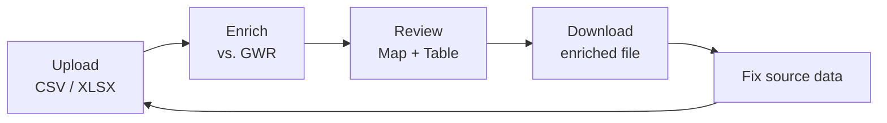
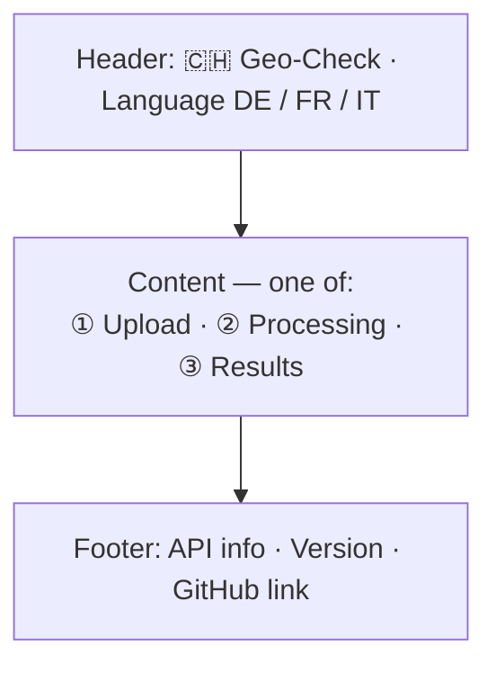
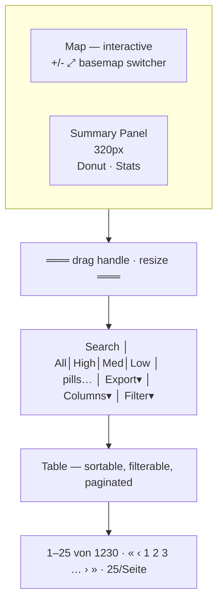

# Geo-Check v2 — Specification

> **Status:** Draft · **Date:** 2026-03-13
> **Goal:** Replace the prototype with a zero-backend, zero-login building data quality tool that runs entirely in the browser.

---

## 1. Problem Statement

Organizations managing Swiss building portfolios need to verify that their internal records (from SAP, Excel exports, etc.) match the official Gebäude- und Wohnungsregister (GWR). The prototype solved this with a full-stack app (Supabase, Deno backend, auth, kanban, rule engine). User feedback and compliance requirements demand a radically simpler approach:

- **No backend** — all processing happens client-side. No data leaves the browser except for calls to the public GWR API.
- **No login** — no user accounts, no stored data. Upload, process, download, done.
- **No persistence** — nothing is saved between sessions. The browser tab is the session.

---

## 2. Core Workflow



**Iterative quality loop.** Users upload their building data, review mismatches visually, download the enriched results, fix their source data, and re-upload to verify corrections. Each cycle improves data quality.

---

## 3. Input Format

Users upload a **CSV** or **Excel (.xlsx)** file. The app accepts the following columns (header names are matched case-insensitively and with common aliases):

| Column | Required | Description | Example |
|--------|----------|-------------|---------|
| `internal_id` | yes | Organization's internal building identifier | `SAP-4821` |
| `egid` | yes | Federal building identifier (EGID) | `1755615` |
| `street` | no | Street name | `Bahnhofstrasse` |
| `street_number` | no | House number | `12` |
| `zip` | no | Postal code | `8001` |
| `city` | no | City / locality name | `Zürich` |
| `region` | no | Canton abbreviation | `ZH` |
| `building_type` | no | Building category code | `1020` |
| `latitude` | no | WGS84 latitude | `47.3769` |
| `longitude` | no | WGS84 longitude | `8.5417` |
| `country` | no | Country code | `CH` |
| `comment` | no | Free-text note (passed through, not processed) | `Check roof area` |

### Column Matching

The app matches uploaded headers to the expected schema using:

1. Exact match (case-insensitive)
2. Common aliases — examples:
   - `egid` ↔ `EGID` ↔ `gwr_id` ↔ `federal_id`
   - `zip` ↔ `plz` ↔ `postal_code` ↔ `npa`
   - `street_number` ↔ `hausnummer` ↔ `house_number` ↔ `deinr`
3. A mapping UI lets the user manually assign columns if auto-detection fails

Rows with an empty or non-numeric `egid` are flagged as `skipped` and included in the output with an error note, but not sent to the API.

---

## 4. Processing

### 4.1 GWR API Lookup

For each valid EGID, the app calls the **public swisstopo MapServer** endpoint:

```
GET https://api3.geo.admin.ch/rest/services/ech/MapServer/find
  ?layer=ch.bfs.gebaeude_wohnungs_register
  &searchField=egid
  &searchText={egid}
  &returnGeometry=true
  &contains=false
  &sr=4326
```

**No API key required.** This is a public Swiss federal API.

**Example response** (abbreviated, EGID 1231641):

```json
{
  "results": [{
    "featureId": "1231641_0",
    "geometry": { "x": 7.430877, "y": 46.958232, "spatialReference": { "wkid": 4326 } },
    "attributes": {
      "egid": "1231641",
      "egrid": "CH251146763508",
      "strname": ["Beaulieustrasse"],       // array (multilingual)
      "strnamk": ["Beaulieustr."],           // abbreviated form
      "deinr": "2",                          // house number (string)
      "strname_deinr": "Beaulieustrasse 2",  // combined label
      "dplz4": 3012,                         // postal code (integer)
      "dplzname": "Bern",                    // city name
      "ggdename": "Bern",                    // municipality
      "ggdenr": 351,                         // BFS municipality number
      "gdekt": "BE",                         // canton
      "gkat": 1020,                          // building category (integer code)
      "gklas": 1122,                         // building class (integer code)
      "gstat": 1004,                         // building status (integer code)
      "gbauj": null,                         // construction year (often null)
      "gbaup": 8012,                         // construction period code
      "garea": 174,                          // building footprint area m²
      "gastw": 4,                            // number of floors
      "ganzwhg": 10,                         // number of dwellings
      "gkode": 2599407.817,                  // Swiss LV95 easting
      "gkodn": 1200797.593,                  // Swiss LV95 northing
      "label": "Beaulieustrasse 2"
    }
  }]
}
```

> **API notes:** `strname` is an **array** (supports multilingual street names — use `strname[0]`). `deinr` is a string for the house number. `dplz4` is an integer. `gkat` / `gklas` / `gstat` are integer codes resolved to labels at render time (see §4.2). `gbauj` (construction year) is often `null` — `gbaup` (construction period) is more reliable.

If the EGID is not found in GWR, the row is marked with `gwr_match = "not_found"`. Successfully looked-up buildings are marked `matched`. Rows with an invalid EGID (see §3) carry `gwr_match = "skipped"`.

### 4.2 Code Resolution

Several GWR fields return integer codes (e.g., `gkat = 1020`, `gstat = 1004`). The app resolves these to multilingual labels at render time using `data/gwr-codes.json` (generated from `assets/GWR Codes.xlsx`). The raw integer code is always preserved in the data; the table displays the resolved label with the code as a tooltip.

| GWR attribute | Output column | Example code | Example label (DE) |
|---------------|---------------|-------------|-------------------|
| `gkat` | `gwr_building_type` | 1020 | Gebäude mit ausschliesslicher Wohnnutzung |
| `gklas` | `gwr_building_class` | 1122 | Gebäude mit drei oder mehr Wohnungen |
| `gstat` | `gwr_status` | 1004 | Gebäude bestehend |
| `gbaup` | `gwr_construction_period` | 8012 | Periode von 1919 bis 1945 |
| `gksce` | `gwr_coord_source` | 901 | Amtliche Vermessung, DM.01 |
| `gwaerzh1` | `gwr_heating_type` | 7460 | Wärmetauscher (einschl. Fernwärme) |
| `genh1` | `gwr_heating_energy` | 7580 | Fernwärme (generisch) |
| `gwaerzw1` | `gwr_hot_water_type` | 7660 | Wärmetauscher (einschl. Fernwärme) |
| `genw1` | `gwr_hot_water_energy` | 7580 | Fernwärme (generisch) |

> **Note:** `gwaerzh1` (7460) and `gwaerzw1` (7660) share the same label text but are distinct codes from separate GWR code tables (GWAERZH and GWAERZW respectively).

Labels are available in DE, FR, and IT. The displayed language follows the app's current locale setting.

### 4.3 Rate Limiting & Batching

- Requests are sent sequentially or in small batches (max 5 concurrent) with a configurable delay (default: 100ms between batches) to respect the public API.
- A progress bar shows `Building 42 of 1,230 — 3.4%` with estimated time remaining.
- The user can cancel processing at any time; already-processed rows are kept.

### 4.4 Match Scoring

After retrieving GWR data, the app computes a **match score (0–100)** per building by comparing input columns against GWR values. Only fields present in both the input and GWR response are scored; missing input fields are excluded and their weight redistributed proportionally.

#### Field Comparisons

| Input field | GWR field | Method | Weight |
|-------------|-----------|--------|--------|
| `street` | `gwr_street` | Normalized string similarity (lowercase, trim, expand/collapse common abbreviations e.g. `Str.` ↔ `Strasse`) | 20% |
| `street_number` | `gwr_street_number` | Exact match (trimmed) | 10% |
| `zip` | `gwr_zip` | Exact match | 15% |
| `city` | `gwr_city` | Normalized string similarity | 15% |
| `region` | `gwr_region` | Exact match (case-insensitive) | 10% |
| `building_type` | `gwr_building_type` | Exact code match | 10% |
| `latitude` + `longitude` | `gwr_latitude` + `gwr_longitude` | Distance-based: 100% if < 50 m, linear decay to 0% at ≥ 500 m | 20% |

Per-field result values: `exact`, `similar`, `mismatch`, or `empty`.

#### Confidence Thresholds

| Score | `confidence` value | Label (DE / FR / IT) |
|-------|--------------------|----------------------|
| ≥ 80 | `high` | Hoch / Élevé / Alto |
| 50–79 | `medium` | Mittel / Moyen / Medio |
| < 50 | `low` | Tief / Faible / Basso |

If the EGID is not found: score = 0, confidence = `low`.

---

## 5. Output Columns

The processed file contains all original input columns plus appended GWR and match result columns in the order below — consistent with the table UI.

> **Register name by language:** GWR (DE) = RegBL (FR) = REA (IT)
> (Gebäude- und Wohnungsregister / Registre fédéral des bâtiments et des logements / Registro federale degli edifici e delle abitazioni)

**Default** column: whether the column is visible by default in the results table. Hidden columns can be shown via the Columns dropdown.

**Value list** column: whether the field uses a controlled vocabulary. GWR integer codes (group GWR) resolve to multilingual labels via `gwr-codes.json` (see §4.2); match result and status strings are fixed enumerations.

| # | Key | Group | EN | DE | FR | IT | Format | Value list | Default | Notes |
|---|-----|-------|----|----|----|----|--------|------------|---------|-------|
| 1 | `internal_id` | Input | Internal ID | Interne ID | ID interne | ID interno | string | No | Yes | |
| 2 | `egid` | Input | EGID | EGID | EGID | EGID | integer | No | Yes | As provided in input |
| 3 | `street` | Input | Street | Strasse | Rue | Via | string | No | Yes | |
| 4 | `street_number` | Input | Number | Nr | Numéro | Numero | string | No | Yes | |
| 5 | `zip` | Input | ZIP | PLZ | NPA | NPA | integer | No | Yes | |
| 6 | `city` | Input | City | Ort | Localité | Località | string | No | Yes | |
| 7 | `region` | Input | Region | Kanton | Canton | Cantone | string | Yes | Yes | 2-letter canton code |
| 8 | `building_type` | Input | Building category | Kategorie | Catégorie de bâtiment | Categoria di edificio | integer | Yes | Yes | GWR category code |
| 9 | `latitude` | Input | Latitude | Breite | Latitude | Latitudine | float | No | Yes | WGS84 |
| 10 | `longitude` | Input | Longitude | Länge | Longitude | Longitudine | float | No | Yes | WGS84 |
| 11 | `country` | Input | Country | Land | Pays | Paese | string | Yes | Yes | ISO 3166-1 alpha-2 |
| 12 | `comment` | Input | Comment | Kommentar | Commentaire | Commento | string | No | Yes | Passed through, not processed |
| 13 | `gwr_egid` | GWR | EGID (GWR) | EGID (GWR) | EGID (RegBL) | EGID (REA) | integer | No | No | EGID confirmed by GWR |
| 14 | `gwr_egrid` | GWR | EGRID (GWR) | EGRID (GWR) | EGRID (RegBL) | EGRID (REA) | string | No | No | Real estate identifier (`egrid`) |
| 15 | `gwr_street` | GWR | Street (GWR) | Strasse (GWR) | Rue (RegBL) | Via (REA) | string | No | Yes | `strname[0]` |
| 16 | `gwr_street_number` | GWR | Number (GWR) | Nr (GWR) | N° (RegBL) | N. (REA) | string | No | Yes | `deinr` |
| 17 | `gwr_zip` | GWR | ZIP (GWR) | PLZ (GWR) | NPA (RegBL) | NPA (REA) | integer | No | Yes | `dplz4` |
| 18 | `gwr_city` | GWR | City (GWR) | Ort (GWR) | Localité (RegBL) | Località (REA) | string | No | Yes | `dplzname` |
| 19 | `gwr_municipality` | GWR | Municipality (GWR) | Gemeinde (GWR) | Commune (RegBL) | Comune (REA) | string | No | No | `ggdename` |
| 20 | `gwr_municipality_nr` | GWR | Municipality nr. (GWR) | BFS-Nr (GWR) | N° OFS (RegBL) | N. UST (REA) | integer | No | No | `ggdenr` |
| 21 | `gwr_region` | GWR | Canton (GWR) | Kt (GWR) | Canton (RegBL) | Cantone (REA) | string | Yes | No | `gdekt` |
| 22 | `gwr_building_type` | GWR | Building category (GWR) | Kategorie (GWR) | Catégorie (RegBL) | Categoria (REA) | integer | Yes | Yes | `gkat` — code resolved (§4.2) |
| 23 | `gwr_building_class` | GWR | Building class (GWR) | Gebäudeklasse (GWR) | Classe de bâtiment (RegBL) | Classe di edificio (REA) | integer | Yes | Yes | `gklas` — code resolved |
| 24 | `gwr_status` | GWR | Building status (GWR) | Gebäudestatus (GWR) | Statut du bâtiment (RegBL) | Stato dell'edificio (REA) | integer | Yes | No | `gstat` — code resolved |
| 25 | `gwr_year_built` | GWR | Year built (GWR) | Baujahr (GWR) | Année de construction (RegBL) | Anno di costruzione (REA) | integer | No | Yes | `gbauj` — often null |
| 26 | `gwr_construction_period` | GWR | Constr. period (GWR) | Bauperiode (GWR) | Période de constr. (RegBL) | Periodo di costr. (REA) | integer | Yes | No | `gbaup` — code resolved |
| 27 | `gwr_area` | GWR | Footprint m² (GWR) | Grundfläche m² (GWR) | Emprise au sol m² (RegBL) | Superficie a terra m² (REA) | integer | No | Yes | `garea` — building footprint (Gebäudegrundfläche) |
| 28 | `gwr_floors` | GWR | Nr. of floors (GWR) | Anz. Geschosse (GWR) | Nb. d'étages (RegBL) | Nr. di piani (REA) | integer | No | No | `gastw` |
| 29 | `gwr_dwellings` | GWR | Dwellings (GWR) | Wohnungen (GWR) | Logements (RegBL) | Abitazioni (REA) | integer | No | No | `ganzwhg` |
| 30 | `gwr_latitude` | GWR | Latitude (GWR) | Breite (GWR) | Latitude (RegBL) | Latitudine (REA) | float | No | No | WGS84 from `geometry.y` |
| 31 | `gwr_longitude` | GWR | Longitude (GWR) | Länge (GWR) | Longitude (RegBL) | Longitudine (REA) | float | No | No | WGS84 from `geometry.x` |
| 32 | `gwr_coord_e` | GWR | E-coord (LV95) | E-Koord. (LV95) | E-coord (MN95) | E-coord (MN95) | float | No | No | `gkode` |
| 33 | `gwr_coord_n` | GWR | N-coord (LV95) | N-Koord. (LV95) | N-coord (MN95) | N-coord (MN95) | float | No | No | `gkodn` |
| 34 | `gwr_coord_source` | GWR | Coord. source (GWR) | Koord.-Herkunft (GWR) | Source coord. (RegBL) | Origine coord. (REA) | integer | Yes | No | `gksce` — code resolved |
| 35 | `gwr_demolition_year` | GWR | Demolition year (GWR) | Abbruchjahr (GWR) | Année de démolition (RegBL) | Anno di demolizione (REA) | integer | No | No | `gabbj` — often null |
| 36 | `gwr_plot_nr` | GWR | Plot nr. (GWR) | Parzelle (GWR) | N° parcelle (RegBL) | N. particella (REA) | string | No | No | `lparz` |
| 37 | `gwr_building_name` | GWR | Building name (GWR) | Gebäudename (GWR) | Nom du bâtiment (RegBL) | Nome dell'edificio (REA) | string | No | No | `gbez` — often empty |
| 38 | `gwr_heating_type` | GWR | Heating type (GWR) | Heizung (GWR) | Type de chauffage (RegBL) | Tipo di riscald. (REA) | integer | Yes | No | `gwaerzh1` — code resolved |
| 39 | `gwr_heating_energy` | GWR | Heating energy (GWR) | Energietr. Heiz. (GWR) | Source énergie chauff. (RegBL) | Fonte en. risc. (REA) | integer | Yes | No | `genh1` — code resolved |
| 40 | `gwr_hot_water_type` | GWR | Hot water type (GWR) | Warmwasser (GWR) | Type eau chaude (RegBL) | Tipo acqua calda (REA) | integer | Yes | No | `gwaerzw1` — code resolved |
| 41 | `gwr_hot_water_energy` | GWR | Hot water energy (GWR) | Energietr. WW (GWR) | Source énergie EC (RegBL) | Fonte en. AC (REA) | integer | Yes | No | `genw1` — code resolved |
| 42 | `match_score` | Match | Score | Score | Score | Score | integer | No | Yes | 0–100 |
| 43 | `confidence` | Match | Confidence | Konfidenz | Confiance | Confidenza | string | Yes | Yes | `high` / `medium` / `low` — see §4.4 |
| 44 | `match_street` | Match | Street match | Match Strasse | Corresp. rue | Corrisp. via | string | Yes | No | `exact` / `similar` / `mismatch` / `empty` |
| 45 | `match_street_number` | Match | Number match | Match Nr | Corresp. n° | Corrisp. n. | string | Yes | No | |
| 46 | `match_zip` | Match | ZIP match | Match PLZ | Corresp. NPA | Corrisp. NPA | string | Yes | No | |
| 47 | `match_city` | Match | City match | Match Ort | Corresp. localité | Corrisp. località | string | Yes | No | |
| 48 | `match_region` | Match | Region match | Match Kt | Corresp. canton | Corrisp. cantone | string | Yes | No | |
| 49 | `match_building_type` | Match | Category match | Match Kategorie | Corresp. catégorie | Corrisp. categoria | string | Yes | No | |
| 50 | `match_coordinates` | Match | Coord. match | Match Koord. | Corresp. coord. | Corrisp. coord. | string | Yes | No | |
| 51 | `gwr_match` | Match | GWR Match | GWR Abgleich | Comparaison RFB | Confronto REA | string | Yes | Yes | `matched` / `not_found` / `skipped` |

---

## 6. User Interface

### 6.1 Layout

Single page, three states:



### 6.2 State 1 — Upload

- Large drop zone (drag & drop or click to browse)
- Accepts `.csv` and `.xlsx` files
- After file selection:
  - Preview table showing first 5 rows
  - Column mapping UI (auto-detected columns highlighted, manual override via dropdowns)
  - Row count and detected columns summary
  - **"Start Processing"** button (disabled until `egid` column is mapped)

### 6.3 State 2 — Processing

- Progress bar: `Building 42 of 1,230 — 3.4%`
- Estimated time remaining
- Live counter: `matched: 38 · not found: 3 · skipped: 1`
- **"Cancel"** button (keeps already-processed rows)
- Transitions automatically to Results when complete

### 6.4 State 3 — Results

Split view with collapsible summary panel:



#### Map

Buildings are plotted at GWR coordinates (fallback to input coordinates if GWR lookup failed).

**Color coding by match score:**

| Color | Condition |
|-------|-----------|
| Green | score ≥ 80 |
| Yellow | score 50–79 |
| Red | score < 50 |
| Grey | `not_found` or `skipped` |

Clicking a marker highlights the corresponding row in the table and shows a popup with key fields.

**Basemaps** (switcher bottom-right):

| ID | Name | Default |
|----|------|---------|
| `positron` | CARTO Positron (light) | ✓ |
| `dark-matter` | CARTO Dark Matter (dark) | |
| `voyager` | CARTO Voyager (colour) | |
| `swisstopo-aerial` | Swisstopo Luftbild (satellite) | |

**Map controls** (top-right, stacked):

| Control | Description |
|---------|-------------|
| Location search | Expands an input panel. Queries the Swisstopo SearchServer (`type=locations`, `sr=4326`). Shows up to 5 suggestions with highlighted matches. Clicking a result places a marker and flies to zoom 15. |
| Navigation | MapLibre default zoom +/− and compass |
| Reset view | Zoom to fit all data points (`fitBounds`) |
| Summary toggle | Re-opens the summary panel when closed (hidden while panel is open) |

**Location search API:**

```
GET https://api3.geo.admin.ch/rest/services/ech/SearchServer
  ?searchText={query}
  &type=locations
  &sr=4326
  &limit=5
```

Response fields used: `results[].attrs.label` (HTML with `<b>` highlights), `results[].attrs.lat`, `results[].attrs.lon` (WGS84).

#### Summary Panel

- Width: 320px, collapsible
- **Donut chart:** SVG ring showing the overall average match score with confidence label
- Statistics: total buildings, matched / not found / skipped counts, confidence distribution

#### Table

- Default height: 40vh (35vh on tablet), resizable via drag handle
- Sortable by any column (click header)
- Clicking a row highlights its marker on the map and flies to its location
- `match_score` rendered as plain text (e.g. `85`)
- `confidence` and `gwr_match` rendered as color-coded badges
- Per-field match result columns (`match_*`) rendered as color-coded badges: `exact` / `similar` / `mismatch`. A value of `empty` means the input field was absent and is not scored; it is shown as a neutral no-badge state rather than a colored badge.
- Code columns (e.g. `gwr_building_type`) display the resolved label with the integer code as a tooltip (see §4.2)
- **All categorical badges are clickable** — clicking activates the corresponding filter

**Default visible columns:** all Input (1–12), selected GWR (13, 15–18, 22, 25, 27), summary Match (42–43, 51) — see §5 for keys and labels.
Hidden by default: `gwr_egrid` and all detailed GWR attributes (14, 19–21, 23–24, 26, 28–41), per-field match details (44–50). These can be toggled via the Columns dropdown.

#### Table Toolbar

| Element | Position | Description |
|---------|----------|-------------|
| Search | Left | Free-text search across all columns, with clear button |
| Presets | After search | Quick confidence filters: All / High (≥ 80) / Medium (50–79) / Low (< 50) — labels are locale-aware (see §4.4) |
| Filter pills | After presets | Active filters as removable pills (e.g. "GWR Abgleich: matched ×"). A "Reset all filters" pill appears when any filter is active. |
| Export | Right | Dropdown: CSV / Excel / GeoJSON (see §7) |
| Columns | Right | Column visibility dropdown with "Show all" / "Hide all" buttons, then per-column checkboxes (scrollable, max-height 320px) |
| Filter | Right | Multi-select dropdown grouped by column, with a search bar. Multiple values per column use OR logic; filters across columns use AND logic. |

**Filterable columns:** `gwr_match`, `gwr_region`, `gwr_building_type`, `gwr_building_class`, `gwr_status`, `gwr_municipality`, `gwr_zip`, and all `match_*` columns.

**URL sync:** all active filters (preset, search, column filters) are persisted in URL query parameters via `history.replaceState`. Multiple values for the same column use `URLSearchParams.append`.

#### Pagination

Entries info (left), page buttons with ellipsis (center), page size dropdown (right). Page sizes: 10, 25 (default), 50, 100.

### 6.5 Responsive Behavior

| Viewport | Layout |
|----------|--------|
| > 1024px | Map and table side by side |
| 768–1024px | Map stacked above table |
| < 768px | Tab toggle between map and table |

---

## 7. Export Formats

### 7.1 CSV

- UTF-8 with BOM (for Excel compatibility)
- Semicolon delimiter (`;`) — standard in Swiss/German locale
- All 51 output columns

### 7.2 Excel (.xlsx)

Generated client-side with SheetJS:

- **Sheet 1 "Results":** all 51 output columns with conditional formatting on `match_score` (green / yellow / red)
- **Sheet 2 "Summary":** key statistics — total, matched, not found, average score, per-canton breakdown

### 7.3 GeoJSON

- `FeatureCollection` with one `Feature` per building
- Geometry: `Point [longitude, latitude]` from GWR (fallback to input coordinates)
- Properties: all 51 output columns
- Buildings with no resolvable coordinates are excluded; a count is shown in the export dialog

---

## 8. Technology Stack

| Concern | Technology | Rationale |
|---------|-----------|-----------|
| Framework | Vanilla JS (ES modules) | No build step, no dependencies to audit |
| CSV parsing | [Papa Parse](https://www.papaparse.com/) | Client-side, battle-tested, MIT |
| XLSX parsing & export | [SheetJS](https://sheetjs.com/) | Client-side, already used in prototype |
| Map | [MapLibre GL JS](https://maplibre.org/) | Free, no API key, vector tiles |
| Basemap tiles | CARTO Positron / Dark Matter / Voyager | Free, no API key |
| String matching | Custom Levenshtein / Jaro-Winkler | ~50 lines, no library needed |
| Styling | CSS custom properties (design tokens) | Carry over from prototype design system |
| Icons | [Lucide](https://lucide.dev/) | Lightweight, already in use |

### No Backend Required

All API calls go directly from the browser to `api3.geo.admin.ch`. Two endpoints are used:

| Endpoint | Purpose | Section |
|----------|---------|---------|
| `MapServer/find` | EGID lookup for building data | §4.1 |
| `SearchServer` | Location search for map navigation | §6.4 |

Both APIs are public (no API key), support CORS, return JSON, and have no documented rate limits. EGID lookups are throttled regardless (see §4.3).

---

## 9. Privacy & Compliance

- **No data storage:** uploaded files are parsed into memory and discarded when the tab closes.
- **No cookies or tracking:** no analytics, no third-party scripts beyond CDN libraries and map tiles.
- **No backend:** no server logs, no database, no infrastructure to secure.
- **API calls:** only the EGID (a public identifier) is sent to the GWR API. No personal data, no internal IDs, no addresses leave the browser.
- **Offline capability:** once loaded, the app functions without a network connection except for GWR API calls and map tile loading. The app can be packaged as a single downloadable HTML file for air-gapped environments (see §12).

---

## 10. Out of Scope

This tool is intentionally minimal. The following are not planned:

- User authentication, roles, or multi-user collaboration
- Server-side processing, databases, or persistent storage
- Workflow features (kanban, task assignment, comments, audit logs)
- Editing or writing back to GWR — results are read-only
- Building image uploads or document attachments

---

## 11. File Structure

```
geo-check/
├── index.html              # Single-page application shell
├── css/
│   ├── tokens.css          # Design tokens (colors, spacing, typography)
│   └── styles.css          # Component styles
├── js/
│   ├── main.js             # App state machine (upload → processing → results)
│   ├── upload.js           # File parsing, column detection, mapping UI
│   ├── processor.js        # GWR API calls, batching, match scoring
│   ├── map.js              # MapLibre GL map, markers, popups
│   ├── table.js            # Results table, sorting, filtering, pagination
│   ├── export.js           # CSV, XLSX, GeoJSON generation
│   ├── gwr-codes.js        # Code → label resolution (loads gwr-codes.json)
│   └── utils.js            # String similarity, helpers
├── data/
│   └── gwr-codes.json      # GWR code tables (DE/FR/IT), generated from GWR Codes.xlsx
├── assets/
│   ├── GWR Codes.xlsx      # Source for gwr-codes.json
│   └── swiss-logo-flag.svg # Branding
├── docs/
│   └── SPECIFICATION.md    # This file
└── README.md
```

No `node_modules`, no `package.json`, no build step. All dependencies loaded via CDN with SRI hashes.

---

## 12. Open Questions

1. **Batch size warning:** 10,000 buildings at ~100 ms/request ≈ 17 minutes. Should the app warn users for files > 5,000 rows before starting?

2. **Downloadable single-file version:** Should we offer a self-contained HTML download for offline / air-gapped use? The main barrier is inlining CDN dependencies (MapLibre, SheetJS, Papa Parse, Lucide). Feasible but increases maintenance overhead.

---

## Appendix A — Glossary

| Term | Definition |
|------|-----------|
| **BFS** | Bundesamt für Statistik / Office fédéral de la statistique / Ufficio federale di statistica. Federal authority responsible for maintaining the GWR. |
| **EGID** | Eidgenössischer Gebäudeidentifikator — the unique federal building identifier. A positive integer assigned once and never reused. |
| **EGRID** | Eidgenössischer Grundstücksidentifikator — the unique federal real estate (land parcel) identifier. Format: `CH` + 12 digits. |
| **EWID** | Eidgenössischer Wohnungsidentifikator — the unique federal dwelling identifier (not used in this tool, which operates at building level). |
| **GWR** (DE) | Gebäude- und Wohnungsregister — the Federal Register of Buildings and Dwellings, maintained by BFS. See also RegBL (FR) and REA (IT). |
| **RegBL** (FR) | Registre fédéral des bâtiments et des logements — French name for the GWR. |
| **REA** (IT) | Registro federale degli edifici e delle abitazioni — Italian name for the GWR. |
| **VGWR** | Verordnung über das eidgenössische Gebäude- und Wohnungsregister (SR 431.841) — the federal ordinance governing the GWR, in force since 1 July 2017. |
| **Merkmalskatalog** | The official GWR attribute catalogue published by BFS, defining all fields, codes, and controlled vocabularies. Current version: 4.2. |
| **LV95** | Landesvermessung 1995 — the Swiss national coordinate reference system (EPSG:2056). Also referred to as MN95 (FR/IT). Coordinates: E ~2,600,000 / N ~1,200,000. |
| **MN95** (FR/IT) | Mensuration nationale 1995 / Misurazione nazionale 1995 — French/Italian name for LV95. |
| **WGS84** | World Geodetic System 1984 (EPSG:4326) — the global coordinate reference system used for latitude/longitude. All GWR API responses return geometry in WGS84. |
| **Match score** | A computed integer (0–100) indicating how closely the input record matches GWR data for a given building, weighted across address and coordinate fields (see §4.4). |
| **Confidence** | A categorical label derived from the match score: `high` (≥ 80), `medium` (50–79), `low` (< 50). |
| **Gebäudegrundfläche** | Building footprint area — the 2D ground-floor area of the building outline in m². Corresponds to GWR attribute `garea`, output column `gwr_area`. Not to be confused with gross floor area (GFA). |
| **swisstopo** | Bundesamt für Landestopografie — the federal geospatial authority. Operates the public GWR API (`api3.geo.admin.ch`) used by this tool. |
| **eCH-0206** | Federal data exchange standard defining the GWR data delivery interface for third parties. |

---

## Appendix B — GWR Code Reference

The tables below list all codes used by Geo-Check, sourced from **Merkmalskatalog v4.2** (`assets/GWR Codes.xlsx`).

> **Keeping codes up to date:** BFS publishes updates to the Merkmalskatalog at irregular intervals. Before regenerating `gwr-codes.json`, check for a new version at:
> - Online catalog: <https://www.housing-stat.ch/de/help/42.html>
> - PDF download: <https://www.housing-stat.ch/files/881-2200.pdf>
> - Contact / updates: housing-stat@bfs.admin.ch · Hotline 0800 866 600
>
> The current version number is stored in the `Version MK` column of the source XLSX. Update `gwr-codes.json` and this appendix together whenever the version changes.

Only the 9 attributes used by Geo-Check are listed here. For the full catalogue of 60+ attributes, refer to the official sources above.

---

### B.1 GKAT — Building category (`gwr_building_type`)

| Code | DE | FR | IT |
|------|----|----|-----|
| 1010 | Provisorische Unterkunft | Habitation provisoire | Abitazione provvisoria |
| 1020 | Gebäude mit ausschliesslicher Wohnnutzung | Bâtiment exclusivement à usage d'habitation | Edificio ad uso esclusivamente abitativo |
| 1021 | Einfamilienhaus, ohne Nebennutzung | Maison individuelle | Casa unifamiliare senza utilizzazione accessoria |
| 1025 | Mehrfamilienhaus, ohne Nebennutzung | Maison à plusieurs logements | Casa plurifamiliare senza utilizzazione accessoria |
| 1030 | Andere Wohngebäude (Wohngebäude mit Nebennutzung) | Autre bâtiment d'habitation (à usage annexe) | Altro edificio abitativo (con utilizzazione accessoria) |
| 1040 | Gebäude mit teilweiser Wohnnutzung | Bâtiment partiellement à usage d'habitation | Edificio ad uso parzialmente abitativo |
| 1060 | Gebäude ohne Wohnnutzung | Bâtiment sans usage d'habitation | Edificio ad uso non abitativo |
| 1080 | Sonderbau | Construction particulière | Costruzione speciale |

### B.2 GKLAS — Building class (`gwr_building_class`)

| Code | DE | FR | IT |
|------|----|----|-----|
| 1110 | Gebäude mit einer Wohnung | Maison à un logement | Edifici ad una abitazione |
| 1121 | Gebäude mit zwei Wohnungen | Maison à deux logements | Edifici a due abitazioni |
| 1122 | Gebäude mit drei oder mehr Wohnungen | Immeuble à trois logements ou plus | Edifici a tre e più abitazioni |
| 1130 | Wohngebäude für Gemeinschaften | Habitat communautaire | Residenze per collettività |
| 1211 | Hotelgebäude | Hôtel | Edifici alberghieri |
| 1212 | Andere Gebäude für kurzfristige Beherbergung | Autre bâtiment d'hébergement de tourisme | Altri edifici per alloggio di breve durata |
| 1220 | Bürogebäude | Immeuble de bureaux | Fabbricati per uffici |
| 1230 | Gross- und Einzelhandelsgebäude | Bâtiment commercial | Fabbricati per il commercio all'ingrosso e al dettaglio |
| 1231 | Restaurants und Bars in Gebäuden ohne Wohnnutzung | Restaurants et bars dans des bâtiments sans usage résidentiel | Ristoranti e bar in edifici non residenziali |
| 1241 | Gebäude des Verkehrs- und Nachrichtenwesens ohne Garagen | Bâtiment des transports et communications sans garage | Edificio dei trasporti e delle comunicazioni senza garage |
| 1242 | Garagengebäude | Garage | Fabbricati per garage |
| 1251 | Industriegebäude | Bâtiment industriel | Fabbricati industriali |
| 1252 | Behälter, Silos und Lagergebäude | Réservoir, silo et entrepôt | Serbatoi, sili e depositi |
| 1261 | Gebäude für Kultur- und Freizeitzwecke | Bâtiment à usage culturel ou récréatif | Edifici destinati ad attività ricreative |
| 1262 | Museen und Bibliotheken | Musée et bibliothèque | Musei e biblioteche |
| 1263 | Schul- und Hochschulgebäude, Forschungseinrichtungen | Bâtiment pour l'enseignement et la recherche | Edifici scolastici, universitari ed edifici di ricerca |
| 1264 | Krankenhäuser und Facheinrichtungen des Gesundheitswesens | Hôpital et établissement de santé | Edifici per fini ospedalieri e di assistenza sociale |
| 1265 | Sporthallen | Salle de sport | Sale sportive |
| 1271 | Landwirtschaftliche Betriebsgebäude | Bâtiment d'exploitation agricole | Fabbricati rurali non residenziali |
| 1272 | Kirchen und sonstige Kultgebäude | Édifice cultuel et religieux | Edifici utilizzati come luoghi di culto e per attività religiose |
| 1273 | Denkmäler oder unter Denkmalschutz stehende Bauwerke | Monument historique ou classé | Monumenti storici o protetti |
| 1274 | Sonstige Hochbauten, anderweitig nicht genannt | Autre bâtiment non classé ailleurs | Altri edifici, n.c.a. |
| 1275 | Andere Gebäude für die kollektive Unterkunft | Autres bâtiments pour l'hébergement collectif | Altri edifici che ospitano collettività |
| 1276 | Gebäude für die Tierhaltung | Bâtiments pour la garde d'animaux | Edifici per la tenuta di animali |
| 1277 | Gebäude für den Pflanzenbau | Bâtiments pour les cultures végétales | Edifici per le colture vegetali |
| 1278 | Andere landwirtschaftliche Gebäude | Autres bâtiments d'exploitation agricole | Altri fabbricati rurali non residenziali |

### B.3 GSTAT — Building status (`gwr_status`)

| Code | DE | FR | IT |
|------|----|----|-----|
| 1001 | Gebäude projektiert | Bâtiment en projet | Edificio in progetto |
| 1002 | Gebäude bewilligt | Bâtiment autorisé | Edificio autorizzato |
| 1003 | Gebäude im Bau | Bâtiment en construction | Edificio in costruzione |
| 1004 | Gebäude bestehend | Bâtiment existant | Edificio esistente |
| 1005 | Gebäude nicht nutzbar | Bâtiment non utilisable | Edificio non utilizzabile |
| 1007 | Gebäude abgebrochen | Bâtiment démoli | Edificio demolito |
| 1008 | Gebäude nicht realisiert | Bâtiment non réalisé | Edificio non realizzato |

### B.4 GBAUP — Construction period (`gwr_construction_period`)

| Code | DE | FR | IT |
|------|----|----|-----|
| 8011 | Periode vor 1919 | Période avant 1919 | Periodo prima del 1919 |
| 8012 | Periode von 1919 bis 1945 | Période de 1919 à 1945 | Periodo dal 1919 al 1945 |
| 8013 | Periode von 1946 bis 1960 | Période de 1946 à 1960 | Periodo dal 1946 al 1960 |
| 8014 | Periode von 1961 bis 1970 | Période de 1961 à 1970 | Periodo dal 1961 al 1970 |
| 8015 | Periode von 1971 bis 1980 | Période de 1971 à 1980 | Periodo dal 1971 al 1980 |
| 8016 | Periode von 1981 bis 1985 | Période de 1981 à 1985 | Periodo dal 1981 al 1985 |
| 8017 | Periode von 1986 bis 1990 | Période de 1986 à 1990 | Periodo dal 1986 al 1990 |
| 8018 | Periode von 1991 bis 1995 | Période de 1991 à 1995 | Periodo dal 1991 al 1995 |
| 8019 | Periode von 1996 bis 2000 | Période de 1996 à 2000 | Periodo dal 1996 al 2000 |
| 8020 | Periode von 2001 bis 2005 | Période de 2001 à 2005 | Periodo dal 2001 al 2005 |
| 8021 | Periode von 2006 bis 2010 | Période de 2006 à 2010 | Periodo dal 2006 al 2010 |
| 8022 | Periode von 2011 bis 2015 | Période de 2011 à 2015 | Periodo dal 2011 al 2015 |
| 8023 | Periode nach 2015 | Période après 2015 | Periodo dopo il 2015 |

### B.5 GKSCE — Coordinate source (`gwr_coord_source`)

| Code | DE | FR | IT |
|------|----|----|-----|
| 901 | Amtliche Vermessung, DM.01 | Mensuration officielle, MD01 | Misurazione ufficiale, DM.01 |
| 902 | Aus amtlicher Vermessung hergeleitet | Produites à partir de la mensuration officielle | Derivazione dalla misurazione ufficiale |
| 903 | Angabe Nachführungsgeometer | Indication du géomètre conservateur | Indicazione del geometra revisore |
| 904 | Angabe Baugesuch | Indication de la demande de permis de construire | Indicazione domanda di costruzione |
| 905 | Bundesamt für Statistik | Office fédéral de la statistique | Ufficio federale di statistica |
| 906 | Datensatz GeoPost | Données de GeoPost | Dati GeoPost |
| 909 | Andere Datenquelle | Autre source | Altra fonte di dati |

### B.6 GWAERZH1 — Primary heating generator (`gwr_heating_type`)

| Code | DE | FR | IT |
|------|----|----|-----|
| 7400 | Kein Wärmeerzeuger | Pas de générateur de chaleur | Senza generatore di calore |
| 7410 | Wärmepumpe für ein Gebäude | Pompe à chaleur PAC pour un seul bâtiment | Pompa di calore PAC per un solo edificio |
| 7411 | Wärmepumpe für mehrere Gebäude | Pompe à chaleur PAC pour plusieurs bâtiments | Pompa di calore PAC per più edifici |
| 7420 | Thermische Solaranlage für ein Gebäude | Installation solaire thermique pour un seul bâtiment | Impianto solare termico per un solo edificio |
| 7421 | Thermische Solaranlage für mehrere Gebäude | Installation solaire thermique pour plusieurs bâtiments | Impianto solare termico per più edifici |
| 7430 | Heizkessel (generisch) für ein Gebäude | Chaudière (générique) pour un seul bâtiment | Caldaia (generica) per un solo edificio |
| 7431 | Heizkessel (generisch) für mehrere Gebäude | Chaudière (générique) pour plusieurs bâtiments | Caldaia (generica) per più edifici |
| 7432 | Heizkessel nicht kondensierend für ein Gebäude | Chaudière standard pour un seul bâtiment | Caldaia standard per un solo edificio |
| 7433 | Heizkessel nicht kondensierend für mehrere Gebäude | Chaudière standard pour plusieurs bâtiments | Caldaia standard per più edifici |
| 7434 | Heizkessel kondensierend für ein Gebäude | Chaudière à condensation pour un seul bâtiment | Caldaia a condensazione per un solo edificio |
| 7435 | Heizkessel kondensierend für mehrere Gebäude | Chaudière à condensation pour plusieurs bâtiments | Caldaia a condensazione per più edifici |
| 7436 | Ofen | Poêle | Stufa |
| 7440 | Wärmekraftkopplungsanlage für ein Gebäude | Installation couplage chaleur-force pour un seul bâtiment | Impianto di cogenerazione per un solo edificio |
| 7441 | Wärmekraftkopplungsanlage für mehrere Gebäude | Installation couplage chaleur-force pour plusieurs bâtiments | Impianto di cogenerazione per più edifici |
| 7450 | Elektrospeicher-Zentralheizung für ein Gebäude | Chauffage central électrique pour un seul bâtiment | Riscaldamento centrale elettrico per un solo edificio |
| 7451 | Elektrospeicher-Zentralheizung für mehrere Gebäude | Chauffage central électrique pour plusieurs bâtiments | Riscaldamento centrale elettrico per più edifici |
| 7452 | Elektro direkt | Chauffage électrique direct (y compris radiateur infra-rouge) | Radiatori elettrici (compresi quelli a infrarossi) |
| 7460 | Wärmetauscher (einschl. Fernwärme) für ein Gebäude | Échangeur de chaleur (y.c. chauffage à distance) pour un seul bâtiment | Scambiatore di calore per teleriscaldamento per un solo edificio |
| 7461 | Wärmetauscher (einschl. Fernwärme) für mehrere Gebäude | Échangeur de chaleur (y.c. chauffage à distance) pour plusieurs bâtiments | Scambiatore di calore per teleriscaldamento per più edifici |
| 7499 | Andere | Autre | Altro |

### B.7 GENH1 — Primary heating energy source (`gwr_heating_energy`)

> **Note:** GENW1 (hot water energy source, §B.9) uses the same code set as GENH1.

| Code | DE | FR | IT |
|------|----|----|-----|
| 7500 | Keine | Aucune | Nessuna |
| 7501 | Luft | Air | Aria |
| 7510 | Erdwärme (generisch) | Géothermie (générique) | Geotermia (generica) |
| 7511 | Erdwärmesonde | Sonde géothermique | Sonda geotermica |
| 7512 | Erdregister | Serpentin géothermique | Serpentina geotermica |
| 7513 | Wasser (Grundwasser, Oberflächenwasser, Abwasser) | Eau (nappe phréatique, eaux superficielles, eaux résiduelles) | Acqua (falda freatica, acque di superficie, acque residue) |
| 7520 | Gas | Gaz | Gas |
| 7530 | Heizöl | Mazout | Olio da riscaldamento |
| 7540 | Holz (generisch) | Bois (générique) | Legna (generica) |
| 7541 | Holz (Stückholz) | Bois (bûches) | Legna (ceppi) |
| 7542 | Holz (Pellets) | Bois (granulés - pellets) | Legna (granulati pellet) |
| 7543 | Holz (Schnitzel) | Bois (bois déchiqueté, copeaux) | Legna (cippato, trucioli) |
| 7550 | Abwärme (innerhalb des Gebäudes) | Rejets thermiques (dans le bâtiment) | Scarichi termici (nell'edificio) |
| 7560 | Elektrizität | Electricité | Elettricità |
| 7570 | Sonne (thermisch) | Soleil (thermique) | Sole (termico) |
| 7580 | Fernwärme (generisch) | Chaleur produite à distance (générique) | Calore prodotto a distanza (generico) |
| 7581 | Fernwärme (Hochtemperatur) | Chaleur produite à distance (haute température) | Calore prodotto a distanza (alta temperatura) |
| 7582 | Fernwärme (Niedertemperatur) | Chaleur produite à distance (basse température) | Calore prodotto a distanza (bassa temperatura) |
| 7598 | Unbestimmt | Indéterminé | Indeterminata |
| 7599 | Andere | Autre | Altro |

### B.8 GWAERZW1 — Primary hot water generator (`gwr_hot_water_type`)

| Code | DE | FR | IT |
|------|----|----|-----|
| 7600 | Kein Wärmeerzeuger | Pas de générateur de chaleur | Senza generatore di calore |
| 7610 | Wärmepumpe | Pompe à chaleur PAC | Pompa di calore PAC |
| 7620 | Thermische Solaranlage | Installation solaire thermique | Impianto solare termico |
| 7630 | Heizkessel (generisch) | Chaudière (générique) | Caldaia (generica) |
| 7632 | Heizkessel nicht kondensierend | Chaudière standard | Caldaia standard |
| 7634 | Heizkessel kondensierend | Chaudière à condensation | Caldaia a condensazione |
| 7640 | Wärmekraftkopplungsanlage | Installation couplage chaleur-force | Impianto di cogenerazione di energia elettrica e termica |
| 7650 | Zentraler Elektroboiler | Boiler électrique central | Boiler centrale elettrico |
| 7651 | Kleinboiler | Petit boiler | Piccolo boiler |
| 7660 | Wärmetauscher (einschl. Fernwärme) | Échangeur de chaleur (y compris pour la chaleur à distance) | Scambiatore di calore per teleriscaldamento |
| 7699 | Andere | Autre | Altro |

### B.9 GENW1 — Primary hot water energy source (`gwr_hot_water_energy`)

Same code set as GENH1 (§B.7) — codes 7500–7599.