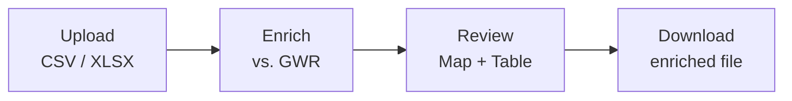

# Geo-Check — GWR Validator

Browser-only tool to verify your building records against the official Swiss **Gebäude- und Wohnungsregister (GWR)**. Upload CSV/XLSX, enrich each row via the public GWR API, review on map + table, export the enriched results. Part of the [`geo-check`](../README.md) repo.

## Live app

https://bbl-dres.github.io/geo-check/gwr-check/

The repository root [`/`](https://bbl-dres.github.io/geo-check/) redirects here.

## How it works



1. **Upload** — CSV/Excel with at minimum `internal_id` and `egid` columns
2. **Enrich** — each EGID is looked up via the public GWR API; address, coordinates, building type, etc. compared and scored (0–100)
3. **Review** — interactive map (MapLibre GL) + sortable/filterable table
4. **Download** — CSV, Excel, or GeoJSON

## Features

- **Map** — MapLibre GL with CARTO basemaps (Positron, Dark Matter, Voyager) + swisstopo aerial
- **Table** — sortable, filterable, paginated; confidence presets (High / Medium / Low); clickable badges
- **Match scoring** — weighted comparison across street, house number, ZIP, city, canton, building type, coordinates
- **GWR code resolution** — integer codes resolved to multilingual labels (DE / FR / IT)
- **PDF report** — per-building report with recommendations and map excerpt (`jsPDF` lazy-loaded)
- **Export** — CSV (semicolon, UTF-8 BOM), Excel (results + summary), GeoJSON
- **Multilingual UI** — DE / FR / IT / EN

## Privacy

All processing happens in the browser. No backend, no database, no cookies. Only the EGID (a public identifier) is sent to the GWR API.

## Input format

| Column | Required | Example |
|---|---|---|
| `internal_id` | Yes | `SAP-4821` |
| `egid` | Yes | `1755615` |
| `street` | No | `Bahnhofstrasse` |
| `street_number` | No | `12` |
| `zip` | No | `8001` |
| `city` | No | `Zürich` |
| `region` | No | `ZH` |
| `building_type` | No | `1020` |
| `latitude` / `longitude` | No | `47.3769` / `8.5417` |
| `country` | No | `CH` |
| `comment` | No | Free text |

Headers are matched case-insensitively with common aliases (`plz` → `zip`, `hausnummer` → `street_number`). Sample: [`assets/demo-buildings.csv`](assets/demo-buildings.csv).

## Running locally

No build step. Serve the repo root with any static file server, then open `/gwr-check/`:

```bash
python -m http.server 8000   # → http://localhost:8000/gwr-check/
npx serve .
```

## Layout

```
gwr-check/
├── index.html
├── css/
│   ├── tokens.css           # Design tokens
│   └── styles.css
├── js/                      # ES modules, no build
│   ├── main.js              # State machine (upload → processing → results)
│   ├── upload.js            # File parsing, column mapping
│   ├── processor.js         # GWR API calls, batching, scoring
│   ├── map.js               # MapLibre GL setup
│   ├── table.js             # Results table
│   ├── export.js            # CSV / XLSX / GeoJSON
│   ├── report.js            # PDF report (lazy-loaded jsPDF)
│   ├── gwr-codes.js         # Code → label resolution
│   ├── i18n.js              # Translations
│   └── utils.js
├── data/
│   ├── gwr-codes.json       # GWR code tables (DE / FR / IT)
│   └── test-buildings.csv
├── docs/
│   ├── SPECIFICATION.md     # Full app specification
│   └── INSTRUCTIONS.md      # End-user quick start (DE / FR / IT / EN)
└── assets/
    ├── swiss-logo-flag.svg
    ├── GWR Codes.xlsx       # Source for gwr-codes.json
    ├── demo-buildings.csv   # Sample upload
    └── geo-check-SAP-002-*.pdf
```

## Data sources

| Source | Use | API |
|---|---|---|
| [GWR](https://www.housing-stat.ch/) | Building data | [`MapServer/find`](https://api3.geo.admin.ch/rest/services/ech/MapServer/find?layer=ch.bfs.gebaeude_wohnungs_register&searchField=egid&searchText=1231641&returnGeometry=true&contains=false&sr=4326) |
| [swisstopo SearchServer](https://api3.geo.admin.ch/rest/services/ech/SearchServer) | Location search | swisstopo |
| [CARTO](https://carto.com/) | Basemap tiles | Free, no key |
| [swisstopo WMTS](https://www.swisstopo.admin.ch/) | Aerial imagery | Free, no key |

All swisstopo APIs are public and require no API key.

## Libraries (all via CDN)

| Library | Purpose |
|---|---|
| [MapLibre GL JS](https://maplibre.org/) | Interactive map |
| [Papa Parse](https://www.papaparse.com/) | CSV parsing |
| [SheetJS](https://sheetjs.com/) | Excel parsing & export |
| [jsPDF](https://github.com/parallax/jsPDF) | PDF report (lazy-loaded) |

## License

[MIT](../LICENSE)
