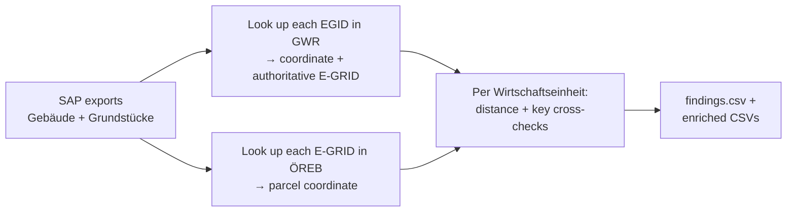

# BBL ÖREB-Check

A command-line tool that validates **BBL SAP building & parcel master data**
against the Swiss national registers, to find parcels whose **E-GRID foreign key
is wrong, missing, or stale**.

Part of the [`geo-check`](../README.md) repo. Unlike the browser apps, this is a
batch **Python script** (standard library only — no install needed) meant to run
on an internal workstation against a SAP export.

## The problem

In SAP, BBL real estate is organised as:

| Level | Example | Key to a national register |
|---|---|---|
| Buchungskreis | `1086` (BBL) | — |
| Wirtschaftseinheit (WE) | `1502` | — |
| Gebäude (building) | `AA`, `BG` | **EGID** → GWR |
| Grundstück (parcel) | `1`, `2`, `3` | **E-GRID** → ÖREB cadastre |

The EGID/E-GRID columns are foreign keys maintained by hand, and some are wrong
(especially on parcels) — pointing at a parcel in the wrong place, or missing
entirely (`0000000000`). They are hard to audit by eye. This tool does it
automatically against the authoritative [swisstopo API](https://docs.geo.admin.ch/).

## How it works



1. **Parse** the two SAP *Dynamische Listenausgabe* reports (pipe-delimited, UTF-8).
2. **GWR** — for every building EGID, fetch the building coordinate **and the
   authoritative E-GRID of the parcel it stands on** ([feature API]). EGIDs are
   looked up **20 per request** (the endpoint's max); a batch containing a stale
   EGID returns HTTP 400/404, so the tool binary-splits it to isolate the bad one
   in ~O(log n) extra requests rather than falling back to one-by-one.
3. **ÖREB** — for every parcel E-GRID, fetch the parcel centroid ([find API]).
   All coordinates are LV95 (EPSG:2056, metres) → distances are exact planar math.
4. **Analyse** per Wirtschaftseinheit and write CSVs.

Requests run concurrently (`--workers`, default 16) with a thread-safe, resumable
on-disk cache, so a cold run over the full portfolio (~1,600 requests) takes well
under a minute and re-runs are instant.

[feature API]: https://api3.geo.admin.ch/rest/services/api/MapServer/ch.bfs.gebaeude_wohnungs_register
[find API]: https://docs.geo.admin.ch/access-data/find-features.html

## What it checks

| Category | Severity | Meaning |
|---|---|---|
| `PARCEL_FAR` | HIGH | Parcel sits **> threshold** (default 500 m) from its WE's building cluster → likely wrong E-GRID |
| `SINGLE_PAIR_FILL` | HIGH | WE with exactly **1 building + 1 parcel** and a missing E-GRID → the parcel's E-GRID can be set to the building's GWR E-GRID |
| `SINGLE_PAIR_MISMATCH` | HIGH | Same 1+1 case, but the existing E-GRID **disagrees** with the building's GWR E-GRID |
| `INVALID_EGRID` | HIGH | E-GRID not found in the ÖREB cadastre (stale / wrong) |
| `INVALID_EGID` | HIGH | EGID not found in GWR (stale / wrong) |
| `GWR_EGRID_NOT_IN_SAP` | MED | A building's GWR parcel is **not among the WE's SAP parcels** → possibly a missing parcel or wrong key |
| `MISSING_EGRID` | MED | Parcel has no / `0000000000` E-GRID in SAP |
| `MISSING_EGID` | MED | **Swiss** building has no EGID in SAP |
| `NONCH_WITH_EGID` | LOW | A non-CH building unexpectedly carries an EGID |

**Switzerland-aware:** the portfolio contains ~1,100 foreign properties
(embassies/consulates) that legitimately have no Swiss EGID/E-GRID — these are
**not** flagged as errors.

> 📋 **[RULE-SET.md](RULE-SET.md)** is the authoritative rule catalogue (in
> German): every check with its ID, severity, exact condition, data source, and
> recommended action — plus the object classes (Abgang, Löschvermerk, Parkplatz,
> Infrastrukturgefäss) that are excluded by default.

## Usage

Put the two SAP `.txt` exports next to `oereb_check.py` (in this folder) and run:

```bash
# Full run — auto-discovers the two .txt exports in this folder,
# queries the API (cached), writes report.html + CSVs here
python oereb_check.py

# Limit to specific Wirtschaftseinheiten (fast; good for spot checks)
python oereb_check.py --we 1498,1502

# Re-analyse from the cache without hitting the network
python oereb_check.py --offline

# Flag parcels farther than 1 km instead of 500 m
python oereb_check.py --threshold 1000
```

| Option | Default | Notes |
|---|---|---|
| `--data-dir` | this script's folder | Folder holding the two SAP `.txt` exports |
| `--gebaeude` | auto | Explicit path to the Gebäude export (overrides discovery) |
| `--grundstuecke` | auto | Explicit path to the Grundstücke export |
| `--out` | `<data-dir>` | Output folder |
| `--threshold` | `500` | Metres; the `PARCEL_FAR` flag boundary |
| `--we` | — | Comma-separated WEs to limit to |
| `--workers` | `16` | Concurrent API requests |
| `--offline` | off | Use cached API responses only |

The two reports are auto-discovered by filename (any `*.txt` containing `geb` /
`grundst`), so next month's `26062_…` exports work without editing anything.
Defaults can also be edited at the top of `oereb_check.py`.

## Output

All CSVs are UTF-8 (with BOM) and **`;`-separated** so they open cleanly in a
Swiss-locale Excel. Coordinates are LV95; a Google-Maps link per row is included.

| File | One row per | Key columns |
|---|---|---|
| **`report.html`** | — | **interactive single-file report** (see below) |
| `findings.csv` | issue | `severity`, `category`, `we`, `sap_id`, `detail`, **`suggested_egrid`**, `distance_m` |
| `parcels_enriched.csv` | parcel | `egrid_status`, `egrid_matches_building`, `parcel_e/n`, **`dist_to_we_center_m`**, `far_flag` |
| `buildings_enriched.csv` | building | `egid_status`, **`gwr_egrid`**, `gwr_egrid_in_sap_we`, `gwr_e/n` |
| `we_summary.csv` | Wirtschaftseinheit | counts, `max_parcel_dist_m`, `is_single_pair`, `single_pair_*` |
| `api_cache.json` | — | HTTP response cache — makes re-runs instant and resumable |

### Interactive report (`report.html`)

A self-contained HTML file (data embedded — just double-click it, no server). It's a
**linked dashboard**: one filter drives the charts, the map, and the tables together.
- summary cards plus three **filter charts** — *findings by severity* (bars),
  *by type* (Buildings vs Parcels, colored like the map), and *by category* (bars).
  **Click a bar to filter; click it again to clear.** The charts **cross-filter**:
  each one shows counts with every active filter applied *except its own dimension*,
  so you can keep refining without a chart collapsing to a single bar.
- a global **active-filter pill row** under the header: each filter is a pill with
  an ✕, ending in an **“Alle Filter zurücksetzen”** link (the bar hides when empty).
- a header **Filter** button opening a scope panel: **object classes** hidden by default —
  Abgang (`ABGA…`), Löschvermerk (`LÖVM…`), Parkplätze (parcel `…PP…`), Infrastrukturgefässe
  (building id `GR`) — plus **Land** (CH / foreign) and **Kanton**. A badge shows how many scope
  filters are active; they apply across charts, tables, map, and drill-down. (Summary cards stay
  dataset totals; charts/table/map reflect the active scope.)
- a **MapLibre GL** map (grey CARTO Positron basemap) that **follows the active
  view** — it shows the points for whatever the current tab is filtered to and
  re-fits as the selection changes. Buildings = blue, parcels = teal (kept off the
  red/amber/grey severity palette); labels appear at higher zoom.
- a unified table with **`Findings | Buildings | Parcels` tabs**, sortable /
  searchable, with a consistent **pager** (row range left · page nav centre ·
  page-size 100/200/500 right). With a findings filter active, the Buildings/Parcels
  tabs **drill down** to the records involved in that filter.
- **click a table row → the map flies to that element**; for a parcel it also
  fetches and draws its **ÖREB polygon** live from the swisstopo API.
- view + filters + page + page-size live in the **URL hash**, so a filtered view is
  shareable and survives reload (works from a local `file://` too).
- a **language switcher (DE / FR / IT / EN)** in the header — the whole UI *and* the
  per-finding detail sentences are translated live (no reload); DE is the default,
  and the choice persists in the URL hash + `localStorage`. All four languages are
  bundled into the single file from [`i18n.json`](i18n.json) (one entry per key, with
  `de`/`fr`/`it`/`en`), so adding or fixing wording is a JSON edit + re-run — no code
  change. *(FR/IT are first-draft translations; have a native speaker review official
  terminology before publishing.)*
- a header **Download** button → a modal with three client-side exports (no server,
  works offline): **the report itself (HTML)**, **GeoJSON** (every located building +
  parcel as a WGS84 point, raw field names for GIS), and **Excel (`.xlsx`)** — a real
  multi-sheet workbook (*findings · buildings · parcels*) written with a tiny built-in
  OOXML/ZIP writer (no library), localized to the current UI language.

**Design:** the report follows the **Swiss Confederation Design System**
([swiss/designsystem](https://github.com/swiss/designsystem)) — Noto Sans, the
federal red `#d8232a` / slate `#2f4356` palette, the federal header lockup (official
Swiss shield + Confederation wordmark SVG + "Bundesamt für Bauten und Logistik BBL"),
a light footer (data source + federal links, matching the gwr-search app), underline
tabs, soft-tint badges, square cards with subtle elevation, red links, and a purple
focus ring. The header content aligns to the main column's max-width; the footer spans
full width and carries the data-source links plus the generation metadata. It
targets **WCAG 2.1 AA** (keyboard-operable charts/sort/tabs, `aria-sort`/`role=tablist`,
labelled controls, skip link, `prefers-reduced-motion`).

The map + live polygons need internet (MapLibre CDN, CARTO tiles, swisstopo API);
the table and charts work offline.

> **Privacy:** the SAP `.txt` exports, the result CSVs, `report.html`, and the API
> cache all embed internal BBL master data, and this repo deploys to a **public**
> GitHub Pages site — so they are **git-ignored**. Only `oereb_check.py`,
> `README.md`, `RULE-SET.md`, `i18n.json`, and `.gitignore` are tracked. The data is not sensitive, but it is
> kept out of the public repo by default; clear it for release before publishing.

`--offline` reports only on keys already in the cache; anything not yet fetched is
marked `unchecked` and is **not** flagged as missing, so an offline run on a
partial cache never invents findings.

**Start with `findings.csv`** (sorted by severity). The enriched files are the
full picture for deeper analysis or re-import.

## How distances are judged

A parcel's distance is measured against its **polygon geometry**, not a single
point. If any of the WE's resolved building coordinates lies **inside** the parcel
polygon, the distance is **0 m** — the parcel clearly belongs to the WE and is not
flagged, regardless of how large or oddly shaped it is. Otherwise the distance is
the shortest distance from the **nearest WE building to the parcel's edge** (LV95
metres). On top of the distance there's a **cross-municipality gate**: a parcel is
only flagged when it also sits in a *different municipality* than the WE's buildings
— a wrong E-GRID almost always lands in another municipality, whereas legitimately
spread forest / building-right holdings stay in the same one. (If either municipality
is unknown, the distance alone decides.) In the current portfolio this cut `PARCEL_FAR`
from 146 to ~39 real suspects. For parcel-only WEs (no resolved buildings) the distance
falls back to the parcel's **pole of inaccessibility** (visual centre) vs. the
parcel-cluster median, trusted only from ≥ 3 parcels. Exact distances and a
`far_diff_gemeinde` flag are always written so you can re-sort borderline cases.

> Earlier versions used the **bounding-box centre** of the parcel as its position.
> For large, concave forest / building-right parcels that centre often fell *outside*
> the polygon and far from the buildings — the main cause of false `PARCEL_FAR` flags.
> The polygon-based method (and the pole-of-inaccessibility centre for the map) fixes
> that; it activates once parcels are re-fetched **with geometry** (one online run).

## Layout

```
oereb-check/
├── oereb_check.py            # The tool — single file, standard library only
├── i18n.json                 # UI + finding translations (DE / FR / IT / EN)
├── RULE-SET.md               # Authoritative rule catalogue (German)
├── README.md
├── .gitignore                # Keeps SAP data + outputs out of the public repo
│
│   # generated locally, git-ignored (internal master data):
├── *_Gebäude.txt             # SAP Gebäude export (input)
├── *_Grundstücke.txt         # SAP Grundstücke export (input)
├── api_cache.json            # Resumable HTTP response cache
├── findings.csv              # Issues, sorted by severity
├── buildings_enriched.csv
├── parcels_enriched.csv
├── we_summary.csv
└── report.html               # Self-contained interactive report
```

Only the five files above the divider are tracked; everything generated is
git-ignored (see **Privacy** under [Output](#output)).

## Requirements

- **Python 3.9+**, standard library only (no `pip install`).
- Internet access to `api3.geo.admin.ch` (public, no API key).

## Data sources

| Source | Use | Layer |
|---|---|---|
| [GWR](https://www.housing-stat.ch/) | Building coordinate + parcel E-GRID | `ch.bfs.gebaeude_wohnungs_register` |
| [ÖREB cadastre](https://www.cadastre.ch/en/oereb.html) | Parcel coordinate | `ch.swisstopo-vd.stand-oerebkataster` |

Both via the public [swisstopo REST API](https://docs.geo.admin.ch/). No API key.

## License

[MIT](../LICENSE)
