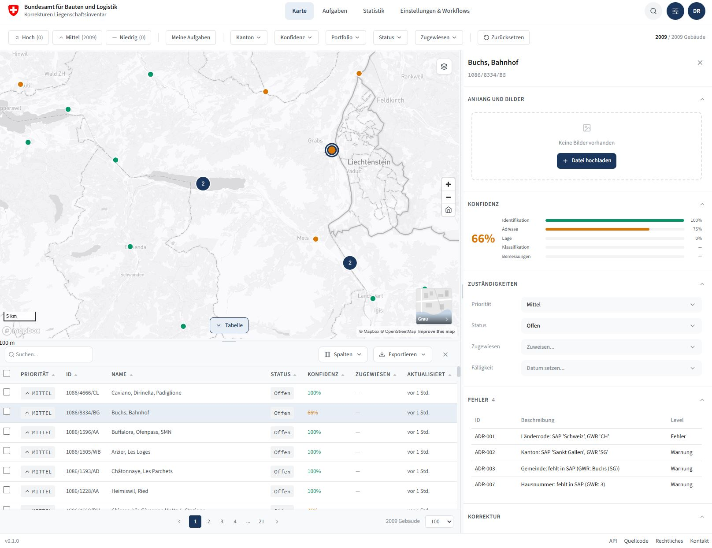

# Data-Quality Prototype

> [!CAUTION]
> **Unofficial mockup for demonstration purposes only.**
> Fictional data, not all features fully functional, not intended for production.

Project-management-style prototype for building-data quality workflows: multi-source validation (GEOREF / SAP RE-FX / GWR), confidence scoring, kanban with inline corrections, role-based auth. German UI. Part of the [`geo-check`](../README.md) repo.

## Live app

https://bbl-dres.github.io/geo-check/prototype-quality/

(Old bookmarks to `/prototype-pm/` redirect here.)



## Features

- **Map view** — Mapbox GL JS with Swiss federal buildings, multiple basemaps, WMS overlays, location search, click-to-identify
- **Data table** — searchable, sortable, configurable page size (100/500/1000), CSV/XLSX export
- **Kanban board** — drag-and-drop status workflow (Backlog → In Bearbeitung → Abklärung → Erledigt) with filters
- **Detail panel** — TVP (sap/gwr/korrektur) data comparison, confidence scores across 5 dimensions, inline editing, comments, image carousel
- **Validation** — Deno + Hono rule engine with configurable rule severity, Swagger UI
- **Auth** — Supabase email + password, roles (Admin / Bearbeiter / Leser), admin invite flow

## Tech stack

| Layer    | Technology |
|----------|---|
| Frontend | Vanilla JS (ES6 modules), no build |
| Maps     | Mapbox GL JS v3.3.0 |
| Charts   | ApexCharts v5.3.6 |
| Icons    | Lucide v0.563.0 |
| Export   | SheetJS / XLSX v0.18.5 (lazy-loaded) |
| Auth / DB | Supabase (PostgreSQL + RLS + Auth + Storage + Realtime) |
| Backend  | Deno + Hono v4.6.0 (TypeScript) |
| CI/CD    | GitHub Actions (edge-function deploy) |

## Running locally

### Frontend

Static files — serve the repo root, then open `/prototype-quality/`:

```bash
python -m http.server 8000   # → http://localhost:8000/prototype-quality/
npx serve .
```

### Backend (rule engine)

Requires [Deno 2.x](https://deno.land/):

```bash
cd backend
deno task dev      # watch mode, port 8787
deno task start    # production
```

Required env vars: `SUPABASE_URL`, `SUPABASE_SERVICE_ROLE_KEY`. Optional: `PORT` (default 8787).

### Edge Functions

Auto-deployed via GitHub Actions on push to `main` when [`supabase/functions/**`](supabase/functions/) changes. For local dev with the [Supabase CLI](https://supabase.com/docs/guides/cli):

```bash
supabase functions serve
```

## Layout

```
prototype-quality/
├── index.html
├── css/                   # tokens.css + styles.css
├── js/                    # 12 ES modules: main, state, map, detail-panel,
│                          # data-table, kanban, statistics, auth, supabase,
│                          # search, icons, xlsx-loader
├── backend/               # Deno + Hono rule engine
│   ├── deno.json
│   └── app/               # main, config, db, models + engine/, rules/, routes/, geo/
├── supabase/
│   ├── config.toml
│   └── functions/         # invite-user, rule-engine
├── docs/                  # DATABASE.md, EDGE-FUNCTIONS.md, RULES.md + wireframes
├── scripts/               # FME workspace (Upsert.fmw)
├── data/                  # rules.json
└── assets/                # basemap icons, preview, logo
```

See [CLAUDE.md](CLAUDE.md) for architecture conventions (TVP pattern, state management, CSP/SRI, design tokens).

## License

[MIT](LICENSE)
